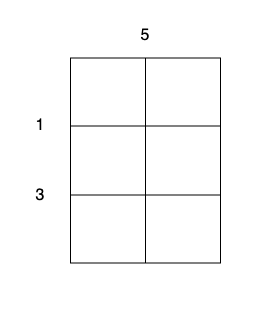

## Problem

There is an `m x n` cake that needs to be cut into `1 x 1` pieces.

You are given integers `m`, `n`, and two arrays:

- `horizontalCut` of size `m - 1`, where `horizontalCut[i]` represents the cost to cut along the horizontal line `i`.
- `verticalCut` of size `n - 1`, where `verticalCut[j]` represents the cost to cut along the vertical line `j`.

In one operation, you can choose any piece of cake that is not yet a `1 x 1` square and perform one of the following cuts:

1. Cut along a horizontal line `i` at a cost of `horizontalCut[i]`.
2. Cut along a vertical line `j` at a cost of `verticalCut[j]`.

After the cut, the piece of cake is divided into two distinct pieces.

The cost of a cut depends only on the initial cost of the line and does not change.

Return the **minimum** total cost to cut the entire cake into `1 x 1` pieces.

<https://leetcode.cn/problems/minimum-cost-for-cutting-cake-i/>

**Example 1:**

> Input: `m = 3, n = 2, horizontalCut = [1,3], verticalCut = [5]`
> Output: `13`
> Explanation:
> 


>
> - Perform a cut on the vertical line 0 with cost 5, current total cost is 5.
> - Perform a cut on the horizontal line 0 on `3 x 1` subgrid with cost 1.
> - Perform a cut on the horizontal line 0 on `3 x 1` subgrid with cost 1.
> - Perform a cut on the horizontal line 1 on `2 x 1` subgrid with cost 3.
> - Perform a cut on the horizontal line 1 on `2 x 1` subgrid with cost 3.
>
> The total cost is `5 + 1 + 1 + 3 + 3 = 13`.

**Example 2:**

> Input: `m = 2, n = 2, horizontalCut = [7], verticalCut = [4]`
> Output: `15`
> Explanation:
>
> - Perform a cut on the horizontal line 0 with cost 7.
> - Perform a cut on the vertical line 0 on `1 x 2` subgrid with cost 4.
> - Perform a cut on the vertical line 0 on `1 x 2` subgrid with cost 4.
>
> The total cost is `7 + 4 + 4 = 15`.

**Constraints:**

- `1 <= m, n <= 20`
- `horizontalCut.length == m - 1`
- `verticalCut.length == n - 1`
- `1 <= horizontalCut[i], verticalCut[i] <= 10³`

## Test Cases

``` python
class Solution:
    def minimumCost(self, m: int, n: int, horizontalCut: List[int], verticalCut: List[int]) -> int:
```



## Thoughts

[1547. Minimum Cost to Cut a Stick](1547-minimum-cost-to-cut-a-stick) 的二维加权重版本。

先试试直接求解。定义 `dp(t, b, l, r)` 为上下左右分别为 t、b、l、r 的矩形区域，被完全切割的最小成本。那就是对第一刀的切割做不同的选择。易知：

$$
dp(t,b,l,r)=\min\begin{cases}
  \min_{t<i<b}\{hc_i+dp(t,i,l,r)+dp(i,b,l,r)\} \\
  \min_{l<j<r}\{vc_j+dp(t,b,l,j)+dp(t,b,j,r\}
\end{cases}
$$

直接递归计算加缓存。也可以改成循环，从下往上算，但整体这个方法都不是很有效，就不折腾了。

时间复杂度 `O(m³ n³)`，空间复杂度 `O(m² n²)`。

## Code



## Greedy

实际上上边忽略了本题跟 [1547. Minimum Cost to Cut a Stick](1547-minimum-cost-to-cut-a-stick) 的核心区别。[problem 1547](1547-minimum-cost-to-cut-a-stick) 中每一刀的切割成本跟子问题（子木棍的长度）相关，而本题每一刀的切割成本只跟切割位置有关。

如果蛋糕只有一行，显然竖着切的顺序无所谓；如果只有一列，横着切的顺序也无所谓。如果是 `2 x 2` 大小的蛋糕，显然横切和竖切哪个成本高就先切哪个，因为剩下的那个要被乘以 2。

实际上每条线最终的切割成本取决于这条线被分成了几段，跟 [2931. Maximum Spending After Buying Items](2931-maximum-spending-after-buying-items) 类似，显然按降序顺序依次切割每条线的总成本最低。

计算过程中只需要确定好当前要切割的线已经被分成了几段（垂直方向切过的刀数加一），跟单次切割成本乘起来就行。

时间复杂度 `O(m log m + n log n)`，空间复杂度 `O(1)`（in-place 排序）。



> 给排序后的 `horizontalCut` 和 `verticalCut` 都各加一个成本为 0 的虚拟切割线，能够简化边界条件的判定。
