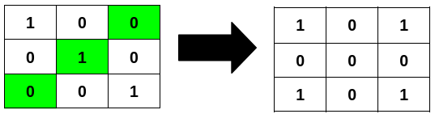
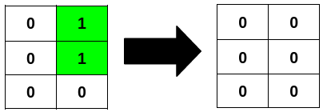
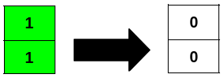

## Problem

You are given an `m x n` binary matrix `grid`.

A row or column is considered **palindromic** if its values read the same forward and backward.

You can **flip** any number of cells in `grid` from `0` to `1`, or from `1` to `0`.

Return the **minimum** number of cells that need to be flipped to make **all** rows and columns **palindromic**, and the total number of `1`'s in `grid` **divisible** by `4`.

<https://leetcode.cn/problems/minimum-number-of-flips-to-make-binary-grid-palindromic-ii/>

**Example 1:**

> Input: `grid = [[1,0,0],[0,1,0],[0,0,1]]`
> Output: `3`
> Explanation:
> 



**Example 2:**

> Input: `grid = [[0,1],[0,1],[0,0]]`
> Output: `2`
> Explanation:
> 



**Example 3:**

> Input: `grid = [[1],[1]]`
> Output: `2`
> Explanation:
> 



**Constraints:**

- `m == grid.length`
- `n == grid[i].length`
- `1 <= m * n <= 2 * 10⁵`
- `0 <= grid[i][j] <= 1`

## Test Cases

``` python
class Solution:
    def minFlips(self, grid: List[List[int]]) -> int:
```



## Thoughts

[3239. Minimum Number of Flips to Make Binary Grid Palindromic I](3239-minimum-number-of-flips-to-make-binary-grid-palindromic-i) 的进阶版。增加的要求除了行和列要同时是回文，还要求 `1` 的个数能被 4 整除。

翻转后的 grid，相对于中央水平线和垂直线是轴对称的。

对于任意的 `0 <= i < m // 2` 和 `0 <= j < n // 2`，都需要 `grid[i][j]`、`grid[i][-j-1]`、`grid[-i-1][j]` 和 `grid[-i-1][-j-1]` 相等。不同 i、j 对应不同四格组相互独立，所以只要让每个四格组的翻转次数最少即可。如果四个格子的数字两两相同，则需要翻转两次；有一个和另外三个不同，需要翻转一次；四格全相同则不用翻转。（可以对四个格子的值求和，和为 2 则翻转两次，为 1 或 3 则翻转一次，为 0 或 4 则不翻转）。

显然只要四个格子的值相等，他们中 `1` 的个数要么是 0，要么是 4，都满足能被 4 整除的要求。

需要考虑 4 的整除性的是对于奇数行或奇数列的 grid，正中的那行或列，即下标为 `m // 2`（m 是奇数）的行或下标为 `n // 2`（n 是奇数）的列。

首先如果行和列同时是奇数，那么中央位置只有一个格子，其值必需为 `0`，如果原来是 `1`，需要翻转一次。

遍历正中行和列每一组对称的双格组，记录两个格子都是 `1` 的组数，如果是偶数，则 `1` 的个数能被 4 整除，否则就会余 2。再看一个 `0` 一个 `1` 的双格组，如果有，就把第一组里的 `0` 翻转成 `1`，跟前边的余 2 加起来正好是 4。剩下的一个 `0` 一个 `1` 的双格组，都把 `1` 翻转成 `0`。如果没有一个 `0` 一个 `1` 的双格组，需要把其边多的两个 `1` 都翻转成 `0`。

## Code


