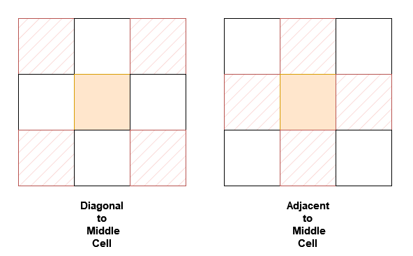
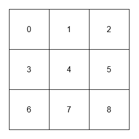
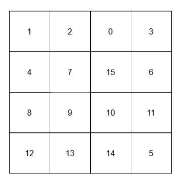

## Problem

You are given a `n x n` 2D array `grid` containing **distinct** elements in the range `[0, n² - 1]`.

Implement the `NeighborSum` class:

- `NeighborSum(int [][]grid)` initializes the object.
- `int adjacentSum(int value)` returns the **sum** of elements which are adjacent neighbors of `value`, that is either to the top, left, right, or bottom of `value` in `grid`.
- `int diagonalSum(int value)` returns the **sum** of elements which are diagonal neighbors of `value`, that is either to the top-left, top-right, bottom-left, or bottom-right of `value` in `grid`.





<https://leetcode.cn/problems/design-neighbor-sum-service/>

**Example 1:**

> Input:
> `["NeighborSum", "adjacentSum", "adjacentSum", "diagonalSum", "diagonalSum"]`
> `[[[[0, 1, 2], [3, 4, 5], [6, 7, 8]]], [1], [4], [4], [8]]`
> Output: `[null, 6, 16, 16, 4]`
> Explanation:
> 


>
> - The adjacent neighbors of 1 are 0, 2, and 4.
> - The adjacent neighbors of 4 are 1, 3, 5, and 7.
> - The diagonal neighbors of 4 are 0, 2, 6, and 8.
> - The diagonal neighbor of 8 is 4.

**Example 2:**

> Input:
> `["NeighborSum", "adjacentSum", "diagonalSum"]`
> `[[[[1, 2, 0, 3], [4, 7, 15, 6], [8, 9, 10, 11], [12, 13, 14, 5]]], [15], [9]]`
> Output: `[null, 23, 45]`
> Explanation:
> 


>
> - The adjacent neighbors of 15 are 0, 10, 7, and 6.
> - The diagonal neighbors of 9 are 4, 12, 14, and 15.

**Constraints:**

- `3 <= n == grid.length == grid[0].length <= 10`
- `0 <= grid[i][j] <= n² - 1`
- All `grid[i][j]` are distinct.
- `value` in `adjacentSum` and `diagonalSum` will be in the range `[0, n² - 1]`.
- At most `2 * n²` calls will be made to `adjacentSum` and `diagonalSum`.

## Test Cases

``` python
class NeighborSum:

    def __init__(self, grid: List[List[int]]):


    def adjacentSum(self, value: int) -> int:


    def diagonalSum(self, value: int) -> int:


# Your NeighborSum object will be instantiated and called as such:
# obj = NeighborSum(grid)
# param_1 = obj.adjacentSum(value)
# param_2 = obj.diagonalSum(value)
```



## Thoughts

在初始化的时候直接把所有格子的 adjacentSum 和 diagonalSum 计算好保存下来。

因为元素的值刚好是 0 到 `n² - 1`，可以直接用作数组，元素值即为数字下标。

每次查询的时间复杂度为 `O(1)`。

构造的时间复杂度为 `O(n²)`，空间复杂度亦然。

构造的计算有两个方向，一是遍历到一个格子时，计算它的 adjacent 格子和 diagonal 格子的数字之和。
另一是遍历到一个格子时，计算它对周围格子的 adjacentSum 和 diagonalSum 的贡献。

注意矩阵的边界。

## Code


