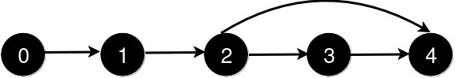
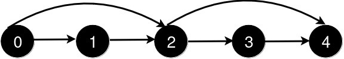
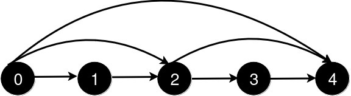
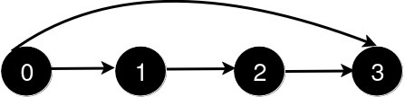
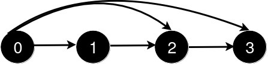

## Problem

You are given an integer `n` and a 2D integer array `queries`.

There are `n` cities numbered from `0` to `n - 1`. Initially, there is a **unidirectional** road from city `i` to city `i + 1` for all `0 <= i < n - 1`.

`queries[i] = [uᵢ, vᵢ]` represents the addition of a new **unidirectional** road from city `uᵢ` to city `vᵢ`. After each query, you need to find the **length** of the **shortest path** from city `0` to city `n - 1`.

Return an array `answer` where for each `i` in the range `[0, queries.length - 1]`, `answer[i]` is the _length of the shortest path_ from city `0` to city `n - 1` after processing the **first** `i + 1` queries.

<https://leetcode.com/problems/shortest-distance-after-road-addition-queries-i/>

<https://leetcode.cn/problems/shortest-distance-after-road-addition-queries-i/>

**Example 1:**

> Input: `n = 5, queries = [[2,4],[0,2],[0,4]]`
> Output: `[3,2,1]`
> Explanation:
> 


> After the addition of the road from 2 to 4, the length of the shortest path from 0 to 4 is 3.
> 


> After the addition of the road from 0 to 2, the length of the shortest path from 0 to 4 is 2.
> 


> After the addition of the road from 0 to 4, the length of the shortest path from 0 to 4 is 1.

**Example 2:**

> Input: `n = 4, queries = [[0,3],[0,2]]`
> Output: `[1,1]`
> Explanation:
> 


> After the addition of the road from 0 to 3, the length of the shortest path from 0 to 3 is 1.
> 


> After the addition of the road from 0 to 2, the length of the shortest path remains 1.

**Constraints:**

- `3 <= n <= 500`
- `1 <= queries.length <= 500`
- `queries[i].length == 2`
- `0 <= queries[i][0] < queries[i][1] < n`
- `1 < queries[i][1] - queries[i][0]`
- There are no repeated roads among the queries.

## Test Cases

``` python
class Solution:
    def shortestDistanceAfterQueries(self, n: int, queries: List[List[int]]) -> List[int]:
```



## Thoughts

显然 `n - 1` 到 `n - 1` 的最短距离是 0，记为 `sd[n-1]`。

如果对于 i，所有的大于 i 的 `sd` 都已知，可知：

$$
sd[i]=1+\max_{j:\space\exists \text{ road } i \to j} sd[j]
$$

时间复杂度为 `O(n+q)`，空间复杂度 `O(n+q)`（`q` 是 `queries` 的长度，即额外增加的道路数量）。

每增加一条道路 `(u, v)` 之后的，先更新 `sd[u]` 的值，如果变小了，则更新其左边所有的 `sd` 值。

总共时间复杂度 `O(q * (n+q))`。

## Code


