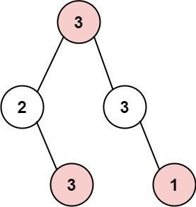
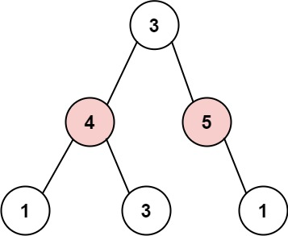

## Problem

The thief has found himself a new place for his thievery again. There is only one entrance to this area, called `root`.

Besides the `root`, each house has one and only one parent house. After a tour, the smart thief realized that all houses in this place form a binary tree. It will automatically contact the police if **two directly-linked houses were broken into on the same night**.

Given the `root` of the binary tree, return _the maximum amount of money the thief can rob **without alerting the police**_.

<https://leetcode.com/problems/house-robber-iii/>

**Example 1:**

{.invert-when-dark}

> Input: `root = [3,2,3,null,3,null,1]`
> Output: `7`
> Explanation: Maximum amount of money the thief can rob `= 3 + 3 + 1 = 7`.

**Example 2:**

{.invert-when-dark}

> Input: `root = [3,4,5,1,3,null,1]`
> Output: `9`
> Explanation: Maximum amount of money the thief can rob `= 4 + 5 = 9`.

**Constraints:**

- The number of nodes in the tree is in the range `[1, 10⁴]`.
- `0 <= Node.val <= 10⁴`

## Test Cases

```python
# Definition for a binary tree node.
# class TreeNode:
#     def __init__(self, val=0, left=None, right=None):
#         self.val = val
#         self.left = left
#         self.right = right
class Solution:
    def rob(self, root: Optional[TreeNode]) -> int:
```



## Thoughts

系列题：

- [198. House Robber](../198-house-robber/index.md) 普通数组
- [213. House Robber II](../213-house-robber-ii/index.md) 循环数组

本题是从数组改成了二叉树。

稍微扩展一下 [198. House Robber](../198-house-robber/index.md) 中定义的 `t[i]`，改为 `t(u)`（其中 u 是二叉树中的一个节点），表示从以 u 为根节点的子树中，能抢到的最多的金额（注意房间 u 可能抢也可能不抢）。初值 `t(null) = 0`，题目所求结果为 `t(root)`。

对于节点 u，可以选择抢，得到金额 `u.val`，那就不能抢 `u.left` 和 `u.right`，但是这两个子节点的再下一层子节点就都可以抢了，总额为 `u.val + t(u.left.left) + t(u.left.right) + t(u.right.left) + t(u.right.right)`。

也可以选择不抢，那么 `u.left` 和 `u.right` 就都可以抢，总额为 `t(u.left) + t(u.right)`。

所以：

$$
t(u)=\max\begin{cases}
  u.val+t(u.l.l)+t(u.l.r)+t(u.r.l)+t(u.r.r) \\
  t(u.l)+t(u.r)
\end{cases}
$$

按后序（post-order，LRN）遍历二叉树，计算每个节点的 t。非递归的后序遍历可以用栈辅助，参考 [124. Binary Tree Maximum Path Sum](../124-binary-tree-maximum-path-sum/index.md)。

时间复杂度 `O(n)`，空间复杂度 `O(log n)`（遍历所用的栈空间）（t 值可以直接存在节点的 val 里）。

## Code



## Another DP

如果嫌访问第二层子节点会有太多是否为空的判定，也可以改造一下状态变量的定义。其实类似于 [198. House Robber](../198-house-robber/index.md) 中定义的 [第二种 DP](../198-house-robber/index.md#Another%20DP)，明确抢还是不抢当前房间。

定义 `ty(u)` 表示抢房间 u 的最大总额，`tn(u)` 表示不抢房间 u 的最大总额。

如果选择抢房间 u，那么 `u.left` 和 `u.right` 就都不能抢，`ty(u) = u.val + tn(u.left) + tn(u.right)`。

如果选择不抢房间 u，那么 `u.left` 和 `u.right` 就都可抢可不抢，哪个收益大选哪个，于是 `tn(u) = max{ty(u.left), tn(u.left)} + max{ty(u.right), tn(u.right)}`。

所以：

$$
\begin{cases}
  ty(u)=u.val+tn(u.l)+tn(u.r) \\
  tn(u)=\max\{ty(u.l),tn(u.l)\}+\max\{ty(u.r),tn(u.r)\}
\end{cases}
$$

最终结果取 `max{ty(root), tn(root)}`。



PS：上边是记录 `ty(u)` 和 `tn(u)` 这两个值，也可以考虑记录 `t(u)` 和 `tn(u)`，其中 `t(u) = max{ty(u), tn(u)}`，代码见 [solution3.py](solution3.py)。
