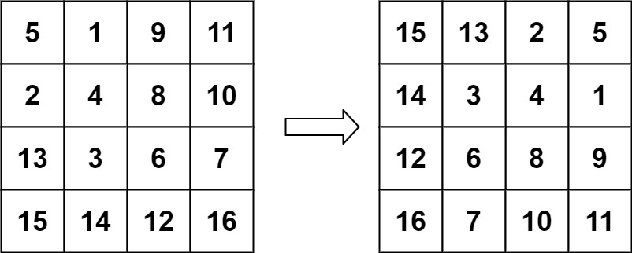

## Problem

You are given an `n x n` 2D `matrix` representing an image, rotate the image by **90** degrees (clockwise).

You have to rotate the image [**in-place**](https://en.wikipedia.org/wiki/In-place_algorithm), which means you have to modify the input 2D matrix directly. **DO NOT** allocate another 2D matrix and do the rotation.

<https://leetcode.com/problems/rotate-image/>

**Example 1:**

{.invert-when-dark}

> Input: `matrix = [[1,2,3],[4,5,6],[7,8,9]]`
> Output: `[[7,4,1],[8,5,2],[9,6,3]]`

**Example 2:**

{.invert-when-dark}

> Input: `matrix = [[5,1,9,11],[2,4,8,10],[13,3,6,7],[15,14,12,16]]`
> Output: `[[15,13,2,5],[14,3,4,1],[12,6,8,9],[16,7,10,11]]`

**Constraints:**

- `n == matrix.length == matrix[i].length`
- `1 <= n <= 20`
- `-1000 <= matrix[i][j] <= 1000`

## Test Cases

```python
class Solution:
    def rotate(self, matrix: List[List[int]]) -> None:
        """
        Do not return anything, modify matrix in-place instead.
        """
```



## Thoughts

从外到内一圈一圈处理。如果 n 是奇数，中心格子无需旋转。因此 `0 <= i < n // 2`。

对于第 `i` 圈，依次处理 `i` 行的 `i <= j < n - 1 -i` 列，跟另外三条边的对应位置做轮换。

`[i][j]` 对应的其他三个位置分别为 `[j][-i-1]`、`[-i-1][-j-1]` 和 `[-j-1][i]`。

## Code


