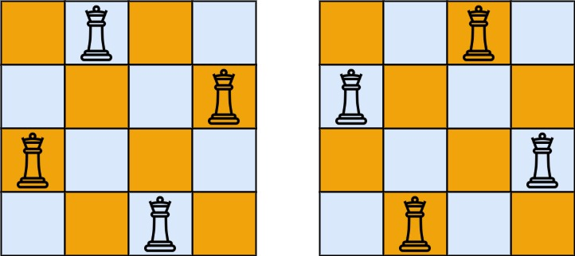

## Problem

The **n-queens** puzzle is the problem of placing `n` queens on an `n x n` chessboard such that no two queens attack each other.

Given an integer `n`, return _all distinct solutions to the **n-queens puzzle**_. You may return the answer in **any order**.

Each solution contains a distinct board configuration of the n-queens' placement, where `'Q'` and `'.'` both indicate a queen and an empty space, respectively.

<https://leetcode.cn/problems/n-queens/>

**Example 1:**

{.invert-when-dark}

> Input: `n = 4`
> Output: `[[".Q..","...Q","Q...","..Q."],["..Q.","Q...","...Q",".Q.."]]`
> Explanation: There exist two distinct solutions to the 4-queens puzzle as shown above

**Example 2:**

> Input: `n = 1`
> Output: `[["Q"]]`

**Constraints:**

- `1 <= n <= 9`

## Test Cases

```python
class Solution:
    def solveNQueens(self, n: int) -> List[List[str]]:
```



## Thoughts

任何两个皇后不能在同一行或同一列或同一斜线上。

经典的回溯算法问题。

按行来摆放皇后，每行只放一个，直接保证任何两个皇后不在同一行。

已经放过的皇后的列也不再放，确保任何两个皇后不在同一列。准备一个大小为 `n` 的空间，记录每一列是否被占用。

斜线上任意两个位置的坐标特点是，要么行列下标之和相等，要么行列下标之差相等。设两个皇后的位置分别在 `(i₁, j₁)` 和 `(i₂, j₂)`。她俩在同一斜线，当且仅当，`i₁ + j₁ = i₂ + j₂` 或 `i₁ - j₁ = i₂ - j₂`，亦即 `|i₁ - i₂| = |j₁ - j₂|`。

开始是按 `|i₁ - i₂| = |j₁ - j₂|` 做的，但这样的时间效率不高，因为需要遍历所有已知的 `(i₁, j₁)`。想要节省时间，还是按 `i₁ + j₁ = i₂ + j₂` 或 `i₁ - j₁ = i₂ - j₂` 进行判定，对于已知的 `(i₁, j₁)` 可以直接把 `i₁ + j₁` 和 `i₁ - j₁` 记录下来。因为 `2 <= i₁ + j₁ <= 2n`、`1-n <= i₁ - j₁ <= n-1`（1-indexed），都只需要 `2n - 1` 大小的空间缓存即可。

对每一行，遍历此行皇后可行的置放位置。对于一行中的每个格子，只需要 `O(1)` 时间判断能否放入皇后。总共时间复杂度为 `O(nⁿ)`，空间复杂度为 `O(n)`。

可以直接递归。或者改写成循环。

## Code

### Recursively



### Iteratively



不用递归的话，需要注意缓存的更新时机，避免设置了但没有清理，或者漏了设置。
