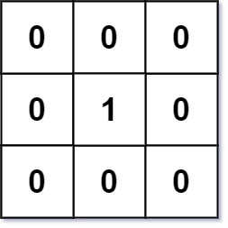
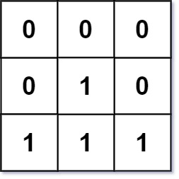

## Problem

Given an `m x n` binary matrix `mat`, return _the distance of the nearest_ `0` _for each cell_.

The distance between two cells sharing a common edge is `1`.

<https://leetcode.com/problems/01-matrix/>

**Example 1:**





> Input: `mat = [[0,0,0],[0,1,0],[0,0,0]]`
> Output: `[[0,0,0],[0,1,0],[0,0,0]]`

**Example 2:**





> Input: `mat = [[0,0,0],[0,1,0],[1,1,1]]`
> Output: `[[0,0,0],[0,1,0],[1,2,1]]`

**Constraints:**

- `m == mat.length`
- `n == mat[i].length`
- `1 <= m, n <= 10⁴`
- `1 <= m * n <= 10⁴`
- `mat[i][j]` is either `0` or `1`.
- There is at least one `0` in `mat`.

**Note:** This question is the same as 1765: <https://leetcode.com/problems/map-of-highest-peak/>

## Test Cases

``` python
class Solution:
    def updateMatrix(self, mat: List[List[int]]) -> List[List[int]]:
```



## Thoughts

跟 [221. Maximal Square](../221-maximal-square/index.md) 很像，少了对于全一正方形的判定。[Problem 221](../221-maximal-square/index.md) 中的 `h(i, j)` 和 `v(i, j)` 分别类似于本题中格子 `(i, j)` 到上边最近的 `0` 和左边最近的 `0` 的距离（如果某个方向没有 `0` 本题应该为 `inf`，[problem 221](../221-maximal-square/index.md) 则为连续 `1` 的个数）。

定义 `dp(i, j)` 为格子 `(i, j)` 到任意方向最近的 `0` 的距离。易知当 `mat[i][j] = 0` 时：

$$
dp(i,j)=0
$$

当 `mat[i][j] = 1` 时：

$$
dp(i,j)=1+\min\begin{cases}
  dp(i-1,j) \\
  dp(i+1,j) \\
  dp(i,j-1) \\
  dp(i,j+1)
\end{cases}
$$

边界值 `dp(i, -1) = dp(-1, j) = dp(i, n) = dp(m, j) = ∞`。

同时看四个方向可能不太方便，可以遍历两次，第一次从上到下、从左到右，看上边和左边；第二次从下到上、从右到左，看下边和右边。

时间复杂度 `O(m * n)`，附加的空间复杂度 `O(1)`。

## Code


