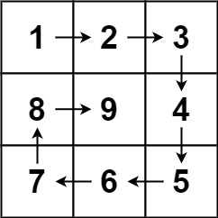

## Problem

Given a positive integer `n`, generate an `n x n` `matrix` filled with elements from `1` to `n²` in spiral order.

<https://leetcode.cn/problems/spiral-matrix-ii/>

**Example 1:**





> Input: `n = 3`
> Output: `[[1,2,3],[8,9,4],[7,6,5]]`

**Example 2:**

> Input: `n = 1`
> Output: `[[1]]`

**Constraints:**

- `1 <= n <= 20`

## Test Cases

``` python
class Solution:
    def generateMatrix(self, n: int) -> List[List[int]]:
```



## Thoughts

跟 [54. Spiral Matrix](../54-spiral-matrix/index.md) 类似，完全一样的遍历顺序，只是读出还是写入的区别。直接把代码搬过来，把 `res[idx] = matrix[i][j]` 替换成 `matrix[i][j] = idx + 1`，m 改成 n，基本就可以了。

## Code


