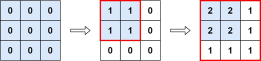

## Problem

You are given an `m x n` matrix `M` initialized with all `0`'s and an array of operations `ops`, where `ops[i] = [aᵢ, bᵢ]` means `M[x][y]` should be incremented by one for all `0 <= x < aᵢ` and `0 <= y < bᵢ`.

Count and return _the number of maximum integers in the matrix after performing all the operations_.

<https://leetcode.cn/problems/range-addition-ii/>

**Example 1:**

{.invert-when-dark}

> Input: `m = 3, n = 3, ops = [[2,2],[3,3]]`
> Output: `4`
> Explanation: The maximum integer in M is 2, and there are four of it in M. So return 4.

**Example 2:**

> Input: `m = 3, n = 3, ops = [[2,2],[3,3],[3,3],[3,3],[2,2],[3,3],[3,3],[3,3],[2,2],[3,3],[3,3],[3,3]]`
> Output: `4`

**Example 3:**

> Input: `m = 3, n = 3, ops = []`
> Output: `9`

**Constraints:**

- `1 <= m, n <= 4 * 10⁴`
- `0 <= ops.length <= 10⁴`
- `ops[i].length == 2`
- `1 <= aᵢ <= m`
- `1 <= bᵢ <= n`

## Test Cases

```python
class Solution:
    def maxCount(self, m: int, n: int, ops: List[List[int]]) -> int:
```



## Thoughts

如果 ops 为空，则初始的整个数组都是最大值（0），大小为 `m * n`。否则取 ops 中最小的 `aᵢ` 和最小的 `bᵢ` 围成的矩形，是每一次 op 都会执行加一操作的区域。

时间复杂度 `O(m * n)`，空间复杂度 `O(1)`。

## Code


