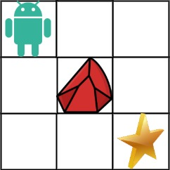

## Problem

You are given an `m x n` integer array `grid`. There is a robot initially located at the **top-left corner** (i.e., `grid[0][0]`). The robot tries to move to the **bottom-right corner** (i.e., `grid[m - 1][n - 1]`). The robot can only move either down or right at any point in time.

An obstacle and space are marked as `1` or `0` respectively in `grid`. A path that the robot takes cannot include **any** square that is an obstacle.

Return _the number of possible unique paths that the robot can take to reach the bottom-right corner_.

The testcases are generated so that the answer will be less than or equal to `2 * 10⁹`.

<https://leetcode.cn/problems/unique-paths-ii/>

**Example 1:**





> Input: `obstacleGrid = [[0,0,0],[0,1,0],[0,0,0]]`
> Output: `2`
> Explanation: There is one obstacle in the middle of the `3x3` grid above.
> There are two ways to reach the bottom-right corner:
>
> 1. Right -> Right -> Down -> Down
> 2. Down -> Down -> Right -> Right

**Example 2:**





> Input: `obstacleGrid = [[0,1],[0,0]]`
> Output: `1`

**Constraints:**

- `m == obstacleGrid.length`
- `n == obstacleGrid[i].length`
- `1 <= m, n <= 100`
- `obstacleGrid[i][j]` is `0` or `1`.

## Test Cases

``` python
class Solution:
    def uniquePathsWithObstacles(self, obstacleGrid: List[List[int]]) -> int:
```



## Thoughts

[62. Unique Paths](62-unique-paths) 的进阶版，有些位置会有障碍物。

因为障碍物是随意摆放的，就没法直接用组合数计算了，可以按照普通的动态规划的方法计算，根据障碍物的特性调整一下状态转移公式。

显然如果格子 `(i, j)` 有障碍物，那么 `u[i][j]` 就只能是 0，否则就按照 [62. Unique Paths](62-unique-paths) 中的递推式子计算即可。

时间复杂度 `O(m * n)`，空间复杂度 `O(n)`。

## Code


