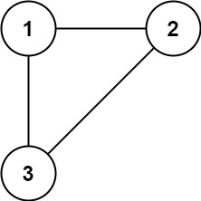
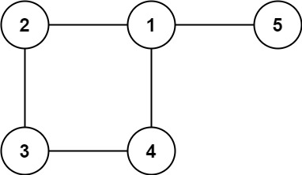

## Problem

In this problem, a tree is an **undirected graph** that is connected and has no cycles.

You are given a graph that started as a tree with `n` nodes labeled from `1` to `n`, with one additional edge added. The added edge has two **different** vertices chosen from `1` to `n`, and was not an edge that already existed. The graph is represented as an array `edges` of length `n` where `edges[i] = [aᵢ, bᵢ]` indicates that there is an edge between nodes `aᵢ` and `bᵢ` in the graph.

Return _an edge that can be removed so that the resulting graph is a tree of_ `n` _nodes_. If there are multiple answers, return the answer that occurs last in the input.

<https://leetcode.com/problems/redundant-connection/>

**Example 1:**





> Input: `edges = [[1,2],[1,3],[2,3]]`
> Output: `[2,3]`

**Example 2:**





> Input: `edges = [[1,2],[2,3],[3,4],[1,4],[1,5]]`
> Output: `[1,4]`

**Constraints:**

- `n == edges.length`
- `3 <= n <= 1000`
- `edges[i].length == 2`
- `1 <= aᵢ < bᵢ <= edges.length`
- `aᵢ != bᵢ`
- There are no repeated edges.
- The given graph is connected.

## Test Cases

``` python
class Solution:
    def findRedundantConnection(self, edges: List[List[int]]) -> List[int]:
```



## Thoughts

开始就直接用类似 [1591. Strange Printer II](1591-strange-printer-ii) 或 [207. Course Schedule](207-course-schedule) 中提到的方法判断给定的图中是否有环。当然一定有环，而发现环的那条边就是环上的一条边，可以删掉。

结果发现题目要求如果有多个可行解，需要返回给定的边中最后出现的那条。有点儿麻烦，而且还要再花不少额外的处理时间。

另一个直观的想法是维护能连通到一起的点集。按顺序扫描所有的边，如果某条边的两个顶点本来就已经是连通的，说明这条边是冗余的。显然再之后的边都不可能是冗余的。

开始想自己用多个顶点的集合来维护各个连通的点集，但复杂度大约在 `O(n²)`。

实际上这个就是「并查集」结构的典型应用场景（[Disjoint-set data structure](https://en.wikipedia.org/wiki/Disjoint-set_data_structure)），支持查询（find）和添加（union）操作。神奇的是平均情况下，find 和 union 方法的时间复杂度都接近 `O(1)`（最坏情况 `O(log n)`）。

整体平均时间复杂度 `O(n)`，空间复杂度 `O(1)`。

## Code


