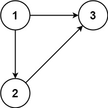
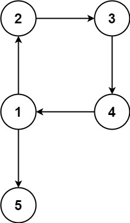

## Problem

In this problem, a rooted tree is a **directed** graph such that, there is exactly one node (the root) for which all other nodes are descendants of this node, plus every node has exactly one parent, except for the root node which has no parents.

The given input is a directed graph that started as a rooted tree with `n` nodes (with distinct values from `1` to `n`), with one additional directed edge added. The added edge has two different vertices chosen from `1` to `n`, and was not an edge that already existed.

The resulting graph is given as a 2D-array of `edges`. Each element of `edges` is a pair `[uᵢ, vᵢ]` that represents a **directed** edge connecting nodes `uᵢ` and `vᵢ`, where `uᵢ` is a parent of child `vᵢ`.

Return _an edge that can be removed so that the resulting graph is a rooted tree of_ `n` _nodes_. If there are multiple answers, return the answer that occurs last in the given 2D-array.

<https://leetcode.com/problems/redundant-connection-ii/>

**Example 1:**

{.invert-when-dark}

> Input: `edges = [[1,2],[1,3],[2,3]]`
> Output: `[2,3]`

**Example 2:**

{.invert-when-dark}

> Input: `edges = [[1,2],[2,3],[3,4],[4,1],[1,5]]`
> Output: `[4,1]`

**Constraints:**

- `n == edges.length`
- `3 <= n <= 1000`
- `edges[i].length == 2`
- `1 <= uᵢ, vᵢ <= n`
- `uᵢ != vᵢ`

## Test Cases

```python
class Solution:
    def findRedundantDirectedConnection(self, edges: List[List[int]]) -> List[int]:
```



## Thoughts

[684. Redundant Connection](../684-redundant-connection/index.md) 的进阶版，从无向图变为有向图。

如果忽略边的方向，冗余的边依然会导致图中出现环，但在有向图中并不是任何一条边都可以被删掉。比如 `edges = [[2,1], [3,1], [4,2], [1,4]]`，环 `1 → 4 → 2 → 1` 上的边 `(1, 4)` 和 `(4, 2)` 都不是冗余的。

::: invert-when-dark

:::

在有向图中，冗余的边可能会导致某个节点的入度为 2（如 Example 1 和上边的 case）。这种情况下，冗余边一定是两条入边中的某一条。显然这两条入边，一定有一条在（忽略边方向的）环上，而另一条不在。把在环上的那条删掉就行。关键在于如果判断哪条边在环上。

先找入度为 2 的节点。只需要遍历所有的边，记录每个节点的父节点，找到有两个父节点的节点。对应的两条入边，按遇到的先后顺序，记为 `e1` 和 `e2`。

有可能不存在入度为 2 的节点，那么直接忽略边的方向，利用并查集（disjoint set）找到图中的环，产生环的最后一条边就是所求的冗余边。

如果存在入度为 2 的节点，可以先假设其中一条入边不存在（不妨假设 `e2` 不存在），尝试在图中找环。如果没找到环，说明 `e2` 就在环上，它就是所求的冗余边。如果能找到环，说明 `e2` 本就不在环上，那么 `e1` 一定在环上，`e1` 是所求的冗余边。

## Code


