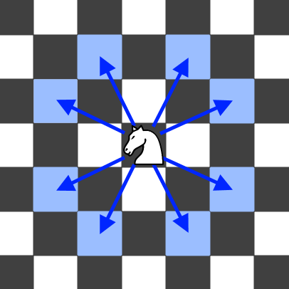

## Problem

On an `n x n` chessboard, a knight starts at the cell `(row, column)` and attempts to make exactly `k` moves. The rows and columns are **0-indexed**, so the top-left cell is `(0, 0)`, and the bottom-right cell is `(n - 1, n - 1)`.

A chess knight has eight possible moves it can make, as illustrated below. Each move is two cells in a cardinal direction, then one cell in an orthogonal direction.



Each time the knight is to move, it chooses one of eight possible moves uniformly at random (even if the piece would go off the chessboard) and moves there.

The knight continues moving until it has made exactly `k` moves or has moved off the chessboard.

Return _the probability that the knight remains on the board after it has stopped moving_.

<https://leetcode.cn/problems/knight-probability-in-chessboard/>

**Example 1:**

> Input: `n = 3, k = 2, row = 0, column = 0`
> Output: `0.06250`
> Explanation: There are two moves (to `(1,2)`, `(2,1)`) that will keep the knight on the board.
> From each of those positions, there are also two moves that will keep the knight on the board.
> The total probability the knight stays on the board is 0.0625.

**Example 2:**

> Input: `n = 1, k = 0, row = 0, column = 0`
> Output: `1.00000`

**Constraints:**

- `1 <= n <= 25`
- `0 <= k <= 100`
- `0 <= row, column <= n - 1`

## Test Cases

``` python
class Solution:
    def knightProbability(self, n: int, k: int, row: int, column: int) -> float:
```



## Thoughts

从初始位置开始，遍历八个可能的移动位置，对于每个新位置，递归计算从该位置开始继续移动 `k - 1` 步仍在棋盘上的概率。最后八个概率求均值即可。

很慢，时间复杂度 `O(8ᵏ)`。

给递归函数加了 [缓存](https://docs.python.org/3/library/functools.html#functools.cache)，速度还挺快，97%。缓存使用的空间大约为 `O(k * n²)`，而时间复杂度大约降到 `O(k * n²)`，因为最多对于 0 到 k 的每一个值、棋盘上的每个位置（n² 个）都要计算一次。

也可以用动态规划，但不一定真的快，因为浪费的计算比较多啊。令 `dp(pos, i)` 是从棋盘上 `pos = (r, c)` 位置开始，走 i 步之后仍在棋盘上的概率。

可知 `dp(pos, i) = Σdp(move(pos), i - 1) / 8`。其中 `move(pos)` 是从 `pos = (r, c)` 移动一步之后的位置（共八种移动方案）。

时间复杂度 `O(k * n²)`，空间复杂度 `O(n²)`（因为只需要保留 i 和 `i - 1` 两层 `dp` 值）。实际速度也差不多在 97%。

## Code

### Backtrack with Cache



### DP


