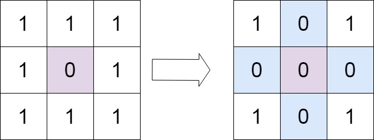
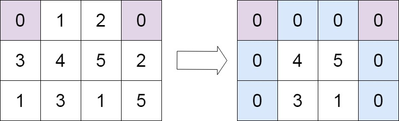

## Problem

Given an `m x n` integer matrix `matrix`, if an element is `0`, set its entire row and column to `0`'s.

You must do it [in place](https://en.wikipedia.org/wiki/In-place_algorithm).

<https://leetcode.com/problems/set-matrix-zeroes/>

**Example 1:**

{.invert-when-dark}

> Input: `matrix = [[1,1,1],[1,0,1],[1,1,1]]`
> Output: `[[1,0,1],[0,0,0],[1,0,1]]`

**Example 2:**

{.invert-when-dark}

> Input: `matrix = [[0,1,2,0],[3,4,5,2],[1,3,1,5]]`
> Output: `[[0,0,0,0],[0,4,5,0],[0,3,1,0]]`

**Constraints:**

- `m == matrix.length`
- `n == matrix[0].length`
- `1 <= m, n <= 200`
- `-2³¹ <= matrix[i][j] <= 2³¹ - 1`

**Follow up:**

- A straightforward solution using `O(mn)` space is probably a bad idea.
- A simple improvement uses `O(m + n)` space, but still not the best solution.
- Could you devise a constant space solution?

## Test Cases

```python
class Solution:
    def setZeroes(self, matrix: List[List[int]]) -> None:
        """
        Do not return anything, modify matrix in-place instead.
        """
```



## Thoughts

用长为 `m` 的数组记录哪一行需要换成 `0`，长为 `n` 的数组记录哪一列需要换成 `0`。

遍历一遍 `grid`，如果 `grid[i][j]` 是 `0`，则标记 i 行和 j 列。

再遍历一遍 `grid`，根据行和列的标记，将需要替换的格子的值改成 `0`。

时间复杂度 `O(mn)`，空间复杂度 `O(m+n)`。

## Code



## Follow Up

可以直接用 `matrix` 的第一行和第一列记录需要全部换成 `0` 的列和行。唯一需要注意的是 `matrix[0][0]` 是公共的元素，为了避免冲突，可以用单独的变量记录第一行和第一列是否需要换。


