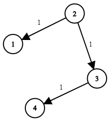

## Problem

You are given a network of `n` nodes, labeled from `1` to `n`. You are also given `times`, a list of travel times as directed edges `times[i] = (uᵢ, vᵢ, wᵢ)`, where `uᵢ` is the source node, `vᵢ` is the target node, and `wᵢ` is the time it takes for a signal to travel from source to target.

We will send a signal from a given node `k`. Return _the **minimum** time it takes for all the_ `n` _nodes to receive the signal_. If it is impossible for all the `n` nodes to receive the signal, return `-1`.

<https://leetcode.cn/problems/network-delay-time/>

**Example 1:**





> Input: `times = [[2,1,1],[2,3,1],[3,4,1]], n = 4, k = 2`
> Output: `2`

**Example 2:**

> Input: `times = [[1,2,1]], n = 2, k = 1`
> Output: `1`

**Example 3:**

> Input: `times = [[1,2,1]], n = 2, k = 2`
> Output: `-1`

**Constraints:**

- `1 <= k <= n <= 100`
- `1 <= times.length <= 6000`
- `times[i].length == 3`
- `1 <= uᵢ, vᵢ <= n`
- `uᵢ != vᵢ`
- `0 <= wi <= 100`
- All the pairs `(uᵢ, vᵢ)` are **unique**. (i.e., no multiple edges.)

## Test Cases

``` python
class Solution:
    def networkDelayTime(self, times: List[List[int]], n: int, k: int) -> int:
```



## Thoughts

记信号传输到节点 i 所需的最小时间为 `c(i)`。初始时 `c(k) = 0`，其他均为 `∞`。

从节点 k 出发遍历图。如果信号从 u 传播到 v，易知 `c(v) = min{c(v), c(u) + w(u, v)}`。如果 `c(v)` 被更新（发现了能更快传播到 v 的路径），继续递归处理 v 的下游节点。

使用广度优先遍历有可能得到更多的剪枝，广度优先可以用队列。尤其如果使用带优先级的队列，每次处理信号最早到达的节点，能加大剪枝的概率。最小堆是很适合的数据结构，堆顶就是最快到达的节点，每次把堆顶推出。

> 做完 [2290. Minimum Obstacle Removal to Reach Corner](2290-minimum-obstacle-removal-to-reach-corner) 发现其实就是实现了 Dijkstra 算法（基于优先队列优化的）。

时间复杂度 `O((e + n) log n)`（每个节点进入队列时要恢复堆的结构），空间复杂度 `O(n)`（队列大小）。`e` 是边的数量，即 `times` 数组的长度。

## Code

> 这里直接借助 Python 自带的 [heapq](https://docs.python.org/3/library/heapq.html) 辅助堆的操作。


