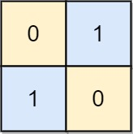

## Problem

You are given an `n x n` binary grid `board`. In each move, you can swap any two rows with each other, or any two columns with each other.

Return _the minimum number of moves to transform the board into a **chessboard board**_. If the task is impossible, return `-1`.

A **chessboard board** is a board where no `0`'s and no `1`'s are 4-directionally adjacent.

<https://leetcode.cn/problems/transform-to-chessboard/>

**Example 1:**





> Input: `board = [[0,1,1,0],[0,1,1,0],[1,0,0,1],[1,0,0,1]]`
> Output: `2`
> Explanation: One potential sequence of moves is shown.
> The first move swaps the first and second column.
> The second move swaps the second and third row.

**Example 2:**





> Input: `board = [[0,1],[1,0]]`
> Output: `0`
> Explanation: Also note that the board with 0 in the top left corner, is also a valid chessboard.

**Example 3:**





> Input: `board = [[1,0],[1,0]]`
> Output: `-1`
> Explanation: No matter what sequence of moves you make, you cannot end with a valid chessboard.

**Constraints:**

- `n == board.length`
- `n == board[i].length`
- `2 <= n <= 30`
- `board[i][j]` is either `0` or `1`.

## Test Cases

``` python
class Solution:
    def movesToChessboard(self, board: List[List[int]]) -> int:
```



## Thoughts

先看第一行。其中 `0` 的个数和 `1` 个数必须相等（对于偶数 n）或者刚好相差 1（对于奇数 n），否则就无法变为棋盘。

第一列也是一样的。

然后看后续的每一行，只能有两个可能，要么跟第一行完全一致，要么跟第一行完全互补（`0` 和 `1` 互补）。否则也无法变为棋盘。

按照此条件检查完所有行如果成功，所有列也就自动符合相同要求，不用额外检查。

以上条件都符合的话，`board` 一定可以变为棋盘，否则不行。

再看第一行，看其中不在正确位置的 `0` 和 `1` 有多少个，该个数除以 2 就是复原所需要的列交换次数。有个问题是正确的位置应该是什么。

当 n 是奇数时，如果这行中 `1` 的个数多，则正确的排列是 `1 - 0 - 1 - ... - 0 - 1`，否则是 `0 - 1 - 0 - ... - 1 - 0`。

当 n 是偶数时，正确的排列是 `0 - 1 - 0 - ... - 0 - 1` 或者 `1 - 0 - 1 - ... - 1 - 0`。两种情况对应的排列错误数量（相加等于 n）取较小的即可。

再用同样方法计算第一列中不在正确位置的 `0` 和 `1` 的个数，除以 2 是需要的行交换次数。

最终总共所需的交换次数为 `列交换次数 + 行交换次数`。

## Code


