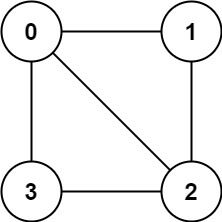
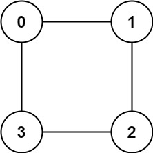

## Problem

There is an **undirected** graph with `n` nodes, where each node is numbered between `0` and `n - 1`. You are given a 2D array `graph`, where `graph[u]` is an array of nodes that node `u` is adjacent to. More formally, for each `v` in `graph[u]`, there is an undirected edge between node `u` and node `v`. The graph has the following properties:

- There are no self-edges (`graph[u]` does not contain `u`).
- There are no parallel edges (`graph[u]` does not contain duplicate values).
- If `v` is in `graph[u]`, then `u` is in `graph[v]` (the graph is undirected).
- The graph may not be connected, meaning there may be two nodes `u` and `v` such that there is no path between them.

A graph is **bipartite**（二分图） if the nodes can be partitioned into two independent sets `A` and `B` such that **every** edge in the graph connects a node in set `A` and a node in set `B`.

Return `true` _if and only if it is **bipartite**_.

<https://leetcode.com/problems/is-graph-bipartite/>

**Example 1:**

{.invert-when-dark}

> Input: `graph = [[1,2,3],[0,2],[0,1,3],[0,2]]`
> Output: `false`
> Explanation: There is no way to partition the nodes into two independent sets such that every edge connects a node in one and a node in the other.

**Example 2:**

{.invert-when-dark}

> Input: `graph = [[1,3],[0,2],[1,3],[0,2]]`
> Output: `true`
> Explanation: We can partition the nodes into two sets: `{0, 2}` and `{1, 3}`.

**Constraints:**

- `graph.length == n`
- `1 <= n <= 100`
- `0 <= graph[u].length < n`
- `0 <= graph[u][i] <= n - 1`
- `graph[u]` does not contain `u`.
- All the values of `graph[u]` are **unique**.
- If `graph[u]` contains `v`, then `graph[v]` contains `u`.

## Test Cases

```python
class Solution:
    def isBipartite(self, graph: List[List[int]]) -> bool:
```



## Thoughts

可以尝试给图中所有顶点染色（设有红色和蓝色两种颜色）。如果一个顶点染成红色，那么跟它相邻的顶点就只能染成蓝色，反之亦然。如果存在一个顶点，跟它相邻的顶点中，同时有至少一个红色和至少一个蓝色，图就不是二部图。

任选一个顶点出发对图做遍历（DFS 或 BFS），给相邻的顶点染相对的颜色，如果发现冲突就说明不是二部图。记录已经染过色的顶点的颜色，如果一个连通子图处理完，还有未染色的顶点就再任取一个继续遍历。

## Code


