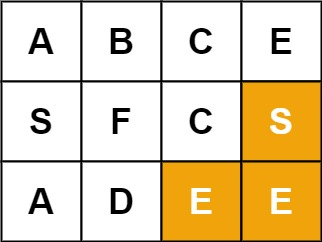

## Problem

Given an `m x n` grid of characters `board` and a string `word`, return `true` _if_ `word` _exists in the grid_.

The word can be constructed from letters of sequentially adjacent cells, where adjacent cells are horizontally or vertically neighboring. The same letter cell may not be used more than once.

<https://leetcode.com/problems/word-search/>

**Example 1:**

{.invert-when-dark}

> Input: `board = [["A","B","C","E"],["S","F","C","S"],["A","D","E","E"]], word = "ABCCED"`
> Output: `true`

**Example 2:**

{.invert-when-dark}

> Input: `board = [["A","B","C","E"],["S","F","C","S"],["A","D","E","E"]], word = "SEE"`
> Output: `true`

**Example 3:**

{.invert-when-dark}

> Input: `board = [["A","B","C","E"],["S","F","C","S"],["A","D","E","E"]], word = "ABCB"`
> Output: `false`

**Constraints:**

- `m == board.length`
- `n = board[i].length`
- `1 <= m, n <= 6`
- `1 <= word.length <= 15`
- `board` and `word` consists of only lowercase and uppercase English letters.

**Follow up:** Could you use search pruning to make your solution faster with a larger `board`?

## Test Cases

``` python
class Solution:
    def exist(self, board: List[List[str]], word: str) -> bool:
```



## Thoughts

直接递归回溯。

从值等于 `word[0]` 的 cell 开始，看上下左右四个，对每个等于 `word[1]` 的 cell 递归处理。

为了避免同一个 cell 被使用多次，可以用一个集合记录当前用到的 cells 的坐标，递归的时候判定是否已经用过了。也可以临时把用到的 cell 的值设置为一个非法值（如空字符串），避免再次被匹配上，注意检查完要还原回去。

设 `word` 的长度为 `w`，时间复杂度为 `O(m * n * 4ʷ)`，空间复杂度 `O(w)`（递归调用深度）。

## Code



## Follow up - Pruning

复杂度高在 `4ʷ` 这里，随着 `word` 长度的增加而指数级增大。

开始想着如果扫描过程中，知道某个 cell 无法串出 `word[k:]`，下次在通过其他路径扫描到这个 cell 时，可以快速裁剪掉。不过似乎不可行，因为 `word` 中可能有重复出现的字符，前一次无法串出可能是因为当时的前半截把一些字符占用了，如果换一个起点是有可能成功的。

比如下图的 `board`，目标 `word = "ABCDA"`。

::: invert-when-dark

:::

从 `board[0][1] = 'A'` 出发时，会发现 `board[1][1] = 'B'` 无法串出 `word[1:] = "BCDA"`；但是如果从 `board[1][0] = 'A'` 出发却可以。

只有当 `word[k:]` 不包含 `word[:k]` 中任何字符时才可以应用此裁剪。

如果只是 `board` 大，似乎影响不大？`w` 不变的时候，时间是跟 `m * n` 成正比的。

TODO
