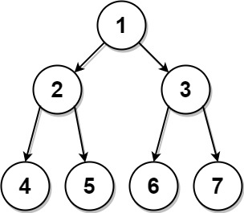

## Problem

Given two integer arrays, `preorder` and `postorder` where `preorder` is the preorder traversal of a binary tree of **distinct** values and `postorder` is the postorder traversal of the same tree, reconstruct and return _the binary tree_.

If there exist multiple answers, you can **return any** of them.

<https://leetcode.com/problems/construct-binary-tree-from-preorder-and-postorder-traversal/>

**Example 1:**





> Input: `preorder = [1,2,4,5,3,6,7], postorder = [4,5,2,6,7,3,1]`
> Output: `[1,2,3,4,5,6,7]`

**Example 2:**

> Input: `preorder = [1], postorder = [1]`
> Output: `[1]`

**Constraints:**

- `1 <= preorder.length <= 30`
- `1 <= preorder[i] <= preorder.length`
- All the values of `preorder` are **unique**.
- `postorder.length == preorder.length`
- `1 <= postorder[i] <= postorder.length`
- All the values of `postorder` are **unique**.
- It is guaranteed that `preorder` and `postorder` are the preorder traversal and postorder traversal of the same binary tree.

## Test Cases

``` python
# Definition for a binary tree node.
# class TreeNode:
#     def __init__(self, val=0, left=None, right=None):
#         self.val = val
#         self.left = left
#         self.right = right
class Solution:
    def constructFromPrePost(self, preorder: List[int], postorder: List[int]) -> Optional[TreeNode]:
```



## Thoughts

跟 [105. Construct Binary Tree from Preorder and Inorder Traversal](105-construct-binary-tree-from-preorder-and-inorder-traversal) 类似，都是给两个不同顺序的遍历结果，构造出二叉树。

本题给的是前序（pre-order，NLR）和后序（post-order，LRN）。当一个节点只有一个子节点时，这两种遍历顺序都无法识别出是左子节点还是右子节点，那么就优先按左子节点算（类似 [1028. Recover a Tree From Preorder Traversal](1028-recover-a-tree-from-preorder-traversal)）。

前序（pre-order，NLR），后序（post-order，LRN）。

``` text
NLR: N-LEFTSUBTREE-RIGHTSUBTREE
     ╰------------------------╮
LRN: LEFTSUBTREE-RIGHTSUBTREE-N
```

NLR 第一个数就是整棵二叉树的根节点，而 LRN 第一个数是整棵二叉树最靠左的节点。NLR 从第一个数字开始，直到遇见 LRN 第一个数字，应该就是从根节点到最左节点的路径。

例子：

``` text
NLR: 3, 4, 1, 6, 7, 2, 8, 5
LRN: 7, 6, 1, 8, 2, 4, 5, 3
```

显然 NLR 的前几个数字 3、4、1、6、7 是最左的一条路径（不排除有些其实是右子节点，但如上边所说，当只有一个子节点时都按左子节点算），7 是叶子节点。为了遍于之后能够再找到这些节点并为它们设置右子节点，需要在遇到的时候就压入栈（最后的 7 不用入栈，因为可知它是叶子节点）。

``` text
                 ↓
NLR: 3, 4, 1, 6, 7, 2, 8, 5
LRN: 7, 6, 1, 8, 2, 4, 5, 3
     ↑
```





LRN 的下一个数字 6，跟栈顶一致，说明 6 没有其他子节点，直接出栈。再下一个数字 1 又跟新的栈顶一致，说明 1 也没有右子节点，出栈。再下一个数字 8 跟新的栈顶 4 不一致，说明 8 是 4 的右子树的最靠左的节点。

``` text
                 ↓
NLR: 3, 4, 1, 6, 7, 2, 8, 5
LRN: 7, 6, 1, 8, 2, 4, 5, 3
              ↑
```





继续看 NLR 中 7 后边的数字，直到遇到 8（LRN 的当前数字），得到 2、8，说明这是 4 的右子树的最左边的路径，即 2 是 4 的右子节点，8 是 2 的左子节点（且是叶子节点）。

``` text
                       ↓
NLR: 3, 4, 1, 6, 7, 2, 8, 5
LRN: 7, 6, 1, 8, 2, 4, 5, 3
              ↑
```





LRN 的后边两个数字 2、4 分别跟栈顶部的两个数字一致，说明 2 和 4 都没有其他子节点，直接出栈。

``` text
                       ↓
NLR: 3, 4, 1, 6, 7, 2, 8, 5
LRN: 7, 6, 1, 8, 2, 4, 5, 3
                       ↑
```





NLR 的下一个数字和 LRN 的下一个数字都是 5，说明 5 就是当前栈顶 3 右子树的唯一节点。

``` text
                          ↓
NLR: 3, 4, 1, 6, 7, 2, 8, 5
LRN: 7, 6, 1, 8, 2, 4, 5, 3
                       ↑
```





NLR 已经扫描完毕，而 LRN 的最后一个数字一定等于 NLR 的第一个数字，即为树根。二叉树构造完成。

根据上边例子，整理出构建二叉树的处理逻辑：

1. 从 `i = 0`、`j = 0` 开始扫描 NLR 和 LRN。创建一个虚拟初始节点放在栈里（简化边界处理）。
2. 创建节点，其值为 `NLR[i]`。
3. 当前栈顶节点即为新节点的父节点，看栈顶节点是否已经有了左子节点，如果没有则令新节点为其左子节点，否则令新节点为其右子节点。
4. 新节点入栈。
5. 如果栈顶节点的值等于 `LRN[j]`，出栈，右移 j。重复此检查直到 `j >= n` 或者栈顶节点的值不等于 `LRN[j]`。
6. 右移 i。
7. 回到 2 重复，直到 NLR 扫描完成。

## Code


