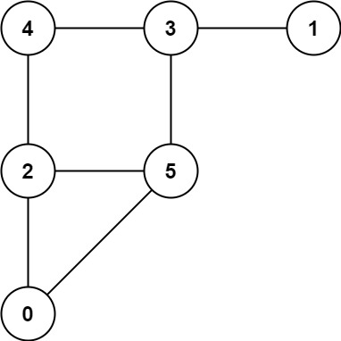
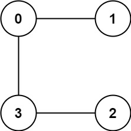

## Problem

A game on an **undirected** graph is played by two players, Mouse and Cat, who alternate turns.

The graph is given as follows: `graph[a]` is a list of all nodes `b` such that `ab` is an edge of the graph.

The mouse starts at node `1` and goes first, the cat starts at node `2` and goes second, and there is a hole at node `0`.

During each player's turn, they **must** travel along one edge of the graph that meets where they are.  For example, if the Mouse is at node 1, it **must** travel to any node in `graph[1]`.

Additionally, it is not allowed for the Cat to travel to the Hole (node `0`).

Then, the game can end in three ways:

- If ever the Cat occupies the same node as the Mouse, the Cat wins.
- If ever the Mouse reaches the Hole, the Mouse wins.
- If ever a position is repeated (i.e., the players are in the same position as a previous turn, and it is the same player's turn to move), the game is a draw.

Given a `graph`, and assuming both players play optimally, return

- `1` if the mouse wins the game,
- `2` if the cat wins the game, or
- `0` if the game is a draw.

<https://leetcode.com/problems/cat-and-mouse/>

**Example 1:**





> Input: `graph = [[2,5],[3],[0,4,5],[1,4,5],[2,3],[0,2,3]]`
> Output: `0`

**Example 2:**





> Input: `graph = [[1,3],[0],[3],[0,2]]`
> Output: `1`

**Constraints:**

- `3 <= graph.length <= 50`
- `1 <= graph[i].length < graph.length`
- `0 <= graph[i][j] < graph.length`
- `graph[i][j] != i`
- `graph[i]` is unique.
- The mouse and the cat can always move.

## Test Cases

``` python
class Solution:
    def catMouseGame(self, graph: List[List[int]]) -> int:
```



## Thoughts

用一个三元组表示游戏的任何一个状态：`state = (mouse, cat, moving)` 分别是老鼠所在位置、猫所在位置、当前该谁移动。

初始状态可以表示为 `initial = (1, 2, MOUSE)`，即老鼠在顶点 1 且先移动，猫在顶点 2。

对于任意的正整数 i（`0 < i < n`），有 `(0, i, CAT)` 状态是老鼠赢（`(0, i, MOUSE)` 状态没意义），`(i, i, *)` 状态是猫赢。

对于轮到老鼠移动的任意状态 `state = (mouse, cat, MOUSE)`，下游状态为 `(∀graph[mouse], cat, CAT)`，上游状态为 `(mouse, ∀graph[cat], CAT)`（为简单起见，不妨设 `graph[cat]` 已经去掉了 0）。

对于轮到猫移动的任意状态 `state = (mouse, cat, CAT)`，下游状态为 `(mouse, ∀graph[cat], MOUSE)`，上游状态为 `(∀graph[mouse], cat, MOUSE)`。

对于任意一个状态，递归判定所有下游状态所能导致的游戏结果，如果 **有一个** 下游状态是当前移动者可以赢，那么当前状态就是它赢；如果 **所有** 下游状态都是对方赢，那么当前状态就是对方赢；其他情况都是平局。按此思路可以写出如下的递归逻辑：



``` python
@cache
def dfs(mouse: int, cat: int, moving: int) -> int:
    if mouse == 0: return 1 # The mouse reaches to the hole.
    elif cat == mouse: return 2 # The cat catches the mouse.

    if moving == MOUSE:
        results = [dfs(node, cat, False) for node in graph[mouse]]
    else:
        results = [dfs(mouse, node, True) for node in graph[cat] if node != 0]

    return judge(results, moving)

dfs(1, 2, MOUSE)
```



但是这样会陷入无限递归，解不出来。

考虑从确定结果的状态倒推。

如果已知某个状态 state 的 **最终** 赢家是动物 A（输了的动物记作 B）（注意这里说的是 A 最终能赢，并不需要在 state 状态当下就是赢的），而上游状态的移动者就是 A（state 状态该 B 移动了），（且上游状态的赢家尚不确定，）那么显然上游状态的 **最终** 赢家也是 A。

> 比如 `(i, i, MOUSE)` 是猫赢，那么「所有」上游状态 `(i, ∀graph[i], CAT)` 都是猫 **最终** 能赢。
>
> 比如 `(0, i, CAT)` 是老鼠赢，那么「所有」上游状态 `(∀graph[0], i, MOUSE)` 都是老鼠 **最终** 能赢。
>
> > 注意即使 `i ∈ graph[0]`，并不意味 `(i, i, MOUSE)` 也是老鼠赢（显然是 **猫** 赢）。所以这里「所有」加了引号，实际上是「所有尚不确定最终结果的」。

而如果上游状态（记为 `p_state`）的移动者是 B，就要检查 `p_state` 的所有下游状态，如果所有下游状态的赢家都是 A，那么 `p_state` 的 **最终** 赢家也是 A。

> 比如 `(i, i, CAT)` 是猫赢，那么对于某个上游状态 `p_state = (j ∈ graph[i], i, MOUSE)`，如果 `p_state` 的 **所有** 下游状态 `(∀graph[j], i, CAT)` 都是猫 **最终** 能赢，那么 `p_state` 也是猫 **最终** 能赢。

当然如果 `p_state` 的某个/些下游状态的最终赢家尚不确定，那么 `p_state` 的最终赢家也暂时无法确定。

> 可见这里的推理跟上边正向递归的推理是完全一致的，只是这里避免了无限递归。只需要事先记录每个状态的下游状态数量，每有一个下游状态的结果被确定时，就给这个数量减一；当值降为 0 时，说明所有下游状态的结果都被确定了（根据处理逻辑，显然这种情况下所有下游状态的结果都是对方能赢）。

用一个任务队列记录所有能明确 **最终** 赢家的状态，不断地处理队列中的状态，当推算出新的确定了 **最终** 赢家的状态时，也把该状态加入队列等待处理。直到任务队列为空时结束。

最终所有未被确定 **最终** 赢家的状态都是平局。

最后检查初始状态 `initial = (1, 2, MOUSE)` 是否得到了确定的结果即可。

不同的状态的量级为 `O(n²)`。最坏情况下需要对每个状态遍历其所有上游状态和下游状态，一个状态的上游和下游状态数量取决于该状态老鼠和猫所在顶点的度数，`O(n * degree) = O(E)`，所以 `O(n² * degree) = O(n * E)`。整体时间复杂度 `O(n * E)`，空间复杂度 `O(n²)`。

## Code


