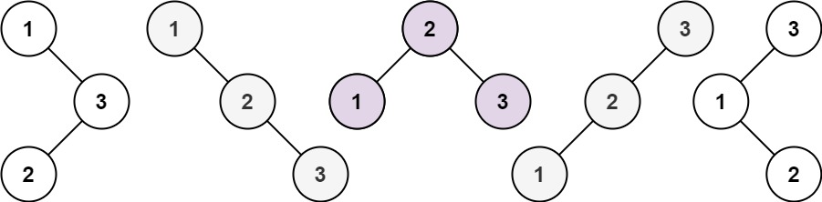

## Problem

Given an integer `n`, return _the number of structurally unique **BST**'s (binary search trees) which has exactly_ `n` _nodes of unique values from_ `1` _to_ `n`.

<https://leetcode.com/problems/unique-binary-search-trees/>

**Example 1:**





> Input: n = 3
> Output: 5

**Example 2:**

> Input: n = 1
> Output: 1

**Constraints:**

- `1 <= n <= 19`

## Test Cases

``` python
class Solution:
    def numTrees(self, n: int) -> int:
```



## Thoughts

定义 `f(i)` 表示 1 到 i 所能组成的二叉搜索树的个数。初值 `f(0) = 1`，题目所求结果为 `f(n)`。

1 到 i 的每个数字都可以作为根节点。假设以 k 作为根节点，那么左边有 `k - 1` 个节点，共有 `f(k - 1)` 种 BSTs；右边有 `i - k` 个节点，共有 `f(i - k)` 中 BSTs；所以以 k 为根节点的 BST 共有 `f(k - 1) * f(i - k)` 个。

所以：

$$
f(i)=\sum_{k=1}^i\{f(k-1)\times f(i-k)\}
$$

时间复杂度 `O(n²)`，空间复杂度 `O(n)`。

## Code



## Math

卡塔兰数（[Catalan number](https://en.wikipedia.org/wiki/Catalan_number)）的数学定义是：

$$
\begin{cases}
  C_0=1 \\
  C_n=\sum_{i=1}^n{C_{i-1}C_{n-i}} & \text{for }n>0
\end{cases}
$$

显然上边定义的 `f(n)` 就是卡塔兰数（`f(n) = Cₙ`），可以用数学方法直接计算。

$$
f(n)=C_n=\frac{1}{n+1}\binom{2n}{n}=\frac{(2n)!}{(n+1)!n!}
$$

本题的 n 不是很大，可以直接用 Python 内置的阶乘函数（[`math.factorial`](https://docs.python.org/3/library/math.html#math.factorial)）计算，时间复杂度 `O(n)`，空间复杂度 `O(1)`。如果 n 比较大，也可以参考 [62. Unique Paths](62-unique-paths) 中的 [方法](62-unique-paths#Math) 计算 $\binom{2n}{n}$。


