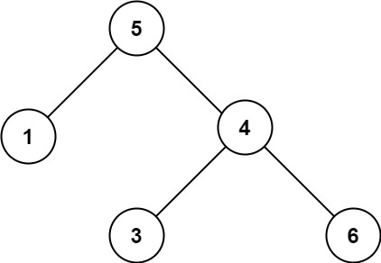

## Problem

Given the `root` of a binary tree, _determine if it is a valid binary search tree (BST)_.

A **valid BST** is defined as follows:

- The left subtree of a node contains only nodes with keys **less than** the node's key.
- The right subtree of a node contains only nodes with keys **greater than** the node's key.
- Both the left and right subtrees must also be binary search trees.

> A **subtree** of `treeName` is a tree consisting of a node in `treeName` and all of its descendants.

<https://leetcode.com/problems/validate-binary-search-tree/>

**Example 1:**





> Input: `root = [2,1,3]`
> Output: `true`

**Example 2:**





> Input: `root = [5,1,4,null,null,3,6]`
> Output: `false`
> Explanation: The root node's value is 5 but its right child's value is 4.

**Constraints:**

- The number of nodes in the tree is in the range `[1, 10⁴]`.
- `-2³¹ <= Node.val <= 2³¹ - 1`

## Test Cases

``` python
# Definition for a binary tree node.
# class TreeNode:
#     def __init__(self, val=0, left=None, right=None):
#         self.val = val
#         self.left = left
#         self.right = right
class Solution:
    def isValidBST(self, root: Optional[TreeNode]) -> bool:
```



## Thoughts

直接按照中序（in-order，LNR）遍历二叉树。如果是 BST，会得到一个严格递增的序列。遍历的时候拿当前节点和前一个节点比较，如果 key 不是严格增大的就不是 BST。

可以用栈和循环替代递归。

## Code


