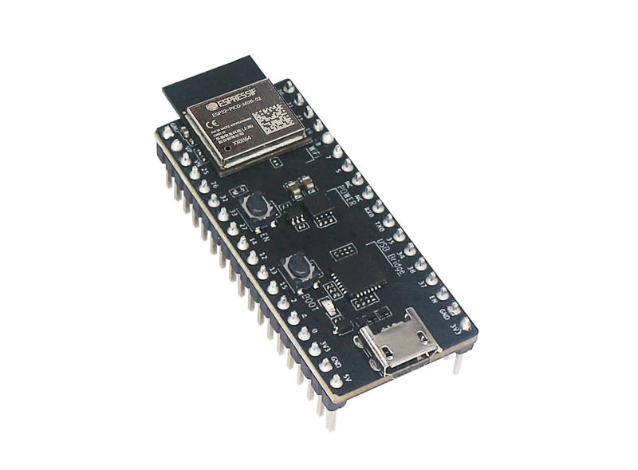
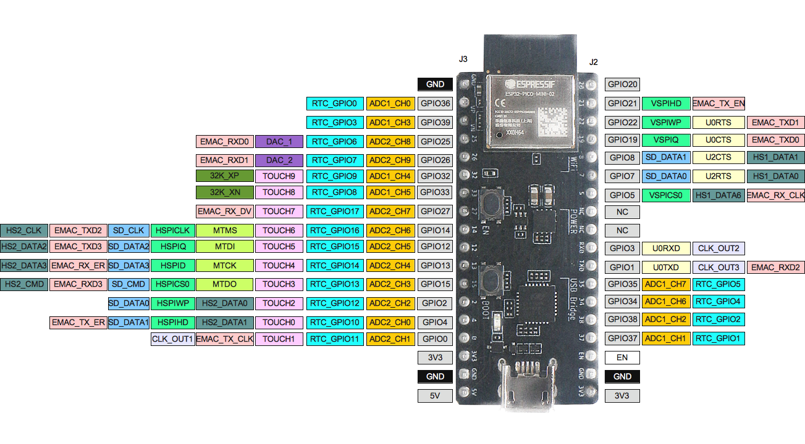

## Document

[ESP32-PICO-DevKitM-2 - ESP32 - — esp-dev-kits latest 文档](https://docs.espressif.com/projects/esp-dev-kits/zh_CN/latest/esp32/esp32-pico-devkitm-2/index.html)

- 开发板: [ESP32-PICO-DevKitM-2](https://docs.espressif.com/projects/esp-idf/zh_CN/latest/esp32/hw-reference/esp32/get-started-pico-devkitm-2.html)
- 模组: [ESP32-PICO-MINI-02](https://www.espressif.com/sites/default/files/documentation/esp32-pico-mini-02_datasheet_cn.pdf)
- 芯片: [ESP32-PICO-V3-02](https://www.espressif.com/sites/default/files/documentation/esp32-pico-v3-02_datasheet_cn.pdf)

ESP32-PICO-DevKitM-2 是一款基于 [ESP32](https://www.espressif.com/zh-hans/products/socs/esp32) 的乐鑫开发板，板上搭载 [ESP32-PICO-MINI-02/02U](https://www.espressif.com/zh-hans/products/modules) 模组。ESP32-PICO-MINI-02/02U 模组具备完整的 Wi-Fi 和蓝牙功能。

- [ESP32-PICO-MINI-02 & ESP32-PICO-MINI-02U 技术规格书](https://www.espressif.com/sites/default/files/documentation/esp32-pico-mini-02_datasheet_cn.pdf) (PDF)
- [乐鑫产品选型工具](https://products.espressif.com/#/product-selector?names=)
- [ESP32-PICO-DevKitM-2 原理图](https://dl.espressif.com/dl/schematics/SCH_ESP32-PICO-DEVKITM-2_V1_0_20200812A.pdf) (PDF)
- [ESP32-PICO-DevKitM-2 PCB 布局图](https://dl.espressif.com/dl/schematics/PCB_ESP32-PICO-DevKitM-2_V1.0_20200812.pdf) (PDF)



| 主要组件               | 描述                                                                                |
| ------------------ | --------------------------------------------------------------------------------- |
| ESP32-PICO-MINI-02 | ESP32-PICO-DevKitM-2 开发板的板载模组，搭载 ESP32 SoC 芯片。用户也可选择板载 ESP32-PICO-MINI-02U 的开发板。  |
| LDO                | 5V 转 3.3V 低压差稳压器                                                                  |
| USB-to-UART        | CP2102N：单芯片 USB-to-UART 桥接器，数据传输速率可达 3 Mbps。                                      |
| Micro-B USB 接口     | USB 接口。可为开发板供电，或连接 PC 进行 USB 通信。                                                  |
| 5V Power On LED    | 开发板上电后，红色指示灯亮起。                                                                   |
| I/O Connector      | ESP32-PICO-MINI-02 上的管脚均已引出至开发板排针。用户可对 ESP32 进行编程，实现 PWM、ADC、DAC、I2C、I2S、SPI 等功能。 |
| BOOT 按键            | 下载按键。按下 **Boot** 键并保持，同时按下 **EN** 键将进入固件下载模式，通过串口下载固件。                            |
| EN 按键              | 复位按键。                                                                             |

⚠️ 需要装 USB-to-UART 的 driver:

- CP210x: [CP210x USB to UART Bridge VCP Drivers](https://www.silabs.com/developers/usb-to-uart-bridge-vcp-drivers)

## 管脚

Header J2:

| 编号  | 名称          | 类型  | 功能                                     |
| --- | ----------- | --- | -------------------------------------- |
| 1   | IO20        | I/O | GPIO20                                 |
| 2   | IO21        | I/O | GPIO21, VSPIHD, EMAC_TX_EN             |
| 3   | IO22        | I/O | GPIO22, VSPIWP, U0RTS, EMAC_TXD1       |
| 4   | IO19        | I/O | GPIO19, VSPIQ, U0CTS, EMAC_TXD0        |
| 5   | IO8         | I/O | GPIO8, SD_DATA1, HS1_DATA1, U2CTS      |
| 6   | IO7         | I/O | GPIO7, SD_DATA0, HS1_DATA0, U2RTS      |
| 7   | IO5         | I/O | GPIO5, VSPICS0, HS1_DATA6, EMAC_RX_CLK |
| 8   | NC          | -   | NC                                     |
| 9   | NC          | -   | NC                                     |
| 10  | RXD0        | I/O | GPIO3, U0RXD, CLK_OUT2                 |
| 11  | TXD0        | I/O | GPIO1, U0TXD, CLK_OUT3, EMAC_RXD2      |
| 12  | IO35        | I   | ADC1_CH7, RTC_GPIO5                    |
| 13  | IO34        | I   | ADC1_CH6, RTC_GPIO4                    |
| 14  | IO38        | I   | GPIO38, ADC1_CH2, RTC_GPIO2            |
| 15  | IO37        | I   | GPIO37, ADC1_CH1, RTC_GPIO1            |
| 16  | EN          | I   | CHIP_PU                                |
| 17  | GND         | P   | 接地                                     |
| 18  | VDD33 (3V3) | P   | 3.3 V 供电                               |

Header J3:

| 编号  | 名称               | 类型  | 功能                                                                         |
| --- | ---------------- | --- | -------------------------------------------------------------------------- |
| 1   | GND              | P   | 接地                                                                         |
| 2   | SENSOR_VP (FSVP) | I   | GPIO36, ADC1_CH0, RTC_GPIO0                                                |
| 3   | SENSOR_VN (FSVN) | I   | GPIO39, ADC1_CH3, RTC_GPIO3                                                |
| 4   | IO25             | I/O | GPIO25, DAC_1, ADC2_CH8, RTC_GPIO6, EMAC_RXD0                              |
| 5   | IO26             | I/O | GPIO26, DAC_2, ADC2_CH9, RTC_GPIO7, EMAC_RXD1                              |
| 6   | IO32             | I/O | 32K_XP, ADC1_CH4, TOUCH9, RTC_GPIO9                                        |
| 7   | IO33             | I/O | 32K_XN, ADC1_CH5, TOUCH8, RTC_GPIO8                                        |
| 8   | IO27             | I/O | GPIO27, ADC2_CH7, TOUCH7, RTC_GPIO17, EMAC_RX_DV                           |
| 9   | IO14             | I/O | ADC2_CH6, TOUCH6, RTC_GPIO16, MTMS, HSPICLK, HS2_CLK, SD_CLK, EMAC_TXD2    |
| 10  | IO12             | I/O | ADC2_CH5, TOUCH5, RTC_GPIO15, MTDI, HSPIQ, HS2_DATA2, SD_DATA2, EMAC_TXD3  |
| 11  | IO13             | I/O | ADC2_CH4, TOUCH4, RTC_GPIO14, MTCK, HSPID, HS2_DATA3, SD_DATA3, EMAC_RX_ER |
| 12  | IO15             | I/O | ADC2_CH3, TOUCH3, RTC_GPIO13, MTDO, HSPICS0, HS2_CMD, SD_CMD, EMAC_RXD3    |
| 13  | IO2              | I/O | ADC2_CH2, TOUCH2, RTC_GPIO12, HSPIWP, HS2_DATA0, SD_DATA0                  |
| 14  | IO4              | I/O | ADC2_CH0, TOUCH0, RTC_GPIO10, HSPIHD, HS2_DATA1, SD_DATA1, EMAC_TX_ER      |
| 15  | IO0              | I/O | ADC2_CH1, TOUCH1, RTC_GPIO11, CLK_OUT1, EMAC_TX_CLK                        |
| 16  | VDD33 (3V3)      | P   | 3.3V 供电                                                                    |
| 17  | GND              | P   | 接地                                                                         |
| 18  | EXT_5V (5V)      | P   | 5V 供电                                                                      |
