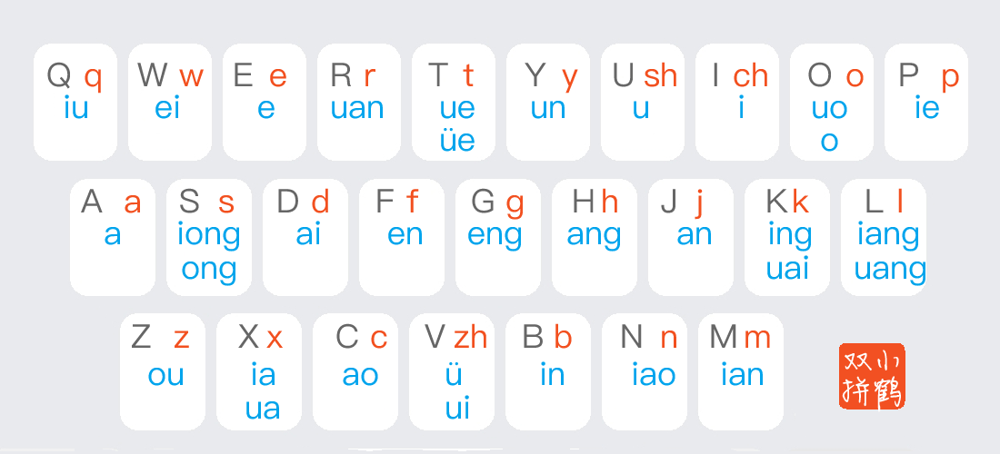

[小鹤音形 flypy](https://flypy.cc/)

## 小鹤双拼

> 以双手均衡性最优、强弱指分布最合理、跨排别扭组合频率最低为追求的双拼设计方案。

### 零声母方案

> 指全拼中无声母的韵母音节在双拼中的处理方案，用来充当其声母的字母即零声母。

以韵母首字母为零声母，即把韵母的首字母当作声母：

- 单字母韵母，零声母 + 韵母所在键，如： 啊＝aa 哦=oo 额=ee
- 双字母韵母，零声母 + 韵母末字母，如： 爱＝ai 恩=en 欧=ou
- 三字母韵母，零声母 + 韵母所在键，如： 昂＝ah

即：双字母音节保持全拼方式，一三字母音节为首字母加韵母所在键

### 键位图





### 记忆口诀

详见 [小鹤入门 · 双拼](https://flypy.cc/help/#/up)。

### Rime 输入法 × 小鹤双拼

在 [Rime 输入法](rime) 中可以用 [雾凇拼音](https://github.com/iDvel/rime-ice)，内置了小鹤双拼方案。

### 微软拼音 × 小鹤双拼

微软拼音没有内置小鹤双拼，可以手动添加（配置按键和声母韵母的对应关系）。

参考：[一键为微软输入法添加小鹤双拼键位 - 知乎](https://zhuanlan.zhihu.com/p/174778114)

``` reg
Windows Registry Editor Version 5.00

[HKEY_CURRENT_USER\SOFTWARE\Microsoft\InputMethod\Settings\CHS]
"EnableExtraDomainType"=dword:00000001
"Enable Double Pinyin"=dword:00000001
"DoublePinyinScheme"=dword:0000000a
"UserDefinedDoublePinyinScheme0"="小鹤双拼*2*^*iuvdjhcwfg^xmlnpbksqszxkrltvyovt"
```

> 注意：reg 文件需要用 GBK 编码，CRLF 换行。

可以直接用的 reg 文件：[plypy.reg](flypy/flypy.reg)。

或者直接在 cmd 中运行：

``` cmd
reg add HKCU\Software\Microsoft\InputMethod\Settings\CHS /v UserDefinedDoublePinyinScheme0 /t REG_SZ /d "小鹤双拼*2*^*iuvdjhcwfg^xmlnpbksqszxkrltvyovt" /f
```
