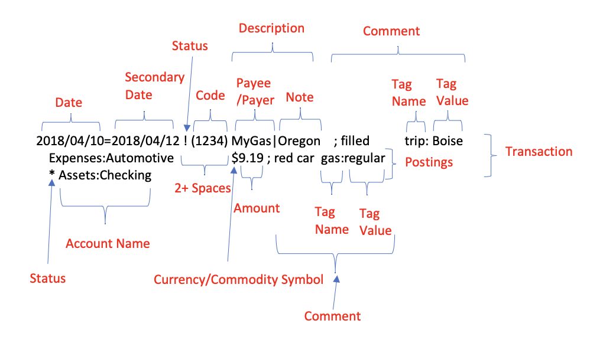

## Info

[Home - hledger](https://hledger.org/)



> **hledger** is friendly, fast, and dependable accounting software for tracking money, investments, cryptocurrencies, time, or any countable commodity. It uses human-readable **[plain text data](https://plaintextaccounting.org/)** that you control.

[hledger manual (1.51) » Journal](https://hledger.org/1.51/hledger.html#journal)

> hledger's usual data source is a plain text file containing journal entries in hledger `journal` format.

```bash
brew install hledger

hledger --version
#> hledger 1.51.1, mac-x86_64
```

## Journal

### Account Type

hledger knows that [in accounting](https://en.wikipedia.org/wiki/Chart_of_accounts#Types_of_accounts) there are three main account types:

| Account     | Type | Note                                       |
| ----------- | ---- | ------------------------------------------ |
| `Asset`     | `A`  | things you own                             |
| `Liability` | `L`  | things you owe                             |
| `Equity`    | `E`  | owner's investment, balances the two above |

and two more representing changes in these:

| Account   | Type | Note                             |
| --------- | ---- | -------------------------------- |
| `Revenue` | `R`  | inflows (also known as `Income`) |
| `Expense` | `X`  | outflows                         |

hledger also uses a couple of subtypes:

| Account      | Type | Note                         |
| ------------ | ---- | ---------------------------- |
| `Cash`       | `C`  | liquid assets                |
| `Conversion` | `V`  | commodity conversions equity |

### Transaction

#### 一图流

{.invert-when-dark}

图片来自：[(Almost) everything you wanted to know about hledger transactions – A User's view of Hledger](https://hledgerfan.com/almost-everything-you-wanted-to-know-about-hledger-transactions/)

## 基本使用

### bal / balance

> A flexible, general purpose "summing" report that shows accounts with some kind of numeric data.

例行核对。检查每笔 transition 以及 [balance assertions](https://hledger.org/1.51/hledger.html#balance-assertions)。

```bash
hledger bal [-f xxx.journal]
```

### reg / register

> Show postings and their running total.

如果某个账户余额核对出错，可以列出其相关交易以便排查：

```bash
hledger reg [-f xxx.journal] -I 'Assets:Online:WeChat$' cur:CNY
```

### check

> Check for various kinds of errors in your data.

检查 transactions 是按日期有序排列的：

```bash
hledger check ordereddates [-f xxx.journal]
```

### areg / aregister

> Show the transactions and running balances in one account, with each transaction on one line.

- `aregister` is best when reconciling real-world asset/liability accounts
- `register` is best when reviewing individual revenues/expenses.

用接近于银行流水单的形式，列出某个账户的交易和 running balances 历史：

```bash
hledger areg [-f xxx.journal] 'Assets:Checking:ICBC'
```

好像 ~~不能~~ 像 register 那样通过 `$` exclude sub-accounts —— 可以，再加一个参数用作 query：

```bash
hledger areg [-f xxx.journal] 'Assets:Checking:ICBC' 'Assets:Checking:ICBC$'
```

### print

> Show full journal entries, representing transactions.

打印 transactions，补全空缺的金额：

```bash
hledger print [-f xxx.journal] -x 'Assets:XXX'
```

### accounts

列出未声明的账户：

```bash
hledger accounts --undeclared
```

### commodities

列出未声明的币种：

```bash
hledger commodities --undeclared
```

### bs / balancesheet

> Show the end balances in **asset and liability** accounts.

看资产和负债汇总：

```bash
hledger bs cur:CNY
hledger bs --cost
```

### is / incomestatement

> Show **revenue inflows and expense outflows** during the report period.

看收入和支出汇总：

```bash
hledger is
```

## 更新注意

### 1.50 - Transaction Balancing

> Transaction balancing is now done in a more robust way, using local precisions only (like Ledger) [#2402](https://github.com/simonmichael/hledger/pull/2402). Until now, a transaction was required to balance using its commodities's global display precisions. Small imbalances were tolerated by configuring display precisions for the whole journal (with `commodity` directives).

比如这条 transaction 在 1.50+ 就不行：

```text
339 | 2013-01-30 计算持仓均价
    |     Assets:Investment:Silver    600 XAGg @ 6.2454167 CNY
    |     Assets:Investment:Silver      -100 XAGg @ 6.2175 CNY
    |     Assets:Investment:Silver       -500 XAGg @ 6.251 CNY

This transaction is unbalanced.
The real postings' sum should be 0 but is: 0.0000200 CNY
Note, hledger <1.50 accepted this entry because of the global display precision,
but hledger 1.50+ checks more strictly, using the entry's local precision.
```

因为后两条的总额相当于 37.4725 CNY，除以 6 无法除尽，`@ 6.2454167 CNY` 无论保留多少位都没办法。

对于这种场景，直接不做这种均价化的处理了（至少不在除不尽的时候做），缺点是要自己管理「先入先出」。

另一种情况：

```text
292 | 2024-02-01 饮料
    |     Expenses:Catering:Drink    380 JPY @ 0.049572 CNY
    |     Liabilities:Credit:ICBC     -2.6 USD @ 7.2451 CNY

This multi-commodity transaction is unbalanced.
The real postings' sum should be 0 but is: 0.000100 CNY
Note, hledger <1.50 accepted this entry because of the global display precision,
but hledger 1.50+ checks more strictly, using the entry's local precision.
```

这里的误差就没法避免了，因为银行在记账的时候做了舍入处理。考虑引入特殊的 account 来 absorb the imbalance：

```hledger
2024-02-01 饮料
    Expenses:Catering:Drink    380 JPY @ 0.049572 CNY
    Liabilities:Credit:ICBC     -2.6 USD @ 7.2451 CNY
    Expenses:Adjustments:Rounding         -0.0001 CNY
```

如果前两行的 `@ UNITPRICE` 都没有问题，也可以省略 `Expenses:Adjustments:Rounding` 的金额，让 hledger 自动计算。

或者使用 `@@ TOTALPRICE` 语法，避开除不尽的 `@ UNITPRICE`：

```hledger
2024-02-01 饮料
    Expenses:Catering:Drink    380 JPY @@ 18.83726 CNY
    Liabilities:Credit:ICBC      -2.6 USD @ 7.2451 CNY
```

## 实践

### 按年拆分 Journal

一年一个 Journal 文件，日常只处理当年的文件，需要的时候可以把连续若干年的文件「连」起来一并处理。

用 `hledger close` 命令生成 closing 文件和 opening 文件。

设起始年是 2000 年，记录于 `2000.journal` 文件。在 2000 年结束后，运行：

```bash
hledger close -f 2000.journal \
    --close --show-costs \
    -e 2001 --close-acct Equity:OpeningClosing:2001 \
    Assets Liabilities > export/2000-closing.journal

hledger close -f 2000.journal \
    --open --show-costs \
    -e 2001 --close-acct Equity:OpeningClosing:2001 \
    Assets Liabilities > export/2001-opening.journal
```

> 👆 `Assets Liabilities` 是默认会带到 closing 或 opening 的 accounts，可以指定任何 accounts。

生成 2000 年的 closing journal 和 2001 年的 opening journal：

```hledger export/2000-closing.journal
2000-12-31 closing balances  ; clopen:2001
    Assets:Cash                       -48.90 CNY = 0.00 CNY
    Assets:Checking:ICBC           -2,913.60 CNY = 0.00 CNY
    Assets:Deposit:Fixed          -11,000.00 CNY = 0.00 CNY
    Equity:OpeningClosing:2001
```

```hledger export/2001-opening.journal
2001-01-01 opening balances  ; clopen:2001
    Assets:Cash                       48.90 CNY = 48.90 CNY
    Assets:Checking:ICBC           2,913.60 CNY = 2,913.60 CNY
    Assets:Deposit:Fixed          11,000.00 CNY = 11,000.00 CNY
    Equity:OpeningClosing:2001
```

在 `2001.journal` 开头 include 其 opening journal：

```hledger 2001.journal
include share/commodities.journal
include export/2001-opening.journal

; Default year.
Y2001
; Default commodity.
D 1,000.00 CNY

; transactions
```

可以创建一个文件，比如叫作 `active.journal`：

```hledger active.journal
include share/accounts.journal
include 2001.journal
```

可以设定环境变量 `LEDGER_FILE` 的值为此文件的路径，那么执行 hledger 命令时就默认使用这个文件。

如果想把所有年份的 journal 放在一起处理，可以创建一个文件，比如 `all.journal`：

```hledger all.journal
include share/accounts.journal

include 2000.journal
include export/2000-closing.journal
include 2001.journal
include export/2001-closing.journal
include 2002.journal
; ...
```

### 股票类交易记账

[Track investments (2020) - hledger](https://hledger.org/investments.html)

主要的问题是多次买卖过程中的 **存货估价法**。常见的方法有先进先出（FIFO）、后进先出（LIFO）、加权平均（Weighted Average Cost），参见 [FIFO vs. LIFO vs Average Cost Method](https://eyelit.ai/average-cost-method-vs-fifo-vs-lifo/)。

考虑对于非高频交易使用 FIFO（加权平均要处理舍入误差）。每次买入都放进一个单独的 sub-account，以便追踪和核验。

例子：

```hledger
2013-01-28 买入
    Assets:Investment:Silver:130128    100 XAGg @ 6.279 CNY
    Assets:Checking:ICBC                        -627.90 CNY

2013-01-29 买入
    Assets:Investment:Silver:130129A    300 XAGg @ 6.197 CNY
    Assets:Checking:ICBC                       -1,859.10 CNY

2013-01-29 卖出
    Assets:Checking:ICBC                         1,862.40 CNY
    Expenses:Finance:CapitalLoss:Securities          4.90 CNY
    Assets:Investment:Silver:130128     -100 XAGg @ 6.279 CNY = 0 XAGg
    Assets:Investment:Silver:130129A    -200 XAGg @ 6.197 CNY

2013-01-29 买入
    Assets:Investment:Silver:130129B    500 XAGg @ 6.251 CNY
    Assets:Checking:ICBC                       -3,125.50 CNY

2013-01-30 卖出
    Assets:Checking:ICBC                         3,168.50 CNY
    Income:CapitalGain:Securities                  -48.40 CNY
    Assets:Investment:Silver:130129A    -100 XAGg @ 6.197 CNY = 0 XAGg
    Assets:Investment:Silver:130129B    -400 XAGg @ 6.251 CNY

2013-02-07 卖出
    Assets:Checking:ICBC                           635.00 CNY
    Income:CapitalGain:Securities                   -9.90 CNY
    Assets:Investment:Silver:130129B    -100 XAGg @ 6.251 CNY = 0 XAGg
    ; 检查所有子账户都已经清零
    Assets:Investment:Silver                         0.00 CNY =* 0 XAGg
```

> [!caution]
> Balance assertion 的时候要带单位（如 `= 0 XAGg`）。只写 `= 0` 可能会被解读为 `= 0.00 CNY`（CNY 是默认币种），在此例中恒为真，失去了 assertion 应有的效果。

### 外币消费

基本原则：尽量保持 Expenses 账户的金额都是人民币。

兑换外币的时候，通过 `@ UNITPRICE` 记录 [costs](https://hledger.org/1.51/hledger.html#costs)。消费的时候，使用相同的 `@ UNITPRICE`，以便 hledger 可以自动计算出对应的人民币金额到 Expenses 账户上：

```hledger
7/20 人民币换美元（100:679.08）
  Assets:CashExt                100 USD @ 6.7908 CNY
  Assets:Checking:ICBC          -679.08

7/23 打车
  Expenses:Traffic:Taxi
  Assets:CashExt                -80 USD @ 6.7908 CNY
```

信用卡消费也一样，唯一的区别是 `@ UNITPRICE` 在还款的时候才确定。

如果再次兑换外币，可以与存量做加权平均，计算出新的平均 costs，避免管理先进先出：

```hledger
8/10 人民币换美元（100:679.20）
  Assets:CashExt                100 USD @ 6.792 CNY
  Assets:Checking:ICBC          -679.2

8/10 计算均价
  Assets:CashExt                120 USD @ 6.7918 CNY
  Assets:CashExt                -20 USD @ 6.7908 CNY
  Assets:CashExt                -100 USD @ 6.792 CNY
```

通过 `hledger print -x --infer-equity` 查看的效果：

```hledger
2010-07-20 人民币换美元（100:679.08）
    Assets:CashExt                   100 USD @ 6.7908 CNY
    equity:conversion:CNY-USD:USD                -100 USD
    equity:conversion:CNY-USD:CNY            679.0800 CNY
    Assets:Checking:ICBC                      -679.08 CNY

2010-07-23 打车
    Expenses:Traffic:Taxi                    543.2640 CNY
    Assets:CashExt                   -80 USD @ 6.7908 CNY
    equity:conversion:CNY-USD:USD                  80 USD
    equity:conversion:CNY-USD:CNY           -543.2640 CNY

2010-08-10 人民币换美元（100:679.20）
    Assets:CashExt                   100 USD @ 6.792 CNY
    equity:conversion:CNY-USD:USD               -100 USD
    equity:conversion:CNY-USD:CNY            679.200 CNY
    Assets:Checking:ICBC                     -679.20 CNY

2010-08-10 计算均价
    Assets:CashExt                   120 USD @ 6.7918 CNY
    equity:conversion:CNY-USD:USD                -120 USD
    equity:conversion:CNY-USD:CNY            815.0160 CNY
    Assets:CashExt                   -20 USD @ 6.7908 CNY
    equity:conversion:CNY-USD:USD                  20 USD
    equity:conversion:CNY-USD:CNY           -135.8160 CNY
    Assets:CashExt                   -100 USD @ 6.792 CNY
    equity:conversion:CNY-USD:USD                 100 USD
    equity:conversion:CNY-USD:CNY            -679.200 CNY
```

### 经由另一币种中转的外币消费

比如刷卡进行日元消费，但信用卡按美元记账，最后用人民币还款。希望可以记录下实际的日元金额、记账的美元金额以及对应的人民币金额。

#### 方案一

简单的方式就是把日元仅当作「注释级事实」，不作为最终财务核算的信任来源：

```hledger
2/1 饮料
  Expenses:Catering:Drink         ; 380 JPY
  Liabilities:Credit:ICBC         -2.6 USD @ 7.2423 CNY

3/25 信用卡还款
  Liabilities:Credit:ICBC         2.6 USD @ 7.2423 CNY == 0 USD
  Assets:Checking:ICBC            -18.83

```

通过 `hledger print -x --infer-equity` 查看的效果：

```hledger
2024-02-01 饮料
    Expenses:Catering:Drink                   18.82998 CNY  ; 380 JPY
    Liabilities:Credit:ICBC          -2.6 USD @ 7.2423 CNY
    equity:conversion:CNY-USD:USD                  2.6 USD
    equity:conversion:CNY-USD:CNY            -18.82998 CNY

2024-03-25 信用卡还款
    Liabilities:Credit:ICBC          2.6 USD @ 7.2423 CNY == 0 USD
    equity:conversion:CNY-USD:USD                -2.6 USD
    equity:conversion:CNY-USD:CNY            18.82998 CNY
    Assets:Checking:ICBC                       -18.83 CNY
```

其中 Assets 和 Liabilities 账户都可以对账，从而保证了 Expenses 的正确。

#### 方案二

或者允许 Expenses 使用日元：

```journal
2/1 饮料
  Expenses:Catering:Drink         380 JPY @@ 18.82998 CNY
  Liabilities:Credit:ICBC         -2.6 USD @ 7.2423 CNY

3/25 信用卡还款
  Liabilities:Credit:ICBC         2.6 USD @ 7.2423 CNY == 0 USD
  Assets:Checking:ICBC            -18.83
```

> 日元上用 `@@ TOTALPRICE` 是因为此例刚好除不尽。

通过 `hledger print -x --infer-equity` 查看的效果：

```hledger
2024-02-01 饮料
    Expenses:Catering:Drink          380 JPY @@ 18.82998 CNY
    equity:conversion:CNY-JPY:JPY                   -380 JPY
    equity:conversion:CNY-JPY:CNY               18.82998 CNY
    Liabilities:Credit:ICBC            -2.6 USD @ 7.2423 CNY
    equity:conversion:CNY-USD:USD                    2.6 USD
    equity:conversion:CNY-USD:CNY              -18.82998 CNY

2024-03-25 信用卡还款
    Liabilities:Credit:ICBC          2.6 USD @ 7.2423 CNY == 0 USD
    equity:conversion:CNY-USD:USD                -2.6 USD
    equity:conversion:CNY-USD:CNY            18.82998 CNY
    Assets:Checking:ICBC                       -18.83 CNY
```

借助 balance assertion 实现了 Expenses 在 costs 层面的校验。

最大的问题是在 Expenses 中引入了日元。

#### 方案三

考虑引入中间账户作为美元到日元的过渡，叫 `Equity:FX:Clearing`。

> 不能叫 `Equity:Conversion`，会报错「Conversion postings must not have a cost」。

```hledger
2/1 饮料
  Expenses:Catering:Drink
  Equity:FX:Clearing              -380 JPY @@ 18.82998 CNY
  Equity:FX:Clearing              2.6 USD @ 7.2423 CNY
  Liabilities:Credit:ICBC         -2.6 USD @ 7.2423 CNY

3/25 信用卡还款
  Liabilities:Credit:ICBC         2.6 USD @ 7.2423 CNY == 0 USD
  Assets:Checking:ICBC            -18.83
```

这里有个问题是，如果日元的信息写错了，甚至对应的 `@@ TOTALPRICE` 错了，无法通过 balance assertion 实现校验。

> [!caution]
> hledger 的 balance assertion，
>
> 永远无法作用在「valuation / cost 折算结果」上。

可以通过 `hledger bal Equity:FX:Clearing --cost` 来检查其最终 cost amount 是否为零。如果不为零，通过 `hledger reg Equity:FX:Clearing --cost` 检查出错的位置。

#### 方案四

事实拆分 + 人工一致性约束。把原本一条 transaction 的消费记录拆成两条：

- 银行事实（authoritative），USD → CNY 是锚点
- 商户事实（declarative），JPY 是锚点

```hledger
2/1 饮料 [Bank]
  Equity:FX:Bridge                380 JPY @@ 18.82998 CNY
  Liabilities:Credit:ICBC         -2.6 USD @ 7.2423 CNY

2/1 饮料 [Receipt]
  Expenses:Catering:Drink
  Equity:FX:Bridge                -380 JPY @@ 18.82998 CNY == 0 JPY

3/25 信用卡还款
  Liabilities:Credit:ICBC         2.6 USD @ 7.2423 CNY == 0 USD
  Assets:Checking:ICBC            -18.83
```

通过 `hledger print -x --infer-equity` 查看的效果：

```hledger
2024-02-01 饮料 [Bank]
    Equity:FX:Bridge                 380 JPY @@ 18.82998 CNY
    equity:conversion:CNY-JPY:JPY                   -380 JPY
    equity:conversion:CNY-JPY:CNY               18.82998 CNY
    Liabilities:Credit:ICBC            -2.6 USD @ 7.2423 CNY
    equity:conversion:CNY-USD:USD                    2.6 USD
    equity:conversion:CNY-USD:CNY              -18.82998 CNY

2024-02-01 饮料 [Receipt]
    Expenses:Catering:Drink                      18.82998 CNY
    Equity:FX:Bridge                 -380 JPY @@ 18.82998 CNY == 0 JPY
    equity:conversion:CNY-JPY:JPY                     380 JPY
    equity:conversion:CNY-JPY:CNY               -18.82998 CNY

2024-03-25 信用卡还款
    Liabilities:Credit:ICBC          2.6 USD @ 7.2423 CNY == 0 USD
    equity:conversion:CNY-USD:USD                -2.6 USD
    equity:conversion:CNY-USD:CNY            18.82998 CNY
    Assets:Checking:ICBC                       -18.83 CNY
```

和方案一其实没有本质区别了，而且也无法避免方案三中的问题。虽然对 `Equity:FX:Bridge` 账户的日元余额做了清零的校验，但无法校验两个 transactions 的汇率一致。就是说如果第二笔 transaction 的 `@ UNITPRICE` 或 `@@ TOTALPRICE` 写错了，balance assertion 不会报错，从而无法确保 Expenses 记录的人民币消耗是正确的。跟方案三类似，只能通过 `hledger bal --cost` 来检查。

## 个人记账的账户结构

### Asset

```text
Assets                        ; type: Asset
├─ AccruedIncome              ; 应收款项（比如公司欠发的工资）
│  └─ Company1
│     └─ Salary               ; Company1 欠发的工资
├─ Cash
│  ├─ CNY
│  └─ Foreign                 ; 可以开不同币种的子账户
├─ Checking                   ; 活期账户
│  └─ ICBC
│     └─ Card1
├─ Deposit                    ; 定期存款、存款类资产
│  ├─ CMB
│  │  └─ Large1               ; 大额存单
│  ├─ ICBC
│  │  └─ Fixed1               ; 定期存款
│  └─ Security                ; 押金
│     └─ CounterParty1
├─ Insurance                  ; 保险类资产
│  ├─ Gongjijin               ; 公积金账户
│  ├─ Medical                 ; 医保个人账户
│  └─ PAIC
│     └─ Product1
├─ Investment                 ; 投资类资产
│  ├─ Alipay
│  │  └─ YuEBao
│  ├─ CMB
│  │  ├─ Jijin
│  │  │  └─ Product1
│  │  ├─ Licai
│  │  │  └─ Product1
│  │  └─ OtherProduct1
│  ├─ Huatai
│  │  └─ Stock1
│  └─ WeChat
│     └─ Licaitong
├─ Lent                       ; 借出款项
│  ├─ Alice
│  └─ Bob
├─ Prepaid                    ; 3rd party merchant accounts (not refundable)
│  ├─ AppleStore
│  └─ Linode
├─ Refundable                 ; 可退还款项
│  └─ Shop1
├─ Reimbursable               ; 可报销款项
│  └─ Company1
│     ├─ Conference
│     └─ Traffic
├─ StoredValue                ; 3rd party merchant accounts (refundable)
│  ├─ Huatai
│  └─ TietaElec
└─ Wallet                     ; e-wallets
   ├─ Alipay
   ├─ Paypal
   └─ WeChat
```

### Liability

```text
Liabilities                   ; type: Liability
├─ Advance                    ; 预支款项
│  └─ Company1
│     └─ TeamBuilding
├─ Borrowed                   ; 借入款项
│  ├─ Alice
│  └─ Bob
├─ CreditCard                 ; 信用卡
│  └─ ICBC
│     └─ Card1
├─ Loan                       ; 贷款
│  ├─ CMB
│  │  └─ PersonalCredit       ; 个人信用贷
│  ├─ Car                     ; 车贷
│  │  └─ Car1
│  ├─ House                   ; 房贷
│  │  └─ House1
│  └─ ICBC
│     └─ Installment          ; 分期付款
├─ Online                     ; Online credit accounts
│  ├─ Huabei
│  └─ Meituan
└─ Unpaid                     ; 未付账款
   └─ Shop1
```

### Revenue

```text
Income                        ; type: Revenue
├─ CapitalGain
│  ├─ Property                ; 房产等出售收益
│  └─ Securities              ; 股票、基金、贵金属等出售收益
├─ Career
│  ├─ Allowance
│  ├─ Bonus
│  ├─ Overtime
│  ├─ PartTime
│  ├─ PreTax
│  │  ├─ Allowance
│  │  ├─ Award
│  │  ├─ BasePay
│  │  ├─ Bonus
│  │  └─ StockRelated
│  ├─ Salary
│  └─ Subsidy
├─ FX
│  └─ Gain                    ; 外汇兑换收益
├─ Finance
│  ├─ Dividend                ; 分红（含余额宝收益等）
│  └─ Interest
│     ├─ Bank                 ; 银行存款利息
│     ├─ Insurance            ; 保险利息、红利
│     └─ Investment           ; 非存款类理财产品的利息型收益
├─ NonOp
│  ├─ Promotion
│  ├─ RedPacket
│  ├─ UsedGoods               ; 二手物品出售
│  ├─ Windfall                ; 意外之财
│  └─ Winning
└─ OperatingRevenue
```

### Expense

```text
Expenses                      ; type: Expense
├─ Adjustments
│  ├─ Discount                ; 折扣
│  ├─ Rebate                  ; 返利
│  ├─ Refund                  ; 退款
│  └─ Rounding                ; 四舍五入误差
├─ Appearance
│  ├─ Accessory
│  ├─ Beauty
│  └─ Clothing
├─ Car
│  ├─ Accessory
│  ├─ Insurance
│  ├─ Maintenance
│  └─ Utility
├─ Catering
│  ├─ Drink
│  ├─ Material
│  ├─ Meal
│  └─ Snack
├─ Communication
│  ├─ Mobile
│  ├─ Network
│  ├─ Post
│  └─ Telephone
├─ Entertainment
│  ├─ Digital
│  ├─ Games
│  ├─ Leisure
│  ├─ Party
│  ├─ Pet
│  ├─ Sport
│  ├─ Toy
│  └─ Travel
├─ FX
│  └─ Loss                    ; 外汇兑换损失
├─ Finance
│  ├─ CapitalLoss
│  │  ├─ Property             ; 房产等出售损失
│  │  └─ Securities           ; 股票、基金、贵金属等出售损失
│  ├─ Commission              ; 手续费
│  ├─ Insurance
│  ├─ Interest
│  │  └─ House
│  ├─ Investment
│  └─ Service
├─ Health
│  ├─ Drug
│  ├─ Equipment
│  ├─ Examination
│  ├─ Nourishment
│  └─ Treatment
├─ Learning
│  ├─ Book
│  ├─ Exam
│  ├─ Training
│  ├─ Tuition
│  └─ Utilities
├─ Living
│  ├─ Commodity
│  ├─ Misc
│  ├─ Service
│  ├─ Software
│  └─ Utilities
├─ Misc
│  ├─ BadDebt                 ; 坏账损失（借出款项无法收回）
│  ├─ Correction              ; 账记错了
│  ├─ Fraction                ; 零头金额处理
│  ├─ IncomeReversal          ; 收入冲销
│  └─ Lost                    ; 丢失
├─ Reside
│  ├─ Accommodation
│  ├─ Cost
│  ├─ Fitment
│  ├─ Furniture
│  └─ Rent
├─ Social
│  ├─ Charity
│  ├─ Compensation
│  ├─ Filial
│  ├─ Gift
│  └─ Treat
├─ Society
│  ├─ Compensation
│  ├─ Insurance
│  ├─ Penalty
│  └─ Tax
│     ├─ Bonus
│     ├─ House
│     └─ Salary
└─ Traffic
   ├─ Airplane
   ├─ Gas
   ├─ Parking
   ├─ Public
   ├─ Rent
   ├─ Taxi
   ├─ Toll
   └─ Train
```

### Equity

```text
Equity                        ; type: Equity
├─ Employer
│  └─ Company1
├─ Extraordinary
│  └─ DebtForgiven            ; 债务豁免
├─ Household
│  └─ Spouse
├─ OpeningClosing
│  └─ 2026
├─ Property
│  ├─ Car
│  │  └─ Car1
│  └─ House
│     └─ House1
├─ Relatives
│  ├─ Self
│  │  ├─ Extended
│  │  └─ Parents
│  └─ Spouse
│     ├─ Extended
│     └─ Parents
├─ Social
│  └─ EventGifts              ; 特殊活动收受的礼金
└─ Society
   └─ Insurance
      ├─ Housing
      │  ├─ Employee
      │  └─ Employer
      ├─ Maternity
      │  └─ Employer
      ├─ Medical
      │  ├─ Employee
      │  └─ Employer
      ├─ Pension
      │  ├─ Employee
      │  └─ Employer
      ├─ Unemployment
      │  ├─ Employee
      │  └─ Employer
      └─ WorkInjury
         └─ Employer
```
