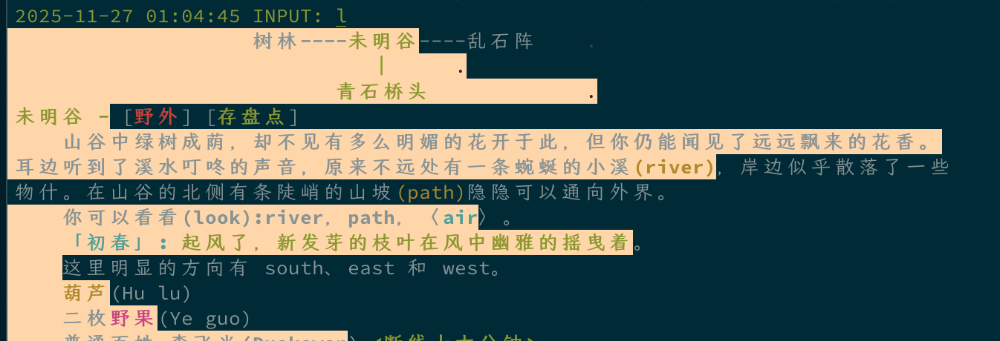

## Info

[mudclient/paotin at beta](https://github.com/mudclient/paotin/tree/beta)



这是一个基于 [TinTin++](https://github.com/scandum/tintin) 的定制发行版。包括一些尚未被合并进官方 TinTin++ 版本的 patch 和一些基础性的框架代码，企图能够对 TinTin++ 的功能有所增强。

> 特别适合玩儿 [北大侠客行 MUD](https://pkuxkx.net/)。

## Install & Run

立即开始：

```
docker run --rm -it --name tt --hostname tt mudclient/paotin:beta
```

> [!caution]
> `beta` tag 持续在更新，`latest` 很久不更新了。

长期挂机：

``` bash
# 创建游戏主目录，该目录可以自定义
mkdir -p $HOME/my-paotin/

# 创建游戏目录结构
mkdir -p $HOME/my-paotin/{ids,etc,data,log,plugins}

docker run -d -it --name tt --hostname tt -v $HOME/my-paotin:/paotin/var mudclient/paotin:beta daemon
```

以后每次上线的时候，只需要用下面的命令就可以连接到 UI：

```
docker exec -it tt start-ui

# or
alias paotin='docker exec -it tt start-ui'

paotin
```

用 `Ctrl+A` `D` 组合键退出游戏。

## Problems

### 反显段落

在 macOS iTerm2 里通过 docker 跑 PaoTin++，房间描述会有这种反显的段落：



解决：换 `beta` 版本（2025-11-27）的 image。

### 无法选取文本和复制

解决：按住 Option 键就可以选取了，选取到的文本自动被复制（iTerm2）。
