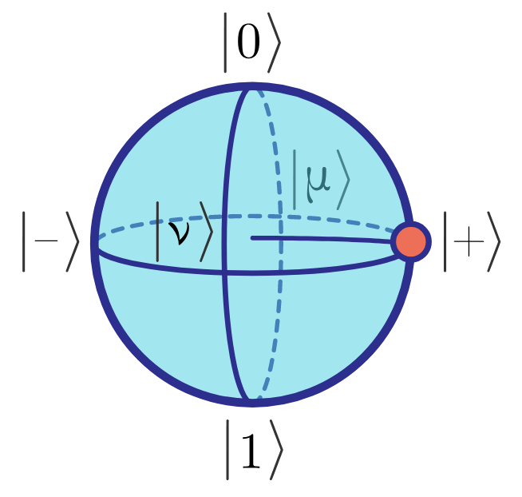

## Basic

量子叠加（superposition）、量子纠缠（entanglement）、量子干涉（interference）

## 单个 qubit

### 基态（Deterministic State）

- $\ket{0}$
- $\ket{1}$

> $\ket{}$ is called a `ket`.

### 叠加态（Superposition State）

$$\ket{\varphi}=a\ket{0}+b\ket{1}=\begin{pmatrix}a \\ b\end{pmatrix}$$

表示：对这个 qubit 进行「测量」操作的时候，有 $|a|^2$ 的概率得到 `0`，有 $|b|^2$ 的概率得到 `1`，其中 $|a|^2+|b|^2=1$。

两个常见的叠加态：

- $\ket{+}=\frac{1}{\sqrt{2}}\left(\ket{0}+\ket{1}\right)$
- $\ket{-}=\frac{1}{\sqrt{2}}\left(\ket{0}-\ket{1}\right)$

其他：

- $\ket{±}=\frac{1}{\sqrt{2}}\left(\ket{0}±\ket{1}\right)$
- $\ket{0}=\frac{1}{\sqrt{2}}\left(\ket{+}+\ket{-}\right)$
- $\ket{1}=\frac{1}{\sqrt{2}}\left(\ket{+}-\ket{-}\right)$
- $\ket{\mu}=\frac{1}{\sqrt{2}}\left(\ket{0}+i\ket{1}\right)$
- $\ket{\nu}=\frac{1}{\sqrt{2}}\left(\ket{0}-i\ket{1}\right)$

### 布洛赫球面（Bloch Sphere）

{.invert-when-dark}

Qubit state: $\cos{\left(\theta/2\right)}\ket{0}+e^{i\varphi}\sin{\left(\theta/2\right)}\ket{1}$

Polar angle: $\theta$

Azimuthal Angle: $\varphi$

- $\ket{0}:\theta=0,\varphi=0$
- $\ket{1}:\theta=\pi,\varphi=0$
- $\ket{+}:\theta=\pi/2,\varphi=0$
- $\ket{-}:\theta=\pi/2,\varphi=\pi$
- $\ket{\mu}:\theta=\pi/2,\varphi=3\pi/2$
- $\ket{\nu}:\theta=\pi/2,\varphi=\pi/2$

## 单量子门

- Hadamard Gate - H
- Identity Gate - I
- 非门 - X
- Z Gate - Z
- S Gate - S ($S=\sqrt{Z}$)

Every quantum gate must always be reversible.

$$
H=\begin{bmatrix}1&1\\1&-1\end{bmatrix},
I=\begin{bmatrix}1&0\\0&1\end{bmatrix},
X=\begin{bmatrix}0&1\\1&0\end{bmatrix},
Z=\begin{bmatrix}1&0\\0&-1\end{bmatrix},
S=\begin{bmatrix}1&0\\0&i\end{bmatrix}
$$

- $H\ket{0}=\ket{+}$, $H\ket{1}=\ket{-}$, $H\ket{+}=\ket{0}$, $H\ket{-}=\ket{1}$
- $H\cdot H=I$
- $I\ket{0}=\ket{0}$, $I\ket{1}=\ket{1}$, $I\ket{+}=\ket{+}$, $I\ket{-}=\ket{-}$
- $X\ket{0}=\ket{1}$, $X\ket{1}=\ket{0}$
- $Z\ket{0}=\ket{0}$, $Z\ket{1}=-\ket{1}$, $Z\ket{+}=\ket{-}$, $Z\ket{-}=\ket{+}$
- $S\ket{+}=\ket{\mu}$, $S\ket{-}=\ket{\nu}$

The phase gate S and Z are 90° and 180° rotations around the vertical axis, often referred to as the z-axis. 

The quantum NOT gate X is a 180° rotation around the horizontal axis between the Hadamard states, often referred to as the x-axis.

The Hadamard gate H is a 180° rotation around a diagonal between the x and z axes.

$$
R_x(\theta)=\begin{bmatrix}
\cos(\theta/2) & -i \sin(\theta/2) \\
-i \sin(\theta/2) & \cos{\theta/2}
\end{bmatrix}
$$

$$
R_z(\varphi)=\begin{bmatrix}
1 & 0 \\
0 & e^{i\varphi/2}
\end{bmatrix}
$$

## Entanglement 纠缠

The Bell state is the prototypical example of an**entangled**state.

$$\ket{\varphi}_{bell}=\frac{1}{\sqrt{2}}\left(\ket{00}+\ket{11}\right)$$
