高中毕业的暑假，自己琢磨出来的魔方复原方法，不用背公式。当然最后几步是固定的套路，可以稍微记一下，记不住就不停地把各种套路都试一试，也可以搞定。



## 整体复原流程

① 从一个角出发逐渐往外扩，直到这三个面都只剩下最边缘的角未完成（不需要公式）。把魔方整体转 180°，可以看到对面未完成的部分也只剩下一个倒 Y 形区域（一个中央角块即出发角块的对顶角，三个棱块，三个边缘角块）。

这部分没有公式，就灵活运用躲避的技巧即可。前提是可以非常轻松地完成单面的复原，理解单面复原时最后一步的精髓。


<!-- cell -->
1. 
<!-- cell -->
2. 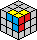
<!-- cell -->
3. 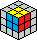
<!-- cell -->
4. 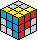
<!-- cell -->
5. 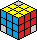 


② 把三个边缘角块归位即完成三个面复原，然后再把三个棱块归位便完成了整个复原。

这个阶段，可以做的操作就非常有限，不能随便乱拧了。关键问题在于找到并了解可能的操作组，每组操作都是一个原子单位，操作完不会引入不可预估的破坏，但又能让尚未完成的部分有所进展。


<!-- cell -->
6. 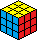 
<!-- cell -->
7.  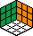


## 复原三面之前的一些操作

关键就是要善于「躲避」，借助适当的「躲避」操作，可以在一组操作完成之后，已经复原的部分不会受到破坏，但有一定的进展。

### 状态 4 ⇒ 状态 5

这个阶段要逐个归位出发角对应的三个面（上边图中的红、黄、蓝）各自的棱块。



注意看一组操作完成之后，除了多归位了一个黄色面的棱块，其他几个棱块都完全不受影响（只有倒 Y 形区域会发生变化，但现在不用考虑它们，动画中全部涂为灰色减少干扰）。


<!-- cell -->
情形一
{% animcube width:100% config:rubik-calf/cube.conf
  facelets:zyyyyyyyyZZZZWWZWWzzzoozoozRRRRRRRRZzggzggzzzBBZBBBBBB
  initmove:"y'"
  move:"b'L'F'Lb"
  initrevmove:#
  movetext:0
%}
<!-- cell -->
情形二
{% animcube width:100% config:rubik-calf/cube.conf
  facelets:zyyyyyyyyZZZZWWZWWzzzoozoozRRRRRRRRZzggzggzzzBBZBBBBBB
  initmove:"y'"
  move:"b'L'F2Lb"
  initrevmove:#
  movetext:0
%}



## 复原三面到六面用的标记 & 操作组

### 记号说明

虽然算不上公式，但还是需要借助一定的符号体系来描述操作组，需要记忆的无非就是在什么情况下要执行哪些操作组。如果不记忆，把可行的操作组按照各种顺序排列组合，也很容易能蒙对的，只是要慢得多。

将倒 Y 形区域标记为 `o-abc` 直角坐标系：

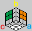

虽然图中标记了各面的颜色（看不见的 a、b、c 面用字母颜色指代），但这只是用于示意的特例，并不是固定的搭配。

如果熟悉 [传统魔方公式符号](http://www.mf100.org/base/about.php)，可以假设手持魔方时，让 a、b 夹住的面（图中的橙色面）冲着自己（即 front），a 面（图中蓝色）为 right，b 面（图中黄色）为 top，由此图中绿色面为 left，白色面为 down，看不到的 c 面（图中红色）为 back。

### 基本操作 `ab`、`ba`

当魔方只剩下倒 Y 形区域没复原的时候，自由度就极低了，一般可以做的操作只有一组（及其逆操作），称其为 `ab`（逆操作为 `ba`）。操作组与传统公式体系的对应关系示意：

- `ab` 相当于 `D' L D L'`
- `ba` 相当于 `L D' L' D` —— 可见 `ab` 和 `ba` 是互逆的



以上边图中的颜色对应关系为例，即 a 为蓝色面，b 为黄色面。`ab` 也可以叫做 `蓝黄`，`ba` 可以叫做 `黄蓝`。


<!-- cell -->
`ab` 操作（操作时视角）
{% animcube width:100% config:rubik-calf/cube.conf
  facelets:zyyyyyyyyZZZZWWZWWzzzoozoozRRRRRRRRZzggzggzzzBBZBBBBBB
  move:"{ab（蓝黄）}D'LDL'"
  initrevmove:#
%}
<!-- cell -->
`ab` 操作（倒 Y 视角）
{% animcube width:100% config:rubik-calf/cube.conf
  position:rrrddd
  facelets:zyyyyyyyyZZZZWWZWWzzzoozoozRRRRRRRRZzggzggzzzBBZBBBBBB
  move:"{ab（蓝黄）}D'LDL'"
  initrevmove:#
%}



<!-- cell -->
`ba` 操作（操作时视角）
{% animcube width:100% config:rubik-calf/cube.conf
  facelets:zyyyyyyyyZZZZWWZWWzzzoozoozRRRRRRRRZzggzggzzzBBZBBBBBB
  move:"{ba（黄蓝）}LD'L'D"
  initrevmove:#
%}
<!-- cell -->
`ba` 操作（倒 Y 视角）
{% animcube width:100% config:rubik-calf/cube.conf
  position:rrrddd
  facelets:zyyyyyyyyZZZZWWZWWzzzoozoozRRRRRRRRZzggzggzzzBBZBBBBBB
  move:"{ba（黄蓝）}LD'L'D"
  initrevmove:#
%}




除了 `ab` 和 `ba` 互逆之外，还有个特点是一个操作组连续做六次，就完全回到初始状态。



<!-- cell -->
`ab` x 6
{% animcube width:100% config:rubik-calf/cube.conf
  move:"{ab（蓝黄）①}D'LDL'.{ab（蓝黄）②}D'LDL'.{ab（蓝黄）③}D'LDL'.{ab（蓝黄）④}D'LDL'.{ab（蓝黄）⑤}D'LDL'.{ab（蓝黄）⑥}D'LDL'"
%}
<!-- cell -->
`ba` x 6
{% animcube width:100% config:rubik-calf/cube.conf
  move:"{ba（黄蓝）①}LD'L'D.{ba（黄蓝）②}LD'L'D.{ba（黄蓝）③}LD'L'D.{ba（黄蓝）④}LD'L'D.{ba（黄蓝）⑤}LD'L'D.{ba（黄蓝）⑥}LD'L'D"
%}




### 衍生操作 `bc`、`cb`、`ca`、`ac`

由于对称性，其实还有其他的组合，如 `bc`（逆操作为 `cb`）、`ca`（逆操作为 `ac`）。实际操作的时候，会把魔方摆成让操作组中涉及到的两个面分别在 top 和 right 位置，这样操作最顺手。

> 跟传统魔方公式不同，他们往往要求不要在手中随意改变魔方的方位，一般至少 top、down 两个面是固定的。但这里的操作组没有这个限制，因为倒 Y 形结构很容易找到，绕着原点 o 怎么调整魔方的方位都是可以的，主要看怎么转着顺手。



先对魔方做一次传统公式的 `y' z`，b 面、c 面就会换到之前 a 面、b 面的位置。


<!-- cell -->
`bc` 操作
{% animcube width:100% config:rubik-calf/cube.conf
  facelets:zyyyyyyyyZZZZWWZWWzzzoozoozRRRRRRRRZzggzggzzzBBZBBBBBB
  move:"{把 bc（黄红）转到顺手位置}y'z.{bc（黄红）}D'LDL'.{回到原来的位置}z'y"
  initrevmove:#
%}
<!-- cell -->
`cb` 操作
{% animcube width:100% config:rubik-calf/cube.conf
  facelets:zyyyyyyyyZZZZWWZWWzzzoozoozRRRRRRRRZzggzggzzzBBZBBBBBB
  move:"{把 cb（红黄）转到顺手位置}y'z.{cb（红黄）}LD'L'D.{回到原来的位置}z'y"
  initrevmove:#
%}


先对魔方做一次传统公式的 `z' y`，c 面、a 面就会换到之前 a 面、b 面的位置。


<!-- cell -->
`ca` 操作
{% animcube width:100% config:rubik-calf/cube.conf
  facelets:zyyyyyyyyZZZZWWZWWzzzoozoozRRRRRRRRZzggzggzzzBBZBBBBBB
  move:"{把 ca（红蓝）转到顺手位置}z'y.{ca（红蓝）}D'LDL'.{回到原来的位置}y'z"
  initrevmove:#
%}
<!-- cell -->
`ac` 操作
{% animcube width:100% config:rubik-calf/cube.conf
  facelets:zyyyyyyyyZZZZWWZWWzzzoozoozRRRRRRRRZzggzggzzzBBZBBBBBB
  move:"{把 ac（蓝红）转到顺手位置}z'y.{ac（蓝红）}LD'L'D.{回到原来的位置}y'z"
  initrevmove:#
%}




### 特殊操作

前面的那几组操作，核心逻辑都是一致的，每组四次转动，只会改变倒 Y 形区域内的分布，其他区域是完全没有破坏的。

有个别特殊场景，需要刻意（临时地）破坏掉已经复原好其他部分，如：

- `b'a` 相当于 `L' D' L D`
- `b` 相当于 `L`

> 由于对称性，还可以有 `c'b`、`c`、`a'c`、`a` 等，不再赘述。




<!-- cell -->
`b'a` 操作
{% animcube width:100% config:rubik-calf/cube.conf
  facelets:zyyyyyyyyZZZZWWZWWzzzoozoozRRRRRRRRZzggzggzzzBBZBBBBBB
  move:"{b'a（黄'蓝）}L'D'LD"
%}
<!-- cell -->
`b` 操作
{% animcube width:100% config:rubik-calf/cube.conf
  facelets:zyyyyyyyyZZZZWWZWWzzzoozoozRRRRRRRRZzggzggzzzBBZBBBBBB
  move:"{b（单独黄）}L"
%}




## 复原三面

基本思路是先盯住任意两个面，让这两个面同时达到复原的状态，再看第三个面的情况。

不同情况的处理步骤示例（由于对称性，其他情况可以旋转魔方，变更 a、b、c 三面跟颜色的对应关系）。

### ① 保持两个面不变，调整第三个面的角的朝向

以 b 面为例，它的角在正确的位置，但没在正确的方向。


<!-- cell -->
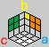


操作方法：`ab ab bc bc`（a、c 两面完全不变）。







### ② 同上，但方向相反

跟上一种类似，只是方向相反，复原操作是对称的。


<!-- cell -->
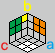


操作方法：`cb cb ba ba`（a、c 两面完全不变）。







### ③ 交换 `o` 点和面的角

这是整个复原过程中最复杂的情况，当时以及之后的很多年一直都没有完全吃透。它无法单纯依靠基本操作组的排列组合完成复原，必须借助前边提到的特殊操作。

以 c 面为例，它的角在倒 Y 形区域的 `o` 点那里，而 a、b 面的角都在正确的位置（方向无所谓）。


<!-- cell -->
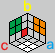
<!-- cell -->
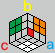
<!-- cell -->
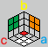


操作方法：`b'a b ba`，再恢复 b 面的棱（这是一次刻意破坏再重建的过程）。

这两步之后并不会直接达到三面都复原了的状态，但可以根据魔方的实际状态，结合前边提到的两种情况的处理方法，灵活运用基本操作组继续复原。下边动画演示部分，会给出一个相对固定的复原套路，但没必要背下来。



以第一张图示意的情况为例。


<!-- cell -->
先做 `b'a b ba`
{% animcube width:100% config:rubik-calf/cube.conf
  facelets:yyyyyyyyyZZZZWWZWWzzzoozoozRRRRRRRRZzggzggrzzBBBBBBBBB
  move:"{b'a（黄'蓝）}L'D'LD.{b（单独黄）}L.{ba（黄蓝）}LD'L'D"
%}
<!-- cell -->
再恢复 b（黄色）面的棱
{% animcube width:100% config:rubik-calf/cube.conf
  facelets:yyyyyyyyyZZZZWWZWWzzzoozoozRRRRRRRRZzggzggrzzBBBBBBBBB
  move:"{恢复 b（黄）棱}r'B'L2Br"
  initmove:"{b'a（黄'蓝）}L'D'LD.{b（单独黄）}L.{ba（黄蓝）}LD'L'D"
%}
<!-- cell -->
再转好的 a、b（蓝、黄色）两面（示意，倒 Y 视角）
{% animcube width:100% config:rubik-calf/cube.conf
  position:rrrddd
  facelets:yyyyyyyyyZZZZWWZWWzzzoozoozRRRRRRRRZzggzggrzzBBBBBBBBB
  move:"{把 bc（黄红）转到顺手位置}y'z.{bc（黄红）}D'LDL'.{回到原来的位置}z'y.{ab ab ab（蓝黄 蓝黄 蓝黄）}D'LDL'.D'LDL'.D'LDL'"
  initmove:"{b'a（黄'蓝）}L'D'LD.{b（单独黄）}L.{ba（黄蓝）}LD'L'D..{恢复 b（黄）棱}r'B'L2Br"
%}




## 复原六面

不同情况的处理步骤示例。

### ① 三个棱逆时针归位


<!-- cell -->
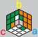


`ba cb ac`，这时原本好的三面会被破坏，再继续观察并按复原三面的方法对 a、b、c 三面进行复原即可。




<!-- cell -->
`ba cb ac`（倒 Y 视角）
{% animcube width:100% config:rubik-calf/cube.conf
  position:rrrddd
  facelets:yyyyyyyyyZWWGWWWWWogzooooooRRRRRRRRRgggwggzogBBBBBBBBB
  move:"{ba（黄蓝）}LD'L'D.{把 cb（红黄）转到顺手位置}y'z.{cb（红黄）}LD'L'D.{把 ac（蓝红）转到顺手位置}y'z.{ac（蓝红）}LD'L'D.{回到原来的位置}y'z"
%}
<!-- cell -->
继续复原示意（倒 Y 视角）
{% animcube width:100% config:rubik-calf/cube.conf
  position:rrrddd
  facelets:yyyyyyyyyZWWGWWWWWogzooooooRRRRRRRRRgggwggzogBBBBBBBBB
  move:"{把 cb（红黄）转到顺手位置}y'z.{cb cb（红黄 红黄）}LD'L'D.LD'L'D.{把 ca（红蓝）转到顺手位置}y'z.{ca ca（红蓝 红蓝）}D'LDL'.D'LDL'.{把 ab（蓝黄）转到顺手位置}y'z.{ab ab（蓝黄 蓝黄）}D'LDL'.D'LDL'"
  initmove:"{ba（黄蓝）}LD'L'D.{把 cb（红黄）转到顺手位置}y'z.{cb（红黄）}LD'L'D.{把 ac（蓝红）转到顺手位置}y'z.{ac（蓝红）}LD'L'D.{回到原来的位置}y'z"
%}




### ② 三个棱顺时针归位


<!-- cell -->
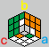


`ab ca bc`，再继续观察并转好 a、b、c。




<!-- cell -->
`ab ca bc`（倒 Y 视角）
{% animcube width:100% config:rubik-calf/cube.conf
  position:rrrddd
  facelets:yyyyyyyyyZOWGWWWWWoozoowoooRRRRRRRRRgggwggzggBBBBBBBBB
  move:"{ab（蓝黄）}D'LDL'.{把 ca（红蓝）转到顺手位置}z'y.{ca（红蓝）}D'LDL'.{把 bc（黄红）转到顺手位置}z'y.{bc（黄红）}D'LDL'.{回到原来的位置}z'y"
%}
<!-- cell -->
继续复原示意（倒 Y 视角）
{% animcube width:100% config:rubik-calf/cube.conf
  position:rrrddd
  facelets:yyyyyyyyyZOWGWWWWWoozoowoooRRRRRRRRRgggwggzggBBBBBBBBB
  move:"{把 ca（红蓝）转到顺手位置}z'y.{ca ca（红蓝 红蓝）}D'LDL'.D'LDL'.{把 cb（红黄）转到顺手位置}z'y.{cb cb（红黄 红黄）}LD'L'D.LD'L'D.{把 ba（黄蓝）转到顺手位置}z'y.{ba ba（黄蓝 黄蓝）}LD'L'D.LD'L'D"
  initmove:"{ab（蓝黄）}D'LDL'.{把 ca（红蓝）转到顺手位置}z'y.{ca（红蓝）}D'LDL'.{把 bc（黄红）转到顺手位置}z'y.{bc（黄红）}D'LDL'.{回到原来的位置}z'y"
%}




### ③ o-a 棱和 o-b 棱各自原地翻转


<!-- cell -->
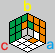


`ab ab ca ca`，再继续观察并转好 a、b、c。




<!-- cell -->
`ab ab ca ca`（倒 Y 视角）
{% animcube width:100% config:rubik-calf/cube.conf
  position:rrrddd
  facelets:yyyyyyyyyZWWOWWWWWogzoowoooRRRRRRRRRgggoggzggBBBBBBBBB
  move:"{ab ab（蓝黄 蓝黄）}D'LDL'.D'LDL'.{把 ca（红蓝）转到顺手位置}z'y.{ca ca（红蓝 红蓝）}D'LDL'.D'LDL'.{回到原来的位置}y'z"
%}
<!-- cell -->
继续复原示意（倒 Y 视角）
{% animcube width:100% config:rubik-calf/cube.conf
  position:rrrddd
  facelets:yyyyyyyyyZWWOWWWWWogzoowoooRRRRRRRRRgggoggzggBBBBBBBBB
  move:"{ba ba（黄蓝 黄蓝）}LD'L'D.LD'L'D.{把 ac（蓝红）转到顺手位置}z'y.{ac ac（蓝红 蓝红）}LD'L'D.LD'L'D.{回到原来的位置}y'z"
  initmove:"{ab ab（蓝黄 蓝黄）}D'LDL'.D'LDL'.{把 ca（红蓝）转到顺手位置}z'y.{ca ca（红蓝 红蓝）}D'LDL'.D'LDL'.{回到原来的位置}y'z"
%}




## 速查表 / 一图流

事项 | 图示 | 操作 | 说明 / 后续
--|--|--|--
倒 Y 形区域 |  | | o-abc 直角坐标系 a 蓝 right b 黄 top c 红 back
基本操作 | | `ab` | 蓝黄 `D' L D L'`
基本操作 | | `ba` | 黄蓝 `L D' L' D`
特殊操作 | | `b'a` | 黄'蓝 `L' D' L D`
特殊操作 | | `b` | 黄 `L`
三① 角的朝向 |  | `ab ab bc bc` | a、c 两面完全不变
三② 角的朝向 |  | `cb cb ba ba` | a、c 两面完全不变
三③ 交换 `o` 和角 |    | `b'a b ba` | 再恢复 b 面的棱 再复原 a、b、c
六① 三棱 逆时针归位 |  | `ba cb ac` | 再复原 a、b、c
六② 三棱 顺时针归位 |  | `ab ca bc` | 再复原 a、b、c
六③ o-a、o-b 棱 原地翻转 |  | `ab ab ca ca` | 再复原 a、b、c

## 关于魔方动画演示

本页内嵌入的魔方操作动画演示，是基于强大且易用的 [AnimCubeJS - the Rubik's Cube Animation Simulator](https://animcubejs.cubing.net/animcubejs.html)。



另外，虽然现在没再使用，但若干年前进行一些尝试的时候，强烈依赖了同样强大好用的 [larspetrus/Roofpig: Rubik's Cube animation for the modern web](https://github.com/larspetrus/Roofpig)。


