## 三阶魔方 - 简易层先法

### 说明

魔方公式中的符号说明参见：

- [三阶魔方公式图解--魔方乐园](http://www.mf100.org/base/about.php)
- [WCA Regulations - Article 12: Notation | World Cube Association](https://www.worldcubeassociation.org/regulations/#article-12-notation)

以下配图与公式，基于的配色约定为：

- 上黄－下白
- 前蓝－后绿
- 左橙－右红



简易层先法的复原步骤为：



- 面位：只有一面颜色与中心块颜色相同， 其他面颜色不相同；
- 到位：位置正确，但任一面的颜色和所在面的中心块颜色都不相同；
- 归位：每面块的颜色均和所在面的中心块的颜色同色，它是魔方块还原后的状态。

这组公式经过一定的分类整理，记忆量极小（代价是复原较慢，大体需要 1 分钟才能完成整个复原）。每一个阶段，最少记住一个公式就可以应对所有情况。

另外，公式不是照着字面去背，而是照着公式去拧，多拧几次，形成肌肉记忆就记住了。默写公式大概率写不出来，但魔方在手就能复原。

### 一图流



### 中棱归位

#### ① 向后归位


<!-- cell -->
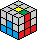


`(R U R U) R (U' R' U' R')`





#### ② 向前归位


<!-- cell -->



`(R' U' R' U') R' (U R U R)`





### 顶棱面位

#### ① ┓ 形


<!-- cell -->
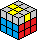


`B' (U' R' U R) B`





#### ② ┅ 形


<!-- cell -->
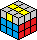


`B' (R' U' R U) B` 或 `① ①`





#### ③ · 形


<!-- cell -->
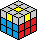


`① U ②`





### 顶角面位

#### ① 缺三逆向


<!-- cell -->
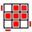


`(R U2' R') (U' R U' R')`





#### ② 缺三顺向


<!-- cell -->



`U (R' U2 R) (U R' U R)` 或 `① U2 ①`





#### ③ 缺二


<!-- cell -->
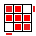
<!-- cell -->

<!-- cell -->
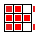


`① {∅ | U' | U} ②`



<!-- cell -->
{% animcube width:100% config:rubik-cube/cube.conf
  facelets:yyyyyyyyyWWWWWWWWWzbbzbbzbbZGGZGGZGGzzzooooooZRRZRRZRR
  move:"{① ②}{< ① > ②}RU2'R'U'RU'R'.{① < ② >}UR'U2RUR'UR"
  initrevmove:#
%}
<!-- cell -->
{% animcube width:100% config:rubik-cube/cube.conf
  facelets:yyyyyyyyyWWWWWWWWWzbbzbbzbbZGGZGGZGGzzzooooooZRRZRRZRR
  move:"{① U' ②}{< ① > U' ②}RU2'R'U'RU'R'.{① < U' > ②}U'.{① U' < ② >}UR'U2RUR'UR"
  initrevmove:#
%}
<!-- cell -->
{% animcube width:100% config:rubik-cube/cube.conf
  facelets:yyyyyyyyyWWWWWWWWWzbbzbbzbbZGGZGGZGGzzzooooooZRRZRRZRR
  move:"{① U ②}{< ① > U ②}RU2'R'U'RU'R'.{① < U > ②}U.{① U < ② >}UR'U2RUR'UR"
  initrevmove:#
%}



#### ④ 缺四


<!-- cell -->

<!-- cell -->
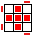


`① {∅ | U'} ①`



<!-- cell -->
{% animcube width:100% config:rubik-cube/cube.conf
  facelets:yyyyyyyyyWWWWWWWWWzbbzbbzbbZGGZGGZGGzzzooooooZRRZRRZRR
  move:"{① ①}{< ① > ①}RU2'R'U'RU'R'.{① < ① >}RU2'R'U'RU'R'"
  initrevmove:#
%}
<!-- cell -->
{% animcube width:100% config:rubik-cube/cube.conf
  facelets:yyyyyyyyyWWWWWWWWWzbbzbbzbbZGGZGGZGGzzzooooooZRRZRRZRR
  move:"{① U' ①}{< ① > U' ①}RU2'R'U'RU'R'.{① < U' > ①}U'.{① U' < ① >}RU2'R'U'RU'R'"
  initrevmove:#
%}



### 顶角归位

#### ① 同色


<!-- cell -->
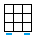


`(R B' R F2) (R' B R F2) R2`





#### ② 异色


<!-- cell -->
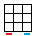


`① U' ①`





### 顶棱归位

#### ① 逆时针归位


<!-- cell -->



`(R U' R) (U R U R) (U' R' U' R2')`





#### ② 顺时针归位


<!-- cell -->
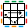


`(R2 U R U) (R' U' R' U') (R' U R')` 或 `① ①`





#### ③ 交叉归位


<!-- cell -->



`① U ①`





#### ④ 平行归位


<!-- cell -->



`① U’ ①`





## 二阶魔方

二阶魔方相当于三阶魔方去掉所有的棱块。直接按三阶层先法 底角归位 ⇒ [顶角翻色/面位](#顶角面位) ⇒ [顶角归位](#顶角归位) 的步骤和公式处理。

## 高阶魔方

高阶魔方可采用降阶法，即把六个面的中心区域（下图浅灰色区域）分别拼好并当成整体，十二对棱块（下图深灰色区域）分别拼好并当成整体，然后就按照三阶魔方的方式进行复原。偶数阶因为不像奇数阶那样，有六个固定的中心块（彼此相对位置不变），有可能会出现两种特殊情况，需要额外处理。另外由于偶数阶没有固定的中心块做为参考，需要在复原六个面中心区域的时候，注意各颜色的相对位置，否则后续可能会无法用三阶的方法完成复原。



### 高阶中心块

#### 精准轮换，无额外破坏

只轮换三个块，对其他块都没有影响。拼花样的时候非常好用。

常规复原过程可以不用这个，用其他破坏性更大但更简单的操作。

以 `上黄-前蓝` 这个位置组合为例。一组操作可以只轮换下图中三个灰色加了标记的块（按粉色箭头方向轮换），其他全都不变。连续三组之后，完全复位（转了一整圈）。



图中黄色面标 `□` 和蓝色面标 `╳` 的块，在面内相对位置一样，距离右边界格数为 2，距离底边界格数为 3，操作公式为：

- `(2R U 3L' U') (2R' U 3L U')`，速记词 `RUL'`

也可以选择黄面上标 `┼` 的块（按绿色箭头方向轮换），对应的操作公式为：

- `(2R' F 3L F') (2R F 3L' F')`，速记词 `R'FL`



<!-- cell -->
{% animcube width:100% size:7 config:rubik-cube/cube.conf
  markers:000000000000000000010000000000000000000000000000000000000000000000000000000000000000000000000000000000000000000000000200000000000000000003000000000000000000000000000000000000000000000000000000000000000000000000000000000000000000000000000000000000000000000000000000000000000000000000000000000000
  move:"2R U 3L' U' 2R' U 3L U'"
  initrevmove:#
  repeat:1
%}
<!-- cell -->
{% animcube width:100% size:7 config:rubik-cube/cube.conf
  markers:000000000100000000030000000000000000000000000000000000000000000000000000000000000000000000000000000000000000000000000000000000000000000002000000000000000000000000000000000000000000000000000000000000000000000000000000000000000000000000000000000000000000000000000000000000000000000000000000000000
  move:"2R' F 3L F' 2R F 3L' F'"
  initrevmove:#
  repeat:1
%}



更多变体：



1. 第 ① 象限：`RU'L'` 或 `R'F'L`
   - `(αR U' βL' U) (αR' U' βL U)`
   - `(αR' F' βL F) (αR F' βL' F)`
2. 第 ② 象限：`L'UR` 或 `LFR'`
   - `(αL' U βR U') (αL U βR' U')`
   - `(αL F βR' F') (αL' F βR F')`
3. 第 ③ 象限：`L'U'R` 或 `LF'R'`
   - `(αL' U' βR U) (αL U' βR' U)`
   - `(αL F' βR' F) (αL' F' βR F)`
4. 第 ④ 象限：`RUL'` 或 `R'FL`
   - `(αR U βL' U') (αR' U βL U')`
   - `(αR' F βL F') (αR F βL' F')`

其中 $2 \leq \alpha,\beta \leq \lceil\frac{N}{2}\rceil$，且 $\{\alpha, \beta\} \neq \{\frac{N+1}{2}\}, when N \equiv 1 \pmod{2}$。

### 偶数阶特殊情况

#### ① 单棱翻转（顶棱面位阶段）


<!-- cell -->
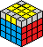


`(αRw2 R2') B2 U2 (αLw L') U2 (αRw' R) U2 (αRw R') U2 F2 (αRw R') F2 (αLw' L) B2 (αRw2 R2')`

其中 $\alpha = \frac{N}{2}$。

特别地，当 N = 4 时可简化为：

`2R2 B2 U2 2L U2 2R' U2 2R U2 F2 2R F2 2L' B2 2R2`



<!-- cell -->
四阶（N = 4）
{% animcube width:100% size:4 config:rubik-cube/cube.conf
  markers:011000000000000000000000000000000000100010000000000000000000000000000000000000000000000000000000
  move:"2R2 B2 U2 2L U2 2R' U2 2R U2 F2 2R F2 2L' B2 2R2"
  initrevmove:#
%}
<!-- cell -->
六阶（N = 6）
{% animcube width:100% size:6 config:rubik-cube/cube.conf
  markers:011110000000000000000000000000000000000000000000000000000000000000000000000000100000100000100000100000000000000000000000000000000000000000000000000000000000000000000000000000000000000000000000000000000000000000000000
  move:"(3Rw2 R2') B2 U2 (3Lw L') U2 (3Rw' R) U2 (3Rw R') U2 F2 (3Rw R') F2 (3Lw' L) B2 (3Rw2 R2')"
  initrevmove:#
%}



#### ② 对棱互换（顶棱归位阶段）


<!-- cell -->
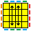


`((αRw2 R2') U2 (αRw2 R2') U2) ((αUw2 U2') (αRw2 R2') (αUw2 U2'))`

其中 $\alpha = \frac{N}{2}$。

特别地，当 N = 4 时可简化为：

`(2R2 U2 2R2 U2) (2U2 2R2 2U2)`



<!-- cell -->
四阶（N = 4）
{% animcube width:100% size:4 config:rubik-cube/cube.conf
  markers:011000000000011000000000000000000000100010000000000010001000000000000000000000000000000000000000
  move:"2R2 U2 2R2 U2 . 2U2 2R2 2U2"
  initrevmove:#
%}
<!-- cell -->
六阶（N = 6）
{% animcube width:100% size:6 config:rubik-cube/cube.conf
  markers:011110000000000000000000000000011110000000000000000000000000000000000000000000100000100000100000100000000000000000100000100000100000100000000000000000000000000000000000000000000000000000000000000000000000000000000000
  move:"(3Rw2 R2') U2 (3Rw2 R2') U2 . (3Uw2 U2') (3Rw2 R2') (3Uw2 U2')"
  initrevmove:#
%}



#### ③ 相邻棱互换（顶棱归位阶段）

先按 ② 做一次对棱互换，然后按三阶魔方的顶棱归位处理。
