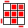
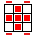

## 三阶 - 简易层先法

### 说明

魔方公式中的符号说明参见：

- [三阶魔方公式图解--魔方乐园](http://www.mf100.org/base/about.php)
- [WCA Regulations - Article 12: Notation | World Cube Association](https://www.worldcubeassociation.org/regulations/#article-12-notation)

以下配图与公式，基于的配色约定为：

- 上黄－下白
- 前蓝－后绿
- 左橙－右红



简易层先法的复原步骤为：



- 面位：只有一面颜色与中心块颜色相同， 其他面颜色不相同；
- 到位：位置正确，但任一面的颜色和所在面的中心块颜色都不相同；
- 归位：每面块的颜色均和所在面的中心块的颜色同色，它是魔方块还原后的状态。

这组公式经过一定的分类整理，记忆量极小（代价是复原较慢，大体需要 1 分钟才能完成整个复原）。每一个阶段，最少记住一个公式就可以应对所有情况。

另外，公式不是照着字面去背，而是照着公式去拧，多拧几次，形成肌肉记忆就记住了。默写公式大概率写不出来，但魔方在手就能复原。

### 一图流



### 中棱归位

#### ① 向后归位


<!-- cell -->



`(R U R U) R (U' R' U' R')`





#### ② 向前归位


<!-- cell -->



`(R' U' R' U') R' (U R U R)`





### 顶棱面位

#### ① ┓ 形


<!-- cell -->



`B' (U' R' U R) B`





#### ② ┅ 形


<!-- cell -->



`B' (R' U' R U) B` 或 `① ①`





#### ③ · 形


<!-- cell -->



`① U ②`





### 顶角面位

#### ① 缺三逆向


<!-- cell -->



`(R U2' R') (U' R U' R')`





#### ② 缺三顺向


<!-- cell -->



`U (R' U2 R) (U R' U R)` 或 `① U2 ①`





#### ③ 缺二


<!-- cell -->

<!-- cell -->

<!-- cell -->



`① {∅ | U' | U} ②`



<!-- cell -->
{% animcube width:100% config:rubik-cube/cube.conf
  facelets:yyyyyyyyyWWWWWWWWWzbbzbbzbbZGGZGGZGGzzzooooooZRRZRRZRR
  move:"{① ②}{<①> ②}RU2'R'U'RU'R'.{① <②>}UR'U2RUR'UR"
  initrevmove:#
%}
<!-- cell -->
{% animcube width:100% config:rubik-cube/cube.conf
  facelets:yyyyyyyyyWWWWWWWWWzbbzbbzbbZGGZGGZGGzzzooooooZRRZRRZRR
  move:"{① U' ②}{<①> U' ②}RU2'R'U'RU'R'.{① <U'> ②}U'.{① U' <②>}UR'U2RUR'UR"
  initrevmove:#
%}
<!-- cell -->
{% animcube width:100% config:rubik-cube/cube.conf
  facelets:yyyyyyyyyWWWWWWWWWzbbzbbzbbZGGZGGZGGzzzooooooZRRZRRZRR
  move:"{① U ②}{<①> U ②}RU2'R'U'RU'R'.{① <U> ②}U.{① U <②>}UR'U2RUR'UR"
  initrevmove:#
%}



#### ④ 缺四


<!-- cell -->

<!-- cell -->



`① {∅ | U'} ①`



<!-- cell -->
{% animcube width:100% config:rubik-cube/cube.conf
  facelets:yyyyyyyyyWWWWWWWWWzbbzbbzbbZGGZGGZGGzzzooooooZRRZRRZRR
  move:"{① ①}{<①> ①}RU2'R'U'RU'R'.{① <①>}RU2'R'U'RU'R'"
  initrevmove:#
%}
<!-- cell -->
{% animcube width:100% config:rubik-cube/cube.conf
  facelets:yyyyyyyyyWWWWWWWWWzbbzbbzbbZGGZGGZGGzzzooooooZRRZRRZRR
  move:"{① U' ①}{<①> U' ①}RU2'R'U'RU'R'.{① <U'> ①}U'.{① U' <①>}RU2'R'U'RU'R'"
  initrevmove:#
%}



### 顶角归位

#### ① 同色


<!-- cell -->



`(R B' R F2) (R' B R F2) R2`





#### ② 异色


<!-- cell -->



`① U' ①`





### 顶棱归位

#### ① 逆时针归位


<!-- cell -->



`(R U' R) (U R U R) (U' R' U' R2')`





#### ② 顺时针归位


<!-- cell -->



`(R2 U R U) (R' U' R' U') (R' U R')` 或 `① ①`





#### ③ 交叉归位


<!-- cell -->



`① U ①`





#### ④ 平行归位


<!-- cell -->



`① U’ ①`




