## All Levels

- [The Nand Game](the-nand-game.md) - Hardware Levels
- [The Nand Game - Software Levels](the-nand-game-software-levels.md)
- [The Nand Game - Optional Levels](the-nand-game-optional-levels.md)

## Optional Level: Transistor level

### Nand (CMOS)

Build a NAND gate from CMOS transistors.

A CMOS circuit uses transistors as switches. There are two kinds: nmos (which connect on 1) and pmos (which disconnect on 1).

**1** represents voltage and **0** represents ground.

The output of a disconnected transistor is neither 0 or 1 (displayed as **?**), so the circuit output should always be connected to either a 0 or 1 input.

Be careful not to shortcut the circuit by connecting a voltage (1) directly to ground (0).

跟继电器不同，这些 CMOS 是三态的，除了 1 和 0 之外还有 disconnected 状态，并不算作是 0。所以不能简单地通过控制端在 0 和 1 之间切换。

可以考虑舍弃一态，比如让一组 CMOS 要么输出 1 要么 disconnect，另一组要么输出 0 要么 disconnect，它们不同时输出，就可以安全地 junction 在一起。

两个 pmos「并联」到 voltage，可以实现 a 和 b 只要有一个为 0 时输出 1；否则 disconnect。

两个 nmos「串联」到 ground，可以实现 a 和 b 同时为 1 时输出 0；否则 disconnect。



``` mermaid
flowchart BT
a((a)) -->|off| p1[pmos]
b((b)) -->|off| p2[pmos]
a -->|on| n2[nmos]
b -->|on| n1[nmos]

v((v)) -->|i| p1 & p2 --> j1@{ shape: f-circ }
g((g)) -->|i| n1 -->|i| n2
j1 & n2 --> j@{ shape: f-circ } --> o(((o)))

subgraph one
    p1
    p2
    j1
end
subgraph zero
    n1
    n2
end
```



👍 Totally 4c.

### Invert (CMOS)

Build an INV gate from CMOS transistors.

因为需要 4 个 CMOS 才能构造出一个 NAND，如果用 NAND 构造 INV 就会比较浪费。



``` mermaid
flowchart BT
a((a)) -->|off| pmos
a((a)) -->|on| nmos
v((v)) -->|i| pmos
g((g)) --> |i| nmos
pmos & nmos --> j@{ shape: f-circ } --> o(((o)))

subgraph one
    pmos
end
subgraph zero
    nmos
end
```



👍 Totally 2c.

### Nor (CMOS)

NOR is an universal logic gate just like NAND. Using only NOR gates any other logic gate can be built.

跟 NAND 刚好反着来即可。

两个 nmos「并联」到 ground，可以实现 a 和 b 只要有一个为 1 时输出 0；否则 disconnect。

两个 pmos「串联」到 voltage，可以实现 a 和 b 同时为 0 时输出 1；否则 disconnect。



``` mermaid
flowchart BT
a -->|on| n1[nmos]
b -->|on| n2[nmos]
a((a)) -->|off| p2[pmos]
b((b)) -->|off| p1[pmos]

g((g)) -->|i| n1 & n2 --> j0@{ shape: f-circ }
v((v)) -->|i| p1 -->|i| p2
j0 & p2 --> j@{ shape: f-circ } --> o(((o)))

subgraph one
    p1
    p2
end
subgraph zero
    n1
    n2
    j0
end
```



👍 Totally 4c.

## Optional Level: Logic

### Xnor

`a xnor b = (a and b) or (inv a and inv b) = (a and b) or inv(a or b)`

把 and 和中间的 or 展开，抵消掉一些之后，得到 `(a nand b) nand (a or b)`.



``` mermaid
flowchart BT
a((a)) & b((b)) --> n1[nand]
a & b --> or
n1 & or --> n2[nand] --> o(((o)))
```



👍 Totally 3c5n:

| Component | Cnt | Nand | Subtotal |
| --------- | --- | ---- | -------- |
| nand      | 2   | 1    | 2        |
| or        | 1   | 3    | 3        |
| Total     | 3   |      | 5        |
<!-- TBLFM: @I$>..@>$>=($2*$3) -->
<!-- TBLFM: @>$2=sum(@I..@-1) -->
<!-- TBLFM: @>$>=sum(@I..@-1) -->

### Left Shift

Shift all bit values one position to the left. The lowest bit in output is set to 0. The top bit in input is discarded.

This is equivalent to multiplying with 2.

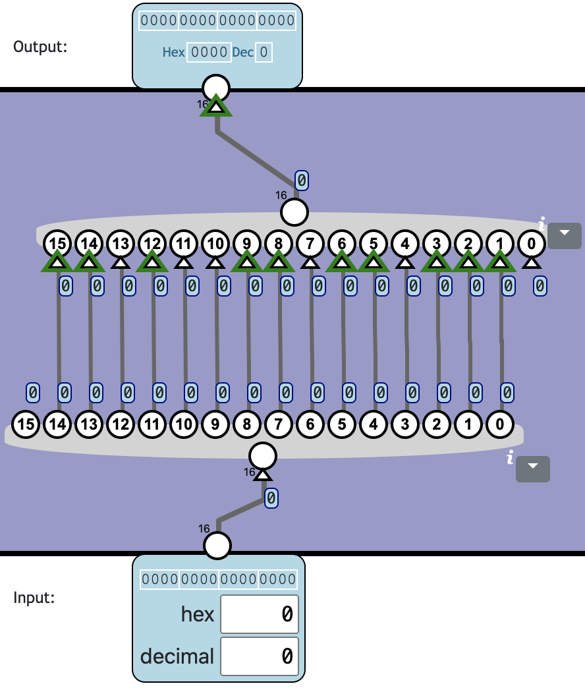

👍 Totally 0c0n!

### Logical Right Shift

Shift all bit values one position to the right. The highest bit in output is set to 0. The lowest bit in input is discarded.

This is equivalent to dividing by 2 for an unsigned number.

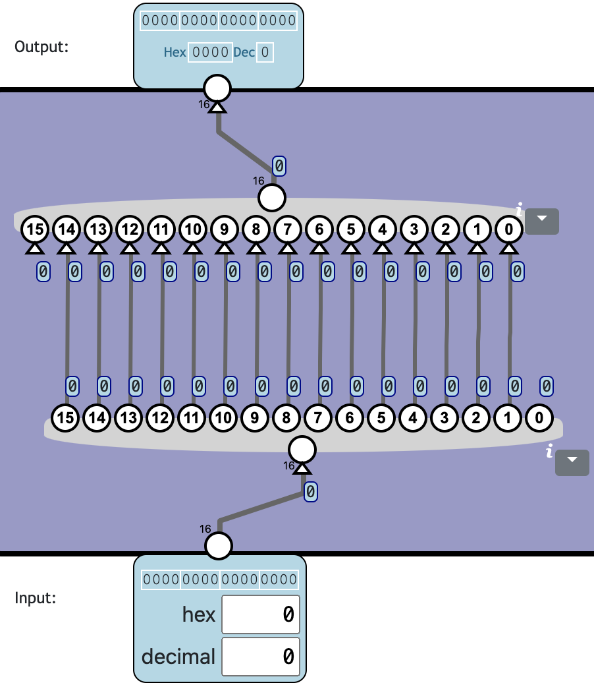

👍 Totally 0c0n!

### Arithmetic Right Shift

Shift all bit values one position to the right, but the highest bit should retain its value. The lowest bit in input is discarded.

This is equivalent to diving by 2 for a signed number.

👍 Totally 0c0n!

### Barrel Shift Left

Shift the 16-bit input 0-15 bits to the left.

The number of bits to move is indicated by the 4-bit **n** input.

一个 **shl 1** 可以左移 1 位，需要至少 15 个才能实现左移 15 位。



``` mermaid
flowchart BT
subgraph gi [" "]
i3((3))
i2((2))
i1((1))
i0((0))
X((X))
end

subgraph g0 [" "]
i0 -->|s| sel0[select 16]
X ==> s01[shl 1] ==>|D1| sel0
X ==>|D0| sel0
end

subgraph g1 [" "]
i1 -->|s| sel1[select 16]
sel0 ==> s11[shl 1 ✖️ 2] ==>|D1| sel1
sel0 ==>|D0| sel1
end

subgraph g2 [" "]
i2 -->|s| sel2[select 16]
sel1 ==> s21[shl 1 ✖️ 4] ==>|D1| sel2
sel1 ==>|D0| sel2
end

subgraph g3 [" "]
i3 -->|s| sel3[select 16]
sel2 ==> s31[shl 1 ✖️ 8] ==>|D1| sel3
sel2 ==>|D0| sel3
end

sel3 ==> O(((O)))
```



❓ Totally 19c256n:

| Component | Cnt | Nand | Subtotal |
| --------- | --- | ---- | -------- |
| shl 1     | 15  | 0    | 0        |
| select 16 | 4   | 64   | 256      |
| Total     | 19  |      | 256      |
<!-- TBLFM: @I$>..@>$>=($2*$3) -->
<!-- TBLFM: @>$2=sum(@I..@-1) -->
<!-- TBLFM: @>$>=sum(@I..@-1) -->

## Optional Level: Arithmetics

### Max

Output the largest of two 16-bit numbers.

按照有符号数就很简单，计算 `A - B`，如果结果是负数，则 B 更大，否则 A 就是最大的。



``` mermaid
flowchart BT
A((A)) ==>|A| sub16[sub 16]
B((B)) ==>|B| sub16
sub16 ==> isneg[is neg] -->|s| select16[select 16] ==> O(((O)))
B ==>|D1| select16
A ==>|D0| select16
```



❓ Totally 2c225n (**is neg** not counting):

| Component | Cnt | Nand | Subtotal |
| --------- | --- | ---- | -------- |
| sub 16    | 1   | 161  | 161      |
| select 16 | 1   | 64   | 64       |
| Total     | 2   |      | 225      |
<!-- TBLFM: @I$>..@>$>=($2*$3) -->
<!-- TBLFM: @>$2=sum(@I..@-1) -->
<!-- TBLFM: @>$>=sum(@I..@-1) -->

### Multiplication

Multiply two positive numbers. Overflow bits should be discarded.

乘法就是移位相加。

实在是摆放太费劲。

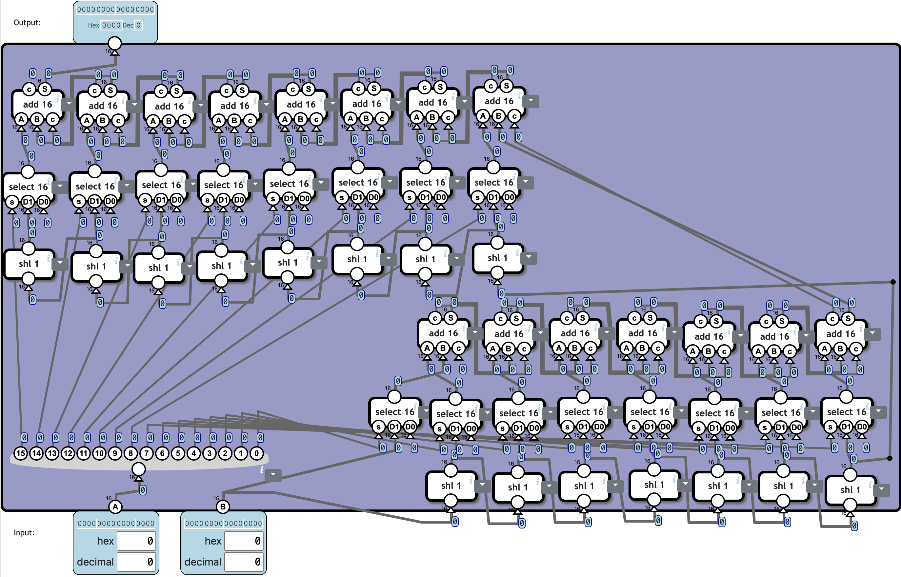

❓ Totally 46c3184n:

| Component | Cnt | Nand | Subtotal |
| --------- | --- | ---- | -------- |
| shl 1     | 15  | 0    | 0        |
| select 16 | 16  | 64   | 1024     |
| add 16    | 15  | 144  | 2160     |
| Total     | 46  |      | 3184     |
<!-- TBLFM: @I$>..@>$>=($2*$3) -->
<!-- TBLFM: @>$2=sum(@I..@-1) -->
<!-- TBLFM: @>$>=sum(@I..@-1) -->

## Optional Level: Floating point

Floating point numbers can represent fractions and a larger range of numbers compared to integers. This is achieved by including an **exponent** part which scale the base number up or down, corresponding to moving the bits left or right.

We use a 16-bit floating-point format which use 10 bits for the significand, 5 bits for the exponent and one bit to the sign.

### Unpack floating-point value

Unpack a normalized 16-bit floating-point value into a separate sign, exponent, and significand parts.

- **sgn**: sign (0 = positive, 1 = negative)
- **exp**: exponent
- **sf** significand

In the packed format:

- bit 15 is the sign (0 = positive, 1 = negative)
- bit 14-10 is the exponent
- bit 9-0 is the normalized significand

Normalized significand means the 10-bit significand is assumed to be prefixed with a 1, unless the exponent is 0. In the unpacked format, this 1 should be inserted so we get an 11-digit significand.

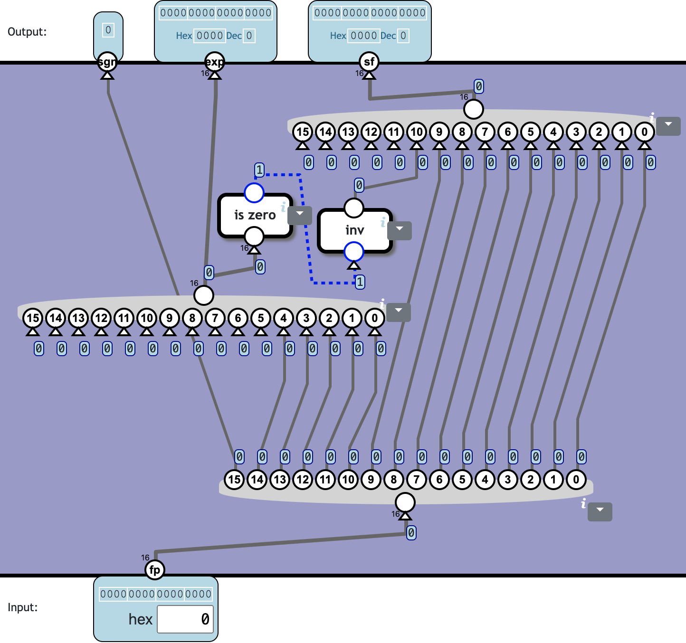

❓ Totally 2c47n:

| Component | Cnt | Nand | Subtotal |
| --------- | --- | ---- | -------- |
| is zero   | 1   | 46   | 46       |
| inv       | 1   | 1    | 1        |
| Total     | 2   |      | 47       |
<!-- TBLFM: @I$>..@>$>=($2*$3) -->
<!-- TBLFM: @>$2=sum(@I..@-1) -->
<!-- TBLFM: @>$>=sum(@I..@-1) -->

### Floating-point multiplication

In floating-point arithmetic, multiplication is simpler than addition or subtraction.

Floating-point numbers are multiplied by multiplying the significands and adding the exponents.

Multiplying two 11-bit significands as if they were integers will result in a 21-bit or 22-bit significand. But we need to compensate for the implicit point, so discard the 10 rightmost digits.

This is one example where floating point operations may result in loss of precision while still giving a result of the correct magnitude.

Multiply two unpacked floating-point numbers.

For the two inputs:

- **sg** is sign (0=positive, 1=negative)
- **exp** is biased exponent (bias = 15)
- **sf** is significand as 11 binary digits

The output should be:

- **sg** sign of the result - should follow the standard rules for multiplication.
- **exp** should be the sum of the exponents minus the bias.
- **sf** should be the product of the significands, as a 11 or 12-bit number. (The low 10 bits of the product should be discarded)

Note: Since the product of multiplying two 11-bit values is 22 bits, this level provides special-case 22-bit multiplier (**mul**) and 22-bit splitter component.

Note: The use of exponent bias seems to just complicate things here. But usually it makes the logic simpler because it avoids negative exponent value. So, in general it is an acceptable trade-off in the design.

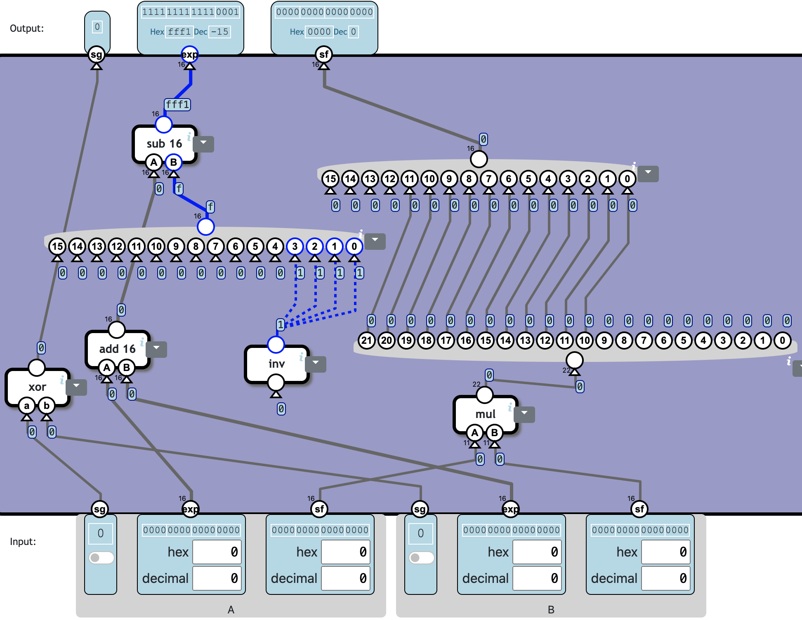

❓ Totally 5c357n:

357 咋算的？

| Component | Cnt | Nand | Subtotal |
| --------- | --- | ---- | -------- |
| xor       | 1   | 4    | 4        |
| add 16    | 1   | 144  | 144      |
| inv       | 1   | 1    | 1        |
| sub 16    | 1   | 161  | 161      |
| mul 11    | 1   | 1474 | 1474     |
| Total     | 5   |      | 1784     |
<!-- TBLFM: @I$>..@>$>=($2*$3) -->
<!-- TBLFM: @>$2=sum(@I..@-1) -->
<!-- TBLFM: @>$>=sum(@I..@-1) -->

其中 **mul 11**:

| Component | Cnt | Nand | Subtotal |
| --------- | --- | ---- | -------- |
| shl 1     | 10  | 0    | 0        |
| select 11 | 11  | 44   | 484      |
| add 11    | 10  | 99   | 990      |
| Total     | 31  |      | 1474     |
<!-- TBLFM: @I$>..@>$>=($2*$3) -->
<!-- TBLFM: @>$2=sum(@I..@-1) -->
<!-- TBLFM: @>$>=sum(@I..@-1) -->

### Normalize overflow

The result of multiplying two significands may result in 11 or 12 binary digits. In the case 12 digits, we normalize this to 11 digits by discarding the lowest bit and increase the exponent by 1.

The input significand (**sf**) is either 11 or 12 binary digits.

In case it is 12 digits, it should be shifted to 11 digits and the least significant bit discarded and the exponent should increase with 1.

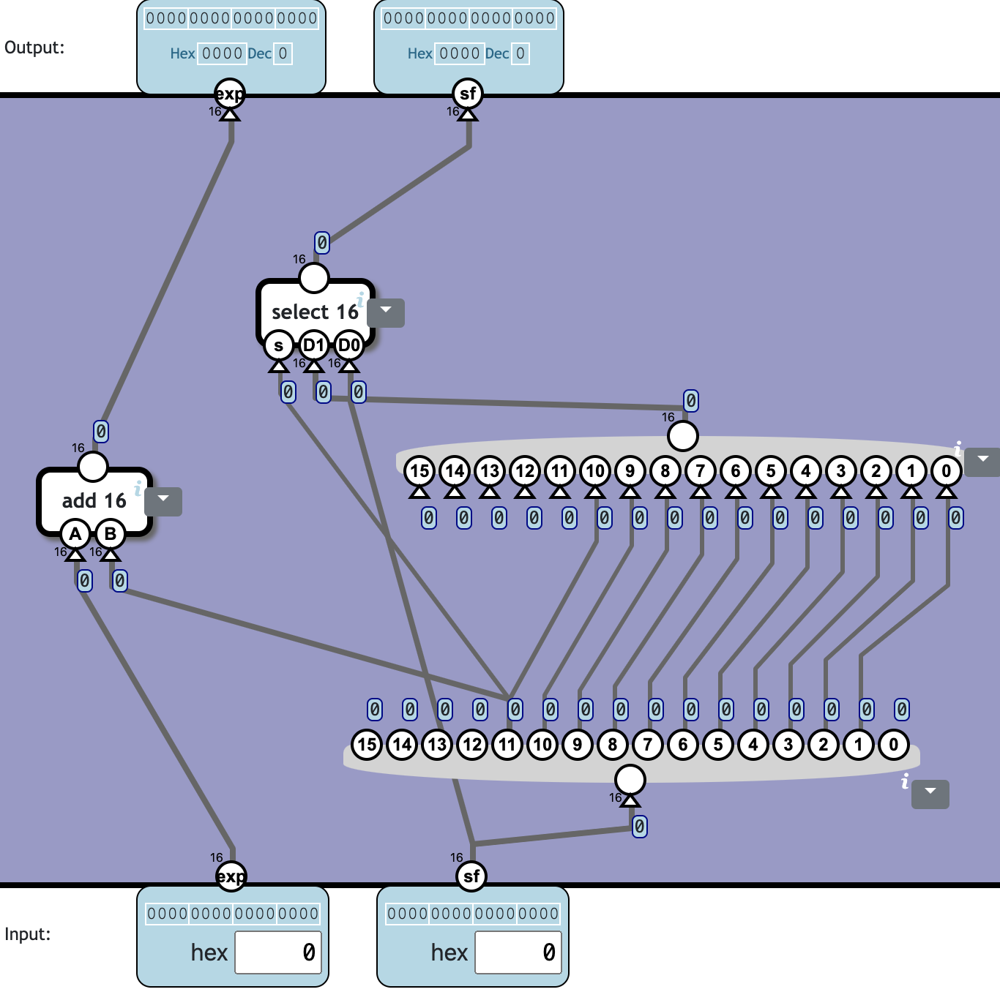

❓ Totally 2c208n:

| Component | Cnt | Nand | Subtotal |
| --------- | --- | ---- | -------- |
| select 16 | 1   | 64   | 64       |
| add 16    | 1   | 144  | 144      |
| Total     | 2   |      | 208      |
<!-- TBLFM: @I$>..@>$>=($2*$3) -->
<!-- TBLFM: @>$2=sum(@I..@-1) -->
<!-- TBLFM: @>$>=sum(@I..@-1) -->

### Verify exponent

If the exponent (exp) is outside the range 0-30 (00-1e in hexadecimal) it should be set to 31 (1f in hexadecimal, 11111 in binary).

如果 **exp** 的高 11 位不全为零，输出 0x1f。否则直接输出 **exp** 即可，因为当 **exp** 等于 0x1f 的时候，输出的也刚好是 0x1f。

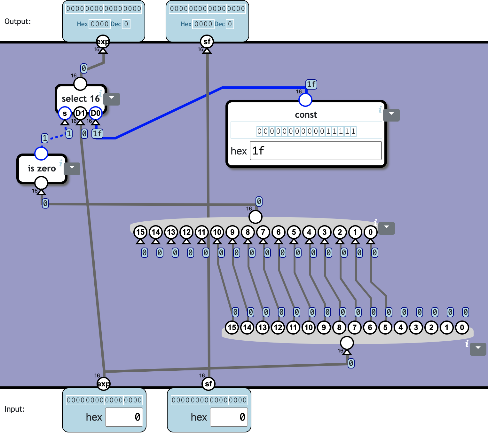

❓ Totally 2c110n:

| Component | Cnt | Nand | Subtotal |
| --------- | --- | ---- | -------- |
| is zero   | 1   | 46   | 46       |
| select 16 | 1   | 64   | 64       |
| Total     | 2   |      | 110      |
<!-- TBLFM: @I$>..@>$>=($2*$3) -->
<!-- TBLFM: @>$2=sum(@I..@-1) -->
<!-- TBLFM: @>$>=sum(@I..@-1) -->

### Align significands

Adjust exponent and significand for two numbers so they share the same exponent.

The common exponent should be the highest of the input exponents. The number with the lower exponent should be adjusted to the same exponent, which might require discarding digits of the significand.

Output:

- **ex** largest of the exponents.
- **asf** significand of the A input, adjusted to the shared exponent.
- **bsf** significand of the B input, adjusted to the shared exponent.

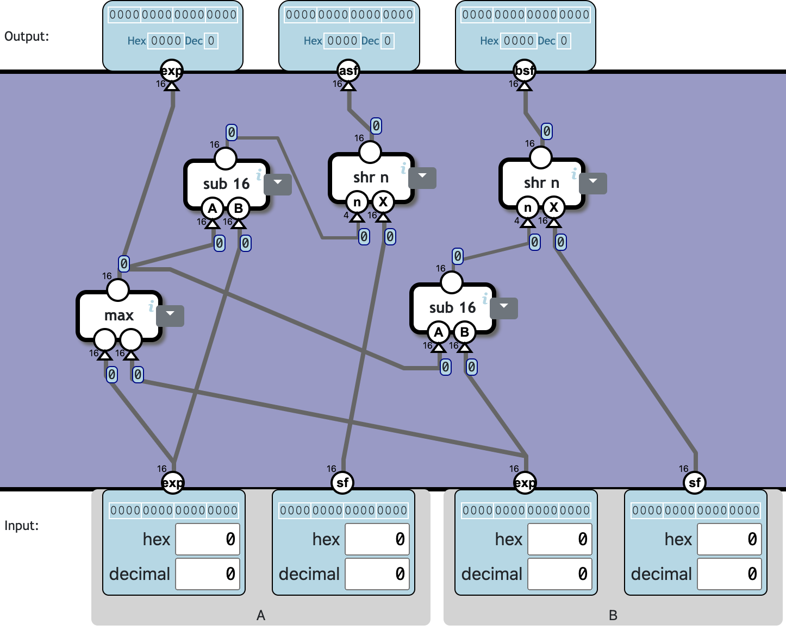

❓ Totally 5c1059n:

| Component | Cnt | Nand | Subtotal |
| --------- | --- | ---- | -------- |
| max       | 1   | 225  | 225      |
| sub 16    | 2   | 161  | 322      |
| shr n     | 2   | 256  | 512      |
| Total     | 5   |      | 1059     |
<!-- TBLFM: @I$>..@>$>=($2*$3) -->
<!-- TBLFM: @>$2=sum(@I..@-1) -->
<!-- TBLFM: @>$>=sum(@I..@-1) -->

其中 **shr n** 应该跟 **Barrel Shift Left** 几乎一致。

### Add signed magnitude

Add or subtract two signed integers.

- **sg** is the sign (0 = positive, 1 = negative)
- **M** is the number without sign

For example -2 would be represented as sg=1, M=2

The **op**-flag determines the operation:

| op  | Operation |
| --- | --------- |
| 0   | A + B     |
| 1   | A - B     |

可以先把 **sg** 和 **M** 组合成普通的数字（**sg** 为 1 时取 **M** 的补数，否则取  **M**），最后的结果再拆开，不过这样比较废 nand。

考虑 **op** 和 **A\.sg** 以及 **B\.sg** 的各种组合：

| A\.sg, B\.sg | op = 0                    | op = 1                    |
| ------------ | ------------------------- | ------------------------- |
| 00 `++`      | A.M + B.M                 | A.M - B.M                 |
| 01 `+-`      | A.M - B.M                 | A.M + B.M                 |
| 10 `-+`      | -A.M + B.M = -(A.M - B.M) | -A.M - B.M = -(A.M + B.M) |
| 11 `--`      | -A.M - B.M = -(A.M + B.M) | -A.M + B.M = -(A.M - B.M) |

可见只需要分别计算 `A + B` 和 `A - B`。当 `xor(xor(A.sg, B.sg), op)` 为 1 时取 `A.M - B.M`，否则取 `A.M + B.M`。记此时的结果为 **X**。

下一步，如果 **A\.sg** 为 1（负数），就需要取 `-X`（即 `0 - X`，或者取 X 的补数）。记此时的结果为 **Y**。

| A\.sg  | Y   |
| ----- | --- |
| 0 `+` | X   |
| 1 `-` | -X  |

最后要把 **Y** 分解成最终输出的符号和本体（**O\.sg** 和 **O.M**）。

| is-neg(Y) | O\.sg  | O.M |
| --------- | ----- | --- |
| 0 `+`     | 0 `+` | Y   |
| 1 `-`     | 1 `-` | -Y  |

把两个表结合一下：

| A\.sg  | Y   | is-neg(X) | is-neg(Y) | O\.sg  | O\.M | O\.M by X |
| ----- | --- | --------- | --------- | ----- | --- | -------- |
| 0 `+` | X   | 0 `+`     | 0 `+`     | 0 `+` | Y   | X        |
| 0 `+` | X   | 1 `-`     | 1 `-`     | 1 `-` | -Y  | -X       |
| 1 `-` | -X  | 1 `-`     | 0 `+`     | 0 `+` | Y   | -X       |
| 1 `-` | -X  | 0 `+`     | 1 `-`     | 1 `-` | -Y  | X        |

可以得到 `O.sg = xor(A.sg, is-neg(X))`，`O.M = select16(s=is-neg(X), D1=-X, D0=X)`。

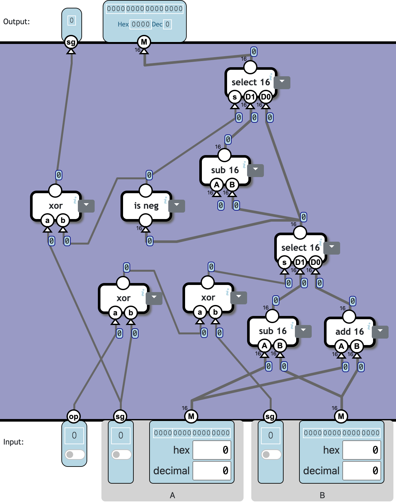

❓ Totally 8c606n (**is neg** not counting):

| Component | Cnt | Nand | Subtotal |
| --------- | --- | ---- | -------- |
| xor       | 3   | 4    | 12       |
| add 16    | 1   | 144  | 144      |
| sub 16    | 2   | 161  | 322      |
| select 16 | 2   | 64   | 128      |
| Total     | 8   |      | 606      |
<!-- TBLFM: @I$>..@>$>=($2*$3) -->
<!-- TBLFM: @>$2=sum(@I..@-1) -->
<!-- TBLFM: @>$>=sum(@I..@-1) -->

### Normalize underflow

If the input significand (**sf**) has less than 11 digits, it should be changed to 11 digits and the exponent adjusted correspondingly.

Assume the input is non-zero and at most 11 digits.

实在是有亿点点麻烦。

实际上就是先判断 **I.sf** 的从 bit 10 开始有几个连续的 0，设有 n 个连续的 0，那么 **O\.sf** 就等于 **I\.sf** 左移 n 位，`O.exp = I.exp - n`。

❓ Totally 51c2789n:

| Component | Cnt | Nand | Subtotal |
| --------- | --- | ---- | -------- |
| or        | 9   | 3    | 27       |
| inc 16    | 10  | 145  | 1450     |
| shl 1     | 10  | 0    | 0        |
| select 16 | 20  | 64   | 1280     |
| inv 16    | 2   | 16   | 32       |
| Total     | 51  |      | 2789     |
<!-- TBLFM: @I$>..@>$>=($2*$3) -->
<!-- TBLFM: @>$2=sum(@I..@-1) -->
<!-- TBLFM: @>$>=sum(@I..@-1) -->

### Pack floating-point value

Normalize and pack sign, exponent, and significand into a 16-bit floating-point format.

In the packed format:

- bit 15 is the sign
- bit 14-10 is the biased exponent
- bit 9-0 is the normalized significand with the leading 1 discarded

If the unnormalized input significand is 0, the exponent should also be set to 0.

If the exponent after normalization is outside of the range 0-31 (ie. what can be represented in 5 bits) the number is invalid and the exponent should be set to 31.

搞清楚三个 components 分别做什么操作，注意顺序。

❓ Totally 3c3107n:

| Component           | Cnt | Nand | Subtotal |
| ------------------- | --- | ---- | -------- |
| normalize overflow  | 1   | 208  | 208      |
| normalize underflow | 1   | 2789 | 2789     |
| verify exponent     | 1   | 110  | 110      |
| Total               | 3   |      | 3107     |
<!-- TBLFM: @I$>..@>$>=($2*$3) -->
<!-- TBLFM: @>$2=sum(@I..@-1) -->
<!-- TBLFM: @>$>=sum(@I..@-1) -->

### Floating-point multiplication

Multiply two floating-point numbers in the 16-bit packed representation.

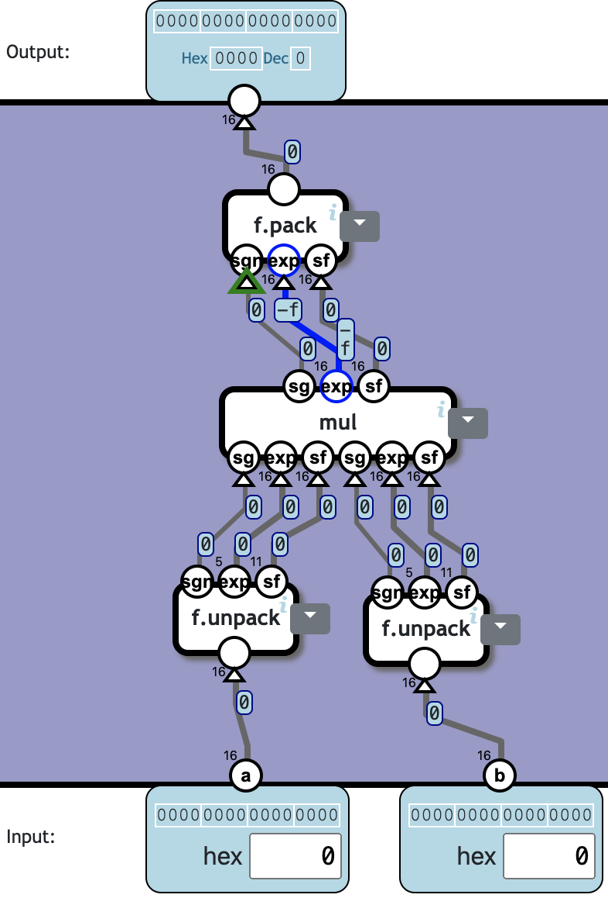

❓ Totally 4c3558n:

| Component | Cnt | Nand | Subtotal |
| --------- | --- | ---- | -------- |
| f.unpack  | 2   | 47   | 94       |
| mul       | 1   | 357  | 357      |
| f.pack    | 1   | 3107 | 3107     |
| Total     | 4   |      | 3558     |
<!-- TBLFM: @I$>..@>$>=($2*$3) -->
<!-- TBLFM: @>$2=sum(@I..@-1) -->
<!-- TBLFM: @>$>=sum(@I..@-1) -->

### Floating-point addition

Add or subtract two floating-point numbers.

The **op**-flag determines the operation:

|op|Operation|
|---|---|
|0|A + B|
|1|A - B|

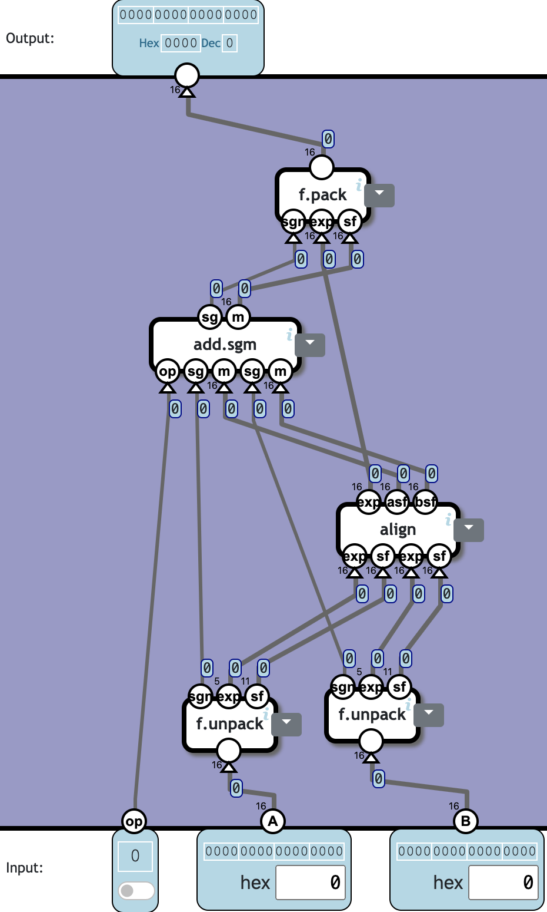

❓ Totally 5c5319n（❓不应该是 4866 么❓）:

| Component | Cnt | Nand | Subtotal |
| --------- | --- | ---- | -------- |
| f.unpack  | 2   | 47   | 94       |
| align     | 1   | 1059 | 1059     |
| add.sgm   | 1   | 606  | 606      |
| f.pack    | 1   | 3107 | 3107     |
| Total     | 5   |      | 4866     |
<!-- TBLFM: @I$>..@>$>=($2*$3) -->
<!-- TBLFM: @>$2=sum(@I..@-1) -->
<!-- TBLFM: @>$>=sum(@I..@-1) -->

## Optional Level: Multitasking

The processor previously built can only run a single program at a time. But modern processors are capable of multitasking – running multiple programs (called processes) simultaneously. In the following section we will build a processor capable of multitasking.

Multitasking is achieved by having the processor cycle between the different processes and executing each for a short while. If the switching happen fast enough, it feels like the programs are executing at the same time.

Multitasking requires _memory safety_ and _process isolation_. A single process should not be able to overtake the whole processor and prevent other processes from running, and a process should not be able to read or modify data or code belonging to another process.

To make all this work, we need:

- A way of delimiting the area of memory accessible to a single process.
- A supervisor process which manage the memory and controls the switching between processes. We call this process a _kernel_ or _operating system_.
- A timer which regularly interrupt the running process, allowing control to switch to the kernel process, which can then let a different process continue. This event is called a context switch.
- A way of saving the state of a running process so it can be restored later.
- A way to give the kernel process rights to memory manipulation which a regular process don't have.
- And we need to extend the instruction set with operations to save and restore state and configure memory protection.

### Timer Trigger

**tr** should emit 1 every 256 clock cycles.

**cl** is the clock signal.

计数器到 256 的时候，也就是 bit 8 为 1。将 bit 8 输出到 **tr**，同时接到计数器的 **st** 重置计数器。因为重置操作需要消耗一个 clock cycle，需要直接重置为 1。

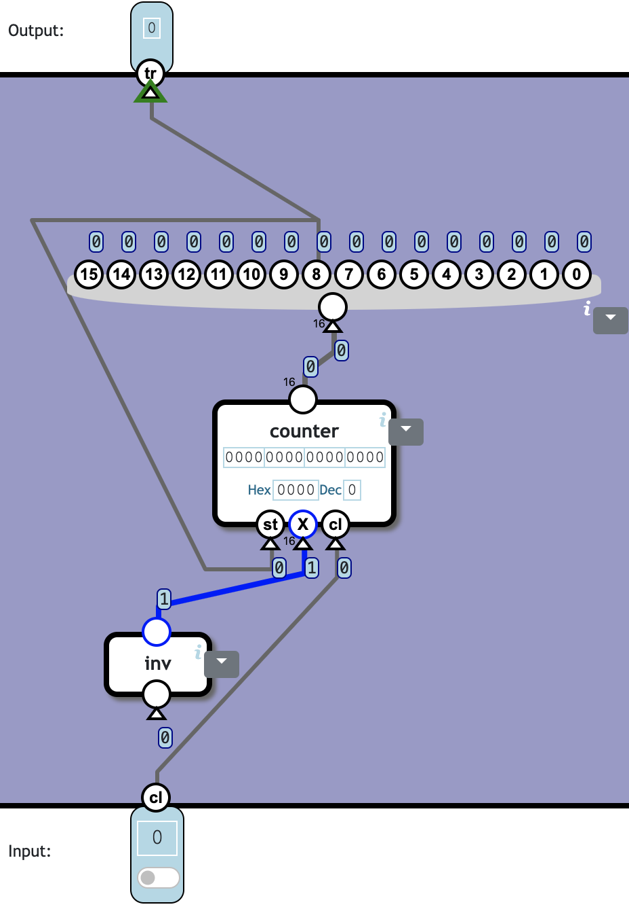

❓ Totally 2c387n:

| Component | Cnt | Nand | Subtotal |
| --------- | --- | ---- | -------- |
| inv       | 1   | 1    | 1        |
| counter   | 1   | 386  | 386      |
| Total     | 2   |      | 387      |
<!-- TBLFM: @I$>..@>$>=($2*$3) -->
<!-- TBLFM: @>$2=sum(@I..@-1) -->
<!-- TBLFM: @>$>=sum(@I..@-1) -->

### Mode controller

The mode controller contains a 1-bit mode register.

- Mode = 0 is called _kernel mode_
- Mode = 1 is called _user mode_

Inputs:

**sw** input cause the mode to change.

**tt** is the timer trigger signal. Will cause mode to change when in user mode, but is ignored in kernel mode.

Switching mode when in user mode is called _interrupt_.

Switching mode when in kernel mode is called _resume_

Output:

**sw** is 1 when a mode change happen (regardless if it was triggered by sw or tr input)

**md**: current mode

**IR** a 16-bit number which indicate the cause of the interrupt. (Only relevant when sw=1). In binary:

- `01` = timer trigger
- `10` = swap

梳理真值表。根据要求可知 **O\.sw** 与 **I\.sw**、**I\.tt** 以及 previous **O\.md** 的值。

| Prev O\.md | I\.sw | I\.tt | ⇒   | O\.sw | O\.md |
| --------- | ---- | ---- | --- | ---- | ---- |
| 0         | 0    | 0    |     | 0    | 0    |
| 0         | 0    | 1    |     | 0    | 0    |
| 0         | 1    | 0    |     | 1    | 1    |
| 0         | 1    | 1    |     | 1    | 1    |
| 1         | 0    | 0    |     | 0    | 1    |
| 1         | 0    | 1    |     | 1    | 0    |
| 1         | 1    | 0    |     | 1    | 0    |
| 1         | 1    | 1    |     | 1    | 0    |

显然 `O.md = PO.md xor O.sw`。**O.sw** 的逻辑也容易推导出 `O.sw = I.sw or (PO.md and I.tt)`。

按照表达式搭建逻辑电路即可，需要注意两点：

1. **O.sw** 用到的 **or** 和 **and** 如果展开，可以抵消掉两个 **inv**，节省用量。
2. 因为输出又被当作输入使用，为避免陷入 0-1 振荡，需要用 DFF (data flip-flop) 做隔离。

> 目前 check solution 的用例可能不够充足，有时候错误的电路也能通过检查。

**IR** 就直接取 **I\.sw** 和 **I\.tt** 作为最低两位即可。

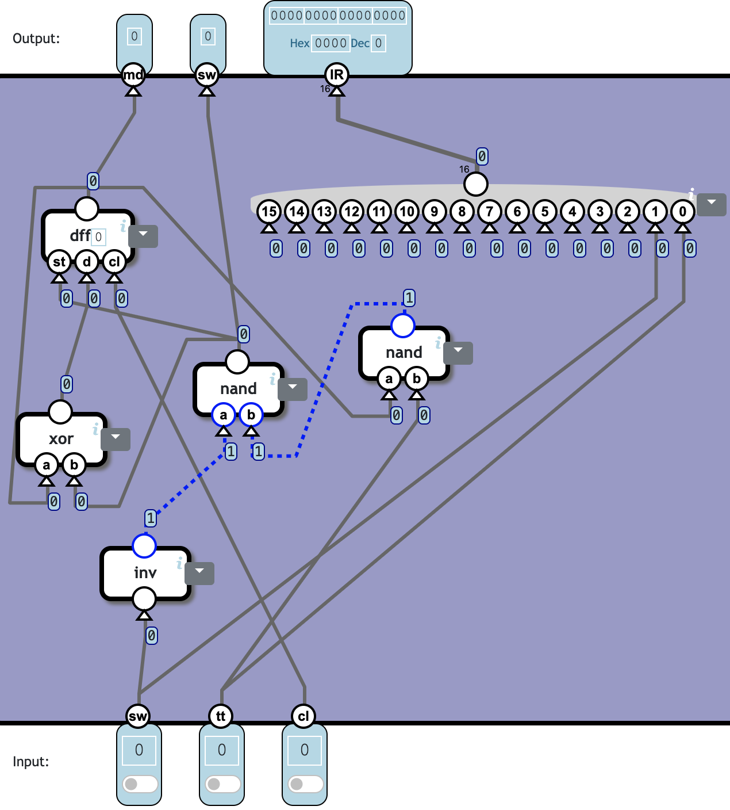

❓ Totally 5c18n:

| Component | Cnt | Nand | Subtotal |
| --------- | --- | ---- | -------- |
| inv       | 1   | 1    | 1        |
| nand      | 2   | 1    | 2        |
| xor       | 1   | 4    | 4        |
| dff       | 1   | 11   | 11       |
| Total     | 5   |      | 18       |
<!-- TBLFM: @I$>..@>$>=($2*$3) -->
<!-- TBLFM: @>$2=sum(@I..@-1) -->
<!-- TBLFM: @>$>=sum(@I..@-1) -->

### Register with backup

A 16-bit register **R** which is paired with a backup register **Rb**. The outputs reflect the current state of the registers.

**st**=1 stores the **X** input in **R**. If **st**=1 and **sb**=1, **X** is stored in **Rb** instead.

Interrupt:

When **sw**=1 and **md**=1, **R** is stored in **Rb** and the **X0** input is stored in **R**.

Resume:

When **sw**=1 and **md**=0, the registers are swapped, i.e. **R** is stored in **Rb** and **Rb** is stored in **R**.

**sb** has no effect when sw=1.

**cl** is the clock signal.

The effect of the input flags on what get stored where:

| st  | sb  | sw  | md  | R   | Rb  |
| --- | --- | --- | --- | --- | --- |
| 0   | -   | 0   | -   | -   | -   |
| 1   | 0   | 0   | -   | X   | -   |
| 1   | 1   | 0   | -   | -   | X   |
| 0   | -   | 1   | 0   | Rb  | R   |
| 0   | -   | 1   | 1   | X0  | R   |
| 1   | 0   | 1   | 1   | X0  | X   |

😵‍💫

直接按照表格处理，分别看两个寄存器应该选什么值，应该在什么时候写入。

先看 **Rb**，可以写入 **X** 或者 **R**，根据表格可知写入的值为 `select16(s=st, D1=X, D0=R)`。可以写入的时机为 `sw or (st and sb)`，同样 **or** 和 **and** 可以展开并抵消掉两个 **inv**。

**R** 可以写入三种不同的值。先在 **X** 和 **X0** 之间选择，可得 `select16(s=sw, D1=X0, D0=X)`。而当 `sw and inv md` 为 1 时，应取 **Rb**，即 `select16(s=(sw and inv md), D1=Rb, D0=select16(s=sw, D1=X0, D0=X))`。**R** 的可写入时机为 `sw or (st and inv sb)`。

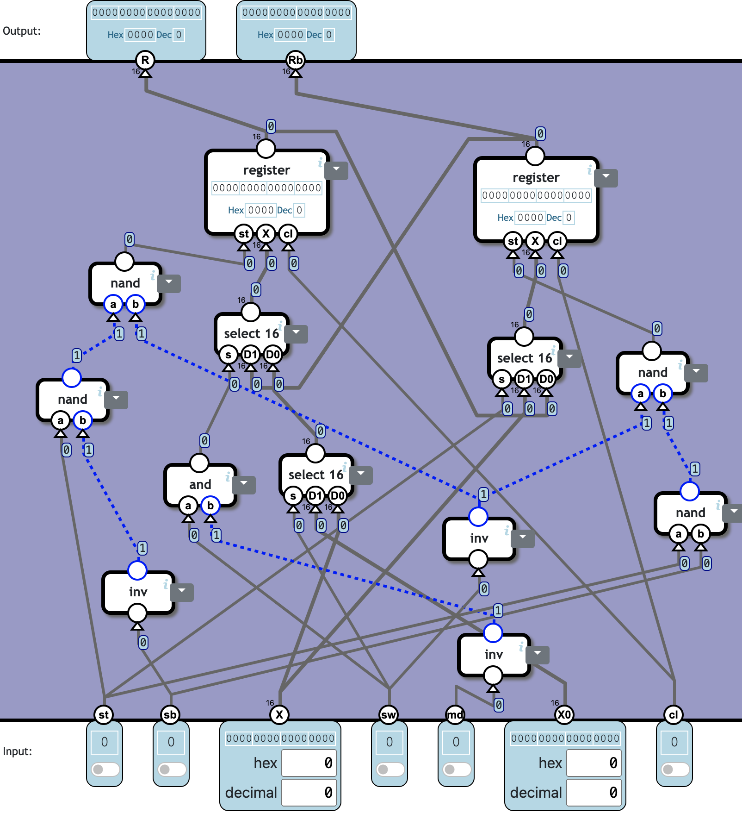

❓ Totally 13c553n:

| Component | Cnt | Nand | Subtotal |
| --------- | --- | ---- | -------- |
| inv       | 3   | 1    | 3        |
| nand      | 4   | 1    | 4        |
| and       | 1   | 2    | 2        |
| select 16 | 3   | 64   | 192      |
| register  | 2   | 176  | 352      |
| Total     | 13  |      | 553      |
<!-- TBLFM: @I$>..@>$>=($2*$3) -->
<!-- TBLFM: @>$2=sum(@I..@-1) -->
<!-- TBLFM: @>$>=sum(@I..@-1) -->

### Program Counter

A register with backup (**PC** and **PCb**), with two additions:

If **st**=0, PC is incremented, i.e. the current PC + 1 is stored in PC.

On interrupt (when **sw**=1 and **md**=1), the number `0` is stored in PC.

没说 **j** 和 **X** 怎么用啊。

根据 check solution 的响应，猜测 **j** 为 1 时提供 **X** 给 register，为 0 时提供 **R** 自增结果给 register。

貌似 register 的 **st** 始终为 1。

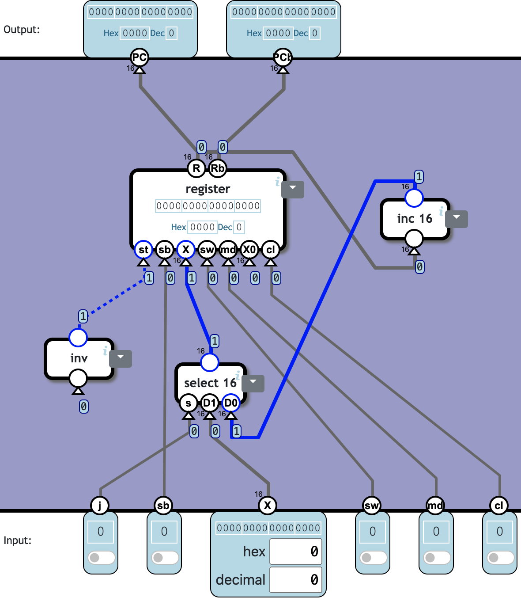

❓ Totally 4c763n:

| Component          | Cnt | Nand | Subtotal |
| ------------------ | --- | ---- | -------- |
| inv                | 1   | 1    | 1        |
| select 16          | 1   | 64   | 64       |
| inc 16             | 1   | 145  | 145      |
| register w/ backup | 1   | 553  | 553      |
| Total              | 4   |      | 763      |
<!-- TBLFM: @I$>..@>$>=($2*$3) -->
<!-- TBLFM: @>$2=sum(@I..@-1) -->
<!-- TBLFM: @>$>=sum(@I..@-1) -->

### Register bank

A block of four 16-bit registers, A, D M and PC, each coupled with a backup register.

- **a**=1: store **X** in A
- **d**=1: store **X** in D
- **m**=1: store **X** in M
- **j**=1: store **PC** input in PC register

**sb**=1 store instead in the corresponding backup register(s).

Mode change:

**md** is the current mode. **sw** indicate a mode change.

Interrupt:

When **sw**=1 and **mode**=1, these values are stored in the registers:

- Ab to **A**
- IR input to **D**
- The number `0` to **M**

不一定对，check solution 覆盖的应该不全（这关 check solution 貌似不起作用）。

sb、sw、md、cl 都对应接线即可。st 按照要求分别接 a、d、m 和 j。X0 分别接 Ab、IR 和全零（留空）。

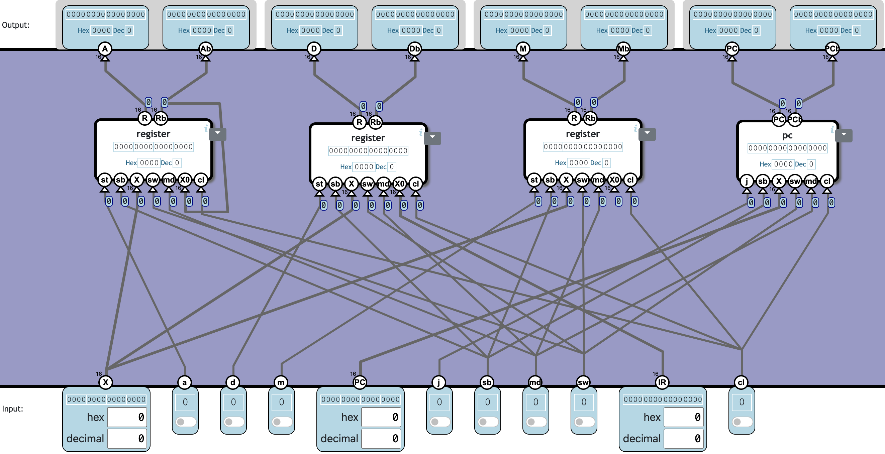

❓ Totally 4c2212n ❓怎么算的❓:

| Component          | Cnt | Nand | Subtotal |
| ------------------ | --- | ---- | -------- |
| register w/ backup | 3   | 553  | 1659     |
| pc                 | 1   | 763  | 763      |
| Total              | 4   |      | 2422     |
<!-- TBLFM: @I$>..@>$>=($2*$3) -->
<!-- TBLFM: @>$2=sum(@I..@-1) -->
<!-- TBLFM: @>$>=sum(@I..@-1) -->

### General-purpose Memory

> In the first processor, instruction memory (ROM) and data memory (RAM) was completely separate. This makes for a simple design, but means there is no way to install new programs or update existing programs. To enable this, we need memory which can be used for both instruction memory and data memory with read/store access.

A memory unit with read/store access to one address and simultaneous read access to another address.

The unit contain four 16 bit registers, accessed with 2-bit addresses.

**a1** and **a0** is the A address. The output ***A** is the value stored at the A address. If **st**=1, the **X** input is stored at the A address.

The output **I** is the value stored at the PC address given by **pc0** and **pc1**.

**cl** is the clock.

跟之前的 RAM 差不多，switch 和 select-16 都增加一层（因为这次有四个 register），再给输出 **I** 来一组 select-16。

❓ Totally 13c1100n:

| Component | Cnt | Nand | Subtotal |
| --------- | --- | ---- | -------- |
| register  | 4   | 176  | 704      |
| switch    | 3   | 4    | 12       |
| select 16 | 6   | 64   | 384      |
| Total     | 13  |      | 1100     |
<!-- TBLFM: @I$>..@>$>=($2*$3) -->
<!-- TBLFM: @>$2=sum(@I..@-1) -->
<!-- TBLFM: @>$>=sum(@I..@-1) -->

### Virtual Memory

> We need to give each process a dedicated area of memory which cannot be read or overwritten by other processes. We also need the possibility of sharing memory between two processes.
>
> We solve this by creating 8 memory segments (each 64Kb) and then assign segments to the active process. When the active process access a 16 bit memory address, we use the segment configuration to select the appropriate segment for the address.
>
> For flexibility we use two different segment-configurations for low and high addresses, so they can be in different segments. We also use different segment-configurations for instruction memory and data memory.

Extend the 16-bit addresses A and PC into 18-bit addresses by prepending 3 bits from M. Bit 15 of the input address determine which 3-bit block is used.

| Input | Bit 15 | Segment   | readonly-flag |
| ----- | ------ | --------- | ------------- |
| PC    | 0      | bit 0-2   | -             |
| PC    | 1      | bit 4-6   | -             |
| A     | 0      | bit 8-10  | bit 11        |
| A     | 1      | bit 12-14 | bit 15        |

The high bit is discarded from the input address and instead the selected three bits is prepended, giving a 18-bit address.

The 'readonly'-flag (only applicable to A addresses) determine if data can be stored. When 0, data can be stored normally by using the **st** flag. When 1, the **st**-flag is ignored.

这关的 check solution 有问题。

但凡提供一个 1-bit select 也能省事儿很多……

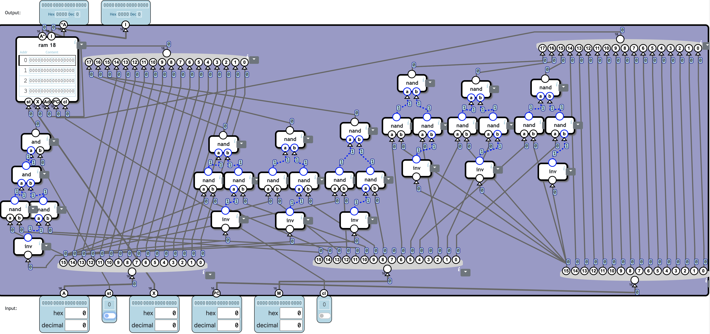

❓ Totally 30c31n + 281600❓ n/KB:

| Component | Cnt | Nand | Subtotal |
| --------- | --- | ---- | -------- |
| inv       | 7   | 1    | 7        |
| nand      | 20  | 1    | 20       |
| and       | 2   | 2    | 4        |
| ram 18    | 1   |      | 0        |
| Total     | 30  |      | 31       |
<!-- TBLFM: @I$>..@>$>=($2*$3) -->
<!-- TBLFM: @>$2=sum(@I..@-1) -->
<!-- TBLFM: @>$>=sum(@I..@-1) -->

### Control Unit

Decode the **I** input into an instruction.

The leftmost bits determine the instruction set:

|bit 15|bit 14|set|
|---|---|---|
|0|-|Data instruction|
|1|1|ALU instruction|
|1|0|See below|

| Bit  | Group                | Flag |
| ---- | -------------------- | ---- |
| 13   |                      | swap |
| 12-9 | unused               | -    |
| 8    | source register      | s1   |
| 7    | source register      | s0   |
| 6    | source register      | sb   |
| 5    | destination register | a    |
| 4    | destination register | d    |
| 3    | destination register | *a   |
| 2    | destination register | m    |
| 1    | destination register | j    |
| 0    | destination register | b    |

The flags s1, s0 and sb selects an input register:

| s1  | s0  | register |
| --- | --- | -------- |
| 0   | 0   | A        |
| 0   | 1   | D        |
| 1   | 0   | M        |
| 1   | 1   | PC       |

When **sb**=1, the backup register is selected instead.

不是很确定，check solution 中的 case 也很少。

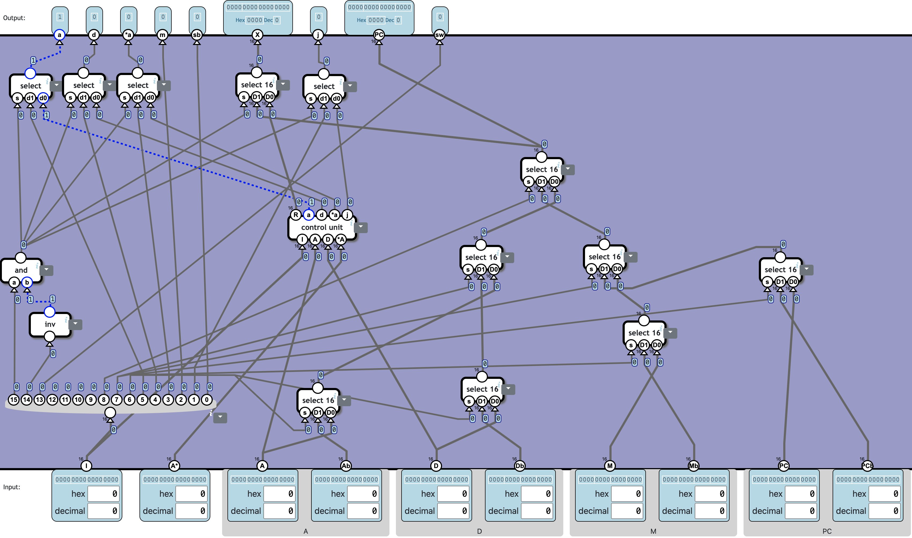

❓ Totally 15c1764n:

| Component    | Cnt | Nand | Subtotal |
| ------------ | --- | ---- | -------- |
| inv          | 1   | 1    | 1        |
| and          | 1   | 2    | 2        |
| select       | 4   | 4    | 16       |
| select 16    | 8   | 64   | 512      |
| control unit | 1   | 1233 | 1233     |
| Total        | 15  |      | 1764     |
<!-- TBLFM: @I$>..@>$>=($2*$3) -->
<!-- TBLFM: @>$2=sum(@I..@-1) -->
<!-- TBLFM: @>$>=sum(@I..@-1) -->

### Processor

Connect components to create a processor with support for multitasking.

😵‍💫😵‍💫😵‍💫😵‍💫😵‍💫 连连看……

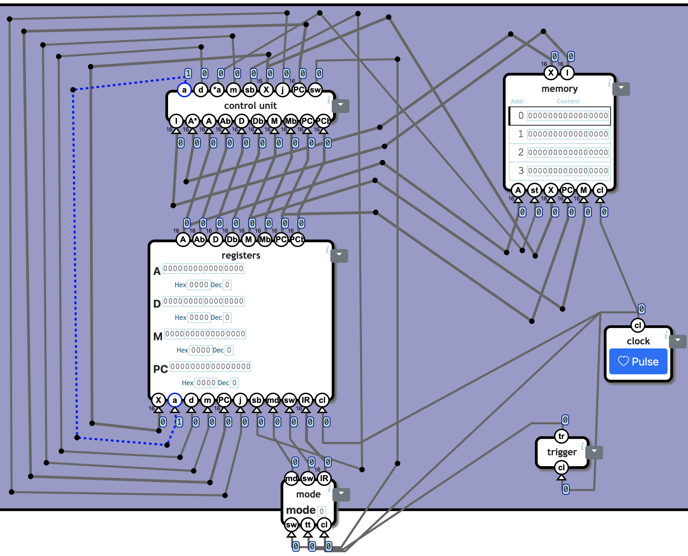

❓ Totally 5c2722❓n + 7936❓ n/KB:

| Component    | Cnt | Nand | Subtotal |
| ------------ | --- | ---- | -------- |
| trigger      | 1   | 387  | 387      |
| mode         | 1   | 18   | 18       |
| registers    | 1   | 2212 | 2212     |
| memory       | 1   |      | 0        |
| control unit | 1   | 1764 | 1764     |
| Total        | 5   |      | 4381     |
<!-- TBLFM: @I$>..@>$>=($2*$3) -->
<!-- TBLFM: @>$2=sum(@I..@-1) -->
<!-- TBLFM: @>$>=sum(@I..@-1) -->
