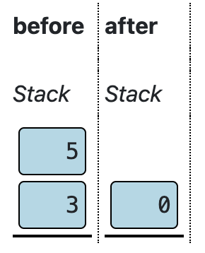

## All Levels

- [The Nand Game](../the-nand-game/index.md) - Hardware Levels
- [The Nand Game - Software Levels](../the-nand-game-software-levels/index.md)
- [The Nand Game - Optional Levels](../the-nand-game-optional-levels/index.md)

## Assembler Quick Reference

Syntax: `destination = calculation ; jump-condition`. Destination and jump-condition are optional.

**D** and **A** are the two registers. **\*A** indicate the value in RAM at the address contained in **A**.

Examples:

- `D = D + 1`: Calculate D + 1 and store the result in D.
- `D - 1 ; JGE`: Calculate D - 1. Jump if the result is greater than 0. (Result is not stored.)
- `A = 1234`: Store the number 1234 in the A register.
- `# Hello`: Comment.

### Calculations

- `D + A`
- `D - A` or `A - D`
- `D & A` (Bitwise and)
- `D | A` (Bitwise or)
- `A + 1` or `D + 1`
- `A - 1` or `D - 1`
- `~A` or `~D` (Bitwise inversion)
- `1` or `0` or `-1`

In all cases can **\*A** be used instead of **A**.

### Destinations

Any combination of **D**, **A** and **\*A** can be used as destination. Multiple destinations are comma separated, e.g. `D, A = 1`.

### Jump conditions

Jump when result of calculations is:

- `JQE` equal to 0
- `JNE` not equal to 0
- `JGT` greater than 0
- `JGE` greater than or equal to 0
- `JLT` less than 0
- `JLE` less than or equal to 0
- `JMP` unconditional jump (regardless of the calculation result)

### Number instructions

**A** can be directly assigned a number. Example: `A = 47`.

Numbers in hexadecimal is prefixed with `0x`, e.g.: `A = 0x7FFF`.

Numbers in binary is prefixed with `0b`, e.g.: `A = 0b010111`. Underscores can be used to separate digit group, e.g. `A = 0b_0101_1100`.

### Comments

Lines starting with `#` are ignored by the assembler. They can be used for comments and documentation.

### Labels

The keyword **LABEL** followed by a name makes the name represent the address of the following instruction. This address can be assigned to **A** before a jump, e.g. `A = LOOP`.

### Defines

The keyword **DEFINE** followed by a name and a number will cause the name to be replaced with the number when it occurs in other instructions. For example:

``` nasm
DEFINE foo 0x7FFF
A = foo
```

Is equivalent to: `A = 0x7FFF`.

### Multiple targes

It is possible to assign a result to multiple register.

E.g. `D, A = D - *A`. The result of calculation will be written to both A and D.

Any combination of A, D, and \*A can be specified as destination.

## Software Level: Low level

### Machine code

Write a program with four instructions:

0) Set the D register to 0
1) Set the A register to 2
2) Add 1 to the D register
3) Jump unconditionally

就是在 Hardware 最后 [Computer](../the-nand-game/index.md#Computer) 那关的 ROM 里填入指令。

> The word at the PC address in the program memory is the **I** input to the control unit.

需要结合 [Control Unit](../the-nand-game/index.md#Control%20Unit)、 [ALU Instruction](../the-nand-game/index.md#ALU%20Instruction)、[ALU](../the-nand-game/index.md#ALU) 和 [Condition](../the-nand-game/index.md#Condition) 看指令每一位的取值。

> Note: Inside ALU instruction: `alu(X=D, Y=A/*A)`.

| I: Bit | I: Hex | Group     | Flag | Note                    |
| ------ | ------ | --------- | ---- | ----------------------- |
| 15     | 0x8000 | -         | ci   | 0: data (to A); 1: ALU  |
| 12     | 0x1000 | -         | \*   | 1: use \*A instead of A |
| 10     | 0x400  | operation | u    |                         |
| 9      | 0x200  | operation | op1  |                         |
| 8      | 0x100  | operation | op0  |                         |
| 7      | 0x80   | operation | zx   | 1: D = 0                |
| 6      | 0x40   | operation | sw   | 1: swap D and A         |
| 5      | 0x20   | target    | a    | 1: a                    |
| 4      | 0x10   | target    | d    | 1: d                    |
| 3      | 0x8    | target    | \*a  | 1: \*a                  |
| 2      | 0x4    | jump      | lt   |                         |
| 1      | 0x2    | jump      | eq   |                         |
| 0      | 0x1    | jump      | gt   |                         |

| u   | op1 | op0 | Output   |
| --- | --- | --- | -------- |
| 0   | 0   | 0   | D and A  |
| 0   | 0   | 1   | D or A   |
| 0   | 1   | 0   | D xor A  |
| 0   | 1   | 1   | invert D |
| 1   | 0   | 0   | D + A    |
| 1   | 1   | 0   | D - A    |
| 1   | 0   | 1   | D + 1    |
| 1   | 1   | 1   | D - 1    |

|lt|eq|gt| output 1 when |
| --- | --- | --- | ------------- |
|0|0|0| Never         |
|0|0|1| X > 0         |
|0|1|0| X = 0         |
|0|1|1| X ≥ 0         |
|1|0|0| X < 0         |
|1|0|1| X ≠ 0         |
|1|1|0| X ≤ 0         |
|1|1|1| Always        |

#### Set the D register to 0

- 往寄存器 D 写数据，得用 alu instruction，`ci = 1`，`target.d = 1`。
- 要写入 0，那么 alu 模块应该取 `u = 0, op1 = 0, op0 = 0` 即 `D and A` ，同时 `zx = 1` 即 `D = 0`（合起来就是 `0 and A = 0`。
- condition 模块取全零即输出恒 0。

So `I = ci | d | zx = 0x8090` (i.e. `D = 0`).

#### Set the A register to 2

- 往寄存器 A 写数据，设置 `ci = 0`，其余位构成要写入的数字 2。

So `I = 0x0002` (i.e. `A = 2`).

#### Add 1 to the D register

- 需要使用 alu instruction，设置 `ci = 1`，`target.d = 1`。
- alu 模块取 `u = 1, op1 = 0, op0 = 1` 即 `D + 1`。
- condition 模块全零。

So `I = ci | d | u | op0 = 0x8510` (i.e. `D = D + 1`).

#### Jump unconditionally

- 需要使用 alu instruction，设置 `ci = 1`。
- condition 模块取全一即输出恒 1。
  - 注意当 `j`（即 condition 的输出）为 1 时，PC 会被设置为寄存器 A 的值。本题中会跳到 `ROM[2]`。

So `I = ci | lt | eq | gt = 0x8007` (i.e. `JMP`).

#### All together






持续运行的效果相当于对寄存器 D 从 0 开始逐步递增。

### Assembly Language

Programming a computer by directly setting instruction bits is quite time-consuming and error-prone.

Therefore we create a so-called **assembler** language, which is a text-based format using letters and symbols instead of bits to represent machine-code instructions.

An **assembler** translates the symbolic instructions into binary machine code.

An assembler instruction has three parts: The _destination_, the _calculation_ and an (optional) _jump-condition_.

- The destination is the register(s) which the output of the operation is written to.
- The calculation is the ALU operation.
- The jump condition is the condition which will cause a jump.

Example instruction:

$$
\underbrace{D=}_{\text{ Destination }} \underbrace{D+1}_{\text{ Calculation }} \underbrace{\text{; JNE}}_{\text{ Jump-condition }}
$$

#### Destination

> 用空白代表 0，让 1 更突出。

| Opcode      | a   | d   | \*a |
| ----------- | --- | --- | --- |
| (blank)     |     |     |     |
| A =         | 1   |     |     |
| D =         |     | 1   |     |
| \*A =       |     |     | 1   |
| A, D =      | 1   | 1   |     |
| D, \*A =    |     | 1   | 1   |
| A, D, \*A = | 1   | 1   | 1   |
| A, \*A =    | 1   |     | 1   |

#### Calculation

有些 operation 可以对应多种不同的 flags 组合。

| Opcode | u   | op1 | op0 | zx  | sw  | Note     |
| ------ | --- | --- | --- | --- | --- | -------- |
| D+A    | 1   |     |     |     |     |          |
| D-A    | 1   | 1   |     |     |     |          |
| A-D    | 1   | 1   |     |     | 1   |          |
| D+1    | 1   |     | 1   |     |     |          |
| A+1    | 1   |     | 1   |     | 1   |          |
| D-1    | 1   | 1   | 1   |     |     |          |
| A-1    | 1   | 1   | 1   |     | 1   |          |
| -D     | 1   | 1   |     | 1   | 1   | i.e. 0-D |
| -A     | 1   | 1   |     | 1   |     | i.e. 0-A |
| -1     | 1   | 1   | 1   | 1   |     | i.e. 0-1 |
| 1      | 1   |     | 1   | 1   |     | i.e. 0+1 |
| D      | 1   |     |     | 1   | 1   | i.e. 0+D |
| A      | 1   |     |     | 1   |     | i.e. 0+A |
| D&A    |     |     |     |     |     |          |
| D\|A   |     |     | 1   |     |     |          |
| ~D     |     | 1   | 1   |     |     |          |
| ~A     |     | 1   | 1   |     | 1   |          |
| 0      |     |     |     | 1   |     | i.e. 0&A |

#### Jump-condition

| Opcode  | lt  | eq  | gt  |
| ------- | --- | --- | --- |
| (blank) |     |     |     |
| ; JLT   | 1   |     |     |
| ; JEQ   |     | 1   |     |
| ; JGT   |     |     | 1   |
| ; JLE   | 1   | 1   |     |
| ; JGE   |     | 1   | 1   |
| ; JMP   | 1   | 1   | 1   |
| ; JNE   | 1   |     | 1   |

### Assembler program

Write a program in assembler which causes the lamp to blink at least three times.

The lamp is memory-mapped to the address 7FFF, bits 1 and 0.

| Bit | Set to 1 to:  |
| --- | ------------- |
| 0   | Turn lamp on  |
| 1   | Turn lamp off |

The external device is only affected when a bit is changing from 0 to 1.

给内存地址 0x7FFF 写入 0x1，则灯亮；直接对此数值取反，则灯灭。

``` nasm
# 0x7FFF
A = 0x7FFF
# 0xe588 = ci3 | u | op0 | zx | *a
*A = 1
# 0xf348 = ci3 | * | op1 | op0 | sw | *a
*A = ~*A
*A = ~*A
*A = ~*A
*A = ~*A
*A = ~*A
```

👆 其中 `ci3` 表示最高的 3 位（`ci` 及其右边的两位）。

### Keyboard input

Write a program in assembler which write keyboard input into memory.

The keyboard input is memory-mapped to address `6000`.

Write the first character typed at memory address `1000`(hex), the second typed at `1001`(hex) and so on.

Note: A key will usually be held down for much longer than a clock cycle, but should only be registered as a single input until the key is released.

主要的麻烦是寄存器太少……得用内存来保存变量。

需要记录下一次要写入的内存地址（起始值为 0x1000），用内存地址 0xFFF 来记录此值。

``` nasm
DEFINE KBD 0x6000
DEFINE W_ADDR 0xFFF

# Variable: the writing addr
A = 0x1000
D = A
A = W_ADDR
*A = D

# Waiting for key press
LABEL WAIT_KEY_PRESS
A = KBD
D = *A
A = WAIT_KEY_PRESS
D ; JEQ

# Some key is pressing
# Write it to next free memory
A = W_ADDR
A = *A
*A = D
A = W_ADDR
*A = *A + 1

# Waiting for key release
LABEL WAIT_KEY_RELEASE
A = KBD
D = *A
A = WAIT_KEY_RELEASE
D ; JNE

# The key has released
A = WAIT_KEY_PRESS
JMP
```

### Escape Labyrinth

The computer is stuck in a labyrinth on Mars. Write a program that will make it escape the labyrinth.

The computer has connected wheels and a forward obstacle detector. Input/output to wheels and detector is memory-mapped on address 7FFF:

**Output signals to peripherals:**

| Bit | Bin      | Set to 1 to:            |
| --- | -------- | ----------------------- |
| 2   | 0b0100   | Move forward (1 step)   |
| 3   | 0b1000   | Turn left (90 degrees)  |
| 4   | 0b1_0000 | Turn right (90 degrees) |

The movement/turn is started when a bit is changing from 0 to 1, but will take a moment to complete.

**Input from peripherals:**

| Bit | Bin            | When 1                     |
| --- | -------------- | -------------------------- |
| 8   | 0b1_00000000   | Obstacle detected in front |
| 9   | 0b10_00000000  | Device is turning          |
| 10  | 0b100_00000000 | Device is moving forward   |

读写都在内存地址 7FFF。

注意移动和旋转都会持续一段时间，需要等待动作完成，如：

``` nasm
DEFINE IO 0x7FFF
DEFINE C_IS_BUSY 0x600

# Wait until idle
LABEL WHILE_BUSY
A = C_IS_BUSY
D = A
A = IO
D = D & *A
A = WHILE_BUSY
D ; JNE
```

走迷宫用「沿墙走法」（使用于没有环形路径的迷宫）。比如选定右手 🫱，单手模住一面墙出发，手始终不离开墙面。

但这里麻烦的点是它不会判定左边或右边是否有墙壁，就得反反复复第左右转动……判断右手是否是墙的动作就变成「向右转 - 判断前方是否有墙 - 向左转」。

- ① 如果右手是墙，前方没有墙，则前进；
- ② 如果右手是墙，前方也是墙，则左转；
- ➂ 如果右手没有墙，则右转。

按照这个 computer 的行为模式则为：

- 判断前方是否有墙并记住
- 右转
- 判断前方有墙
  - 若没有，则前进（对应上边情况 ③）
  - 若有，则检查刚才记录的开始时前方是否有墙
    - 若有，则左转两次（对应上边情况 ②）
    - 若没有，则左转，然后前进（对应上边情况 ①）

``` nasm
# Assembler code
DEFINE IO 0x7FFF
DEFINE C_FRONT_WALL 0x100
DEFINE C_IS_BUSY 0x600
DEFINE C_MOVE_FORWARD 0x04
DEFINE C_TURN_LEFT 0x08
DEFINE C_TURN_RIGHT 0x10
DEFINE F_IS_WALL 0x100
DEFINE ONE_STACK 0xFF

LABEL GOTO_BEGIN

# Detect current front and remeber
A = C_FRONT_WALL
D = A
A = IO
D = D & *A
A = F_IS_WALL
*A = D

# Turn right
A = GOTO_1
D = A
A = ONE_STACK
*A = D
A = C_TURN_RIGHT
D = A
A = FUNC_EXEC_ACTION
JMP

LABEL GOTO_1

# Detect current front (previous right)
A = C_FRONT_WALL
D = A
A = IO
D = D & *A
A = CASE_3
D ; JEQ

# Check previous front status
A = F_IS_WALL
D = *A
A = CASE_1
D ; JEQ

# Case 2: turn left twice
LABEL CASE_2
A = GOTO_2
D = A
A = ONE_STACK
*A = D
A = C_TURN_LEFT
D = A
A = FUNC_EXEC_ACTION
JMP

LABEL GOTO_2

A = GOTO_BEGIN
D = A
A = ONE_STACK
*A = D
A = C_TURN_LEFT
D = A
A = FUNC_EXEC_ACTION
JMP

# Case 1: turn left then move forward
LABEL CASE_1
A = GOTO_3
D = A
A = ONE_STACK
*A = D
A = C_TURN_LEFT
D = A
A = FUNC_EXEC_ACTION
JMP

LABEL GOTO_3

A = GOTO_BEGIN
D = A
A = ONE_STACK
*A = D
A = C_MOVE_FORWARD
D = A
A = FUNC_EXEC_ACTION
JMP

# Case 3: move forward now
LABEL CASE_3
A = GOTO_BEGIN
D = A
A = ONE_STACK
*A = D
A = C_MOVE_FORWARD
D = A
A = FUNC_EXEC_ACTION
JMP

# A function
# Performs the move/turn action specified by D
# Waits until the move/turn complete
# Jump to *ONE_STACK
LABEL FUNC_EXEC_ACTION
A = IO
*A = D | *A
LABEL WHILE_BUSY
A = C_IS_BUSY
D = A
A = IO
D = D & *A
A = WHILE_BUSY
D ; JNE
A = ONE_STACK
A = *A
JMP
```

### Display

Display a logo (at least 16 pixels in both width and height) of your own choice on the screen.

The screen is 512 x 256 monochrome pixels, memory-mapped from address 0x4000 to 0x6000. Each address correspond to 16 pixel on the screen. The lines are contiguously in memory, so first line start at 0x4000, second line starts at 0x4020 and so forth.

做一个 32 x 32 的 logo 放在屏幕中央。Logo 第一行内存地址为 0x4E0F、0x4E10，下一行是 0x4E2F 和 0x4E30，然后是 0x4E4F 和 0x4E50，……

另外需要注意，以 data instruction 模式往寄存器 A 写数据的时候，最高位被 **ci** flag 占用，无法写入大于等于 0x8000 的数字。所以对于大于等于 0x8000 的数值，需要先将其反码写入寄存器 A，然后在执行 bitwise inversion 操作得到想要的数字。

> [!tip]
> 以下代码完全由 AI 生成。
>
> 把 PNG 图片给 AI，让它缩放后生成 32 行、每行两个 16-bit hex 的数据。再把第一行数据的处理代码示例以及每一行的地址变化规律告诉它，把大数字的取反规则告诉它，让它生成完整的代码。

``` nasm

# Generated assembly instructions from hex data
# Each line processes two 16-bit hex numbers and stores them at incrementing addresses

# Line 1: 0400 0020
A = 0x0400
D = A
A = 0x4E0F
*A = D
A = 0x0020
D = A
A = 0x4E10
*A = D

# Line 2: 0E00 0070
A = 0x0E00
D = A
A = 0x4E2F
*A = D
A = 0x0070
D = A
A = 0x4E30
*A = D

# Line 3: 0700 00E0
A = 0x0700
D = A
A = 0x4E4F
*A = D
A = 0x00E0
D = A
A = 0x4E50
*A = D

# Line 4: 078F F1E0
A = 0x078F
D = A
A = 0x4E6F
*A = D
A = 0x0E1F
D = ~A
A = 0x4E70
*A = D

# Line 5: 07FF FFE0
A = 0x07FF
D = A
A = 0x4E8F
*A = D
A = 0x001F
D = ~A
A = 0x4E90
*A = D

# Line 6: 03FF FFC0
A = 0x03FF
D = A
A = 0x4EAF
*A = D
A = 0x003F
D = ~A
A = 0x4EB0
*A = D

# Line 7: 03FF FFC0
A = 0x03FF
D = A
A = 0x4ECF
*A = D
A = 0x003F
D = ~A
A = 0x4ED0
*A = D

# Line 8: 03FF FFC0
A = 0x03FF
D = A
A = 0x4EEF
*A = D
A = 0x003F
D = ~A
A = 0x4EF0
*A = D

# Line 9: 07FE 7FE0
A = 0x07FE
D = A
A = 0x4F0F
*A = D
A = 0x7FE0
D = A
A = 0x4F10
*A = D

# Line 10: 07F0 0FE0
A = 0x07F0
D = A
A = 0x4F2F
*A = D
A = 0x0FE0
D = A
A = 0x4F30
*A = D

# Line 11: 0FE0 07F0
A = 0x0FE0
D = A
A = 0x4F4F
*A = D
A = 0x07F0
D = A
A = 0x4F50
*A = D

# Line 12: 0FC0 03C0
A = 0x0FC0
D = A
A = 0x4F6F
*A = D
A = 0x03C0
D = A
A = 0x4F70
*A = D

# Line 13: 1F80 0100
A = 0x1F80
D = A
A = 0x4F8F
*A = D
A = 0x0100
D = A
A = 0x4F90
*A = D

# Line 14: 1F00 0000
A = 0x1F00
D = A
A = 0x4FAF
*A = D
A = 0x0000
D = A
A = 0x4FB0
*A = D

# Line 15: 1F00 0000
A = 0x1F00
D = A
A = 0x4FCF
*A = D
A = 0x0000
D = A
A = 0x4FD0
*A = D

# Line 16: 1F00 0000
A = 0x1F00
D = A
A = 0x4FEF
*A = D
A = 0x0000
D = A
A = 0x4FF0
*A = D

# Line 17: 3F00 0000
A = 0x3F00
D = A
A = 0x500F
*A = D
A = 0x0000
D = A
A = 0x5010
*A = D

# Line 18: 3F00 0000
A = 0x3F00
D = A
A = 0x502F
*A = D
A = 0x0000
D = A
A = 0x5030
*A = D

# Line 19: 3F00 0000
A = 0x3F00
D = A
A = 0x504F
*A = D
A = 0x0000
D = A
A = 0x5050
*A = D

# Line 20: 1F00 0000
A = 0x1F00
D = A
A = 0x506F
*A = D
A = 0x0000
D = A
A = 0x5070
*A = D

# Line 21: 1F00 0000
A = 0x1F00
D = A
A = 0x508F
*A = D
A = 0x0000
D = A
A = 0x5090
*A = D

# Line 22: 1F80 0000
A = 0x1F80
D = A
A = 0x50AF
*A = D
A = 0x0000
D = A
A = 0x50B0
*A = D

# Line 23: 1F80 0180
A = 0x1F80
D = A
A = 0x50CF
*A = D
A = 0x0180
D = A
A = 0x50D0
*A = D

# Line 24: 0FC0 03E0
A = 0x0FC0
D = A
A = 0x50EF
*A = D
A = 0x03E0
D = A
A = 0x50F0
*A = D

# Line 25: 0FE0 07F0
A = 0x0FE0
D = A
A = 0x510F
*A = D
A = 0x07F0
D = A
A = 0x5110
*A = D

# Line 26: 07F8 1FE0
A = 0x07F8
D = A
A = 0x512F
*A = D
A = 0x1FE0
D = A
A = 0x5130
*A = D

# Line 27: 07FF FFE0
A = 0x07FF
D = A
A = 0x514F
*A = D
A = 0x001F
D = ~A
A = 0x5150
*A = D

# Line 28: 03FF FFC0
A = 0x03FF
D = A
A = 0x516F
*A = D
A = 0x003F
D = ~A
A = 0x5170
*A = D

# Line 29: 01FF FF80
A = 0x01FF
D = A
A = 0x518F
*A = D
A = 0x007F
D = ~A
A = 0x5190
*A = D

# Line 30: 007F FE00
A = 0x007F
D = A
A = 0x51AF
*A = D
A = 0x01FF
D = ~A
A = 0x51B0
*A = D

# Line 31: 003F FC00
A = 0x003F
D = A
A = 0x51CF
*A = D
A = 0x03FF
D = ~A
A = 0x51D0
*A = D

# Line 32: 0003 C000
A = 0x0003
D = A
A = 0x51EF
*A = D
A = 0x3FFF
D = ~A
A = 0x51F0
*A = D
```


### Network

Receive data from another computer over the network and display it on the screen.

The payload will be an image 16 pixels in width.

The network wires are memory mapped to the address `6001` (hex), with two significant bits: **data** (bit 0) which is the current bit of data sent over the wire and **sync** (bit 1) which change to indicate that a new bit has arrived.

> Each time the sync signal changes (from 0 to 1 or from 1 to 0), a new bit can be read from the data wire.

The protocol (in this mission) is that a transmission always starts with a 1 bit, followed by 16 bits of data, then followed by a control bit. If the control bit is 0, it means the transmission has ended. If the control bit is 1, it means another 16 bits data will follow, again followed by a control bit. And so on.

``` nasm
DEFINE C_NET_ADDR 0x6001
DEFINE C_NET_DATA 0x01
DEFINE C_NET_SYNC 0x02
DEFINE C_STACK_BOTTOM_ADDR 0x1FF

DEFINE V_STACK_TOP_ADDR 0x100
DEFINE V_WRITE_ADDR 0x101
DEFINE V_IMG_WORD 0x102
DEFINE V_BIT_MASK 0x103
DEFINE V_PREV_NET_SYNC 0x104
DEFINE V_NET_DATA 0x105

# Init net `sync` state
A = C_NET_ADDR
D = *A
A = C_NET_SYNC
D = D & A
A = V_PREV_NET_SYNC
*A = D

# Init stack
A = C_STACK_BOTTOM_ADDR
D = A
A = V_STACK_TOP_ADDR
*A = D

# Init image write address
A = 0x4000
D = A
A = V_WRITE_ADDR
*A = D

LABEL L_IMAGE_WORD_LOOP

# Call F_RECEIVE_BIT to receive the control bit
A = L_001
D = A
A = V_STACK_TOP_ADDR
*A = *A + 1
A = *A
*A = D
A = F_RECEIVE_BIT
JMP

LABEL L_001

# End if no more data
A = V_NET_DATA
D = *A
A = L_END
D ; JEQ

# Init for receiving a word
A = V_IMG_WORD
*A = 0
A = V_BIT_MASK
*A = 1

# Loop to receive 16 bits
LABEL L_RECEIVE_BIT_LOOP

# Call F_RECEIVE_BIT to receive a single bit
A = L_002
D = A
A = V_STACK_TOP_ADDR
*A = *A + 1
A = *A
*A = D
A = F_RECEIVE_BIT
JMP

LABEL L_002

# Skip if data is `0`
A = V_NET_DATA
D = *A
A = L_AFTER_BIT
D ; JEQ

# Merge the received bit into the word
A = V_BIT_MASK
D = *A
A = V_IMG_WORD
*A = D | *A

LABEL L_AFTER_BIT

# Shift the bit mask left
A = V_BIT_MASK
D = *A
D = D + *A
*A = D

# Check if we have received 16 bits
A = L_RECEIVE_BIT_LOOP
D ; JNE

# Write the received word to the image
A = V_IMG_WORD
D = *A
A = V_WRITE_ADDR
A = *A
*A = D

# Increment the write address
A = 0x20
D = A
A = V_WRITE_ADDR
*A = D + *A

A = L_IMAGE_WORD_LOOP
JMP


# Function
# Receives a single bit from net
LABEL F_RECEIVE_BIT

# Wait for next bit
LABEL L_WAIT_NET_DATA
A = C_NET_ADDR
D = *A
A = C_NET_SYNC
D = D & A
A = V_PREV_NET_SYNC
D = D ^ *A
A = L_WAIT_NET_DATA
D ; JEQ

# Store the current net `sync`
LABEL F_STORE_NET_SYNC
A = C_NET_ADDR
D = *A
A = C_NET_SYNC
D = D & A
A = V_PREV_NET_SYNC
*A = D

# Store the current net data
A = C_NET_ADDR
D = *A
A = C_NET_DATA
D = D & A
A = V_NET_DATA
*A = D

# Return
A = V_STACK_TOP_ADDR
A = *A
D = *A
A = V_STACK_TOP_ADDR
*A = *A - 1
A = D
JMP


LABEL L_END
```

## Software Level: Stack machine

### Init stack

The stack is an area of memory where we can store and retrieve intermediate values in a last-in-first-out manner.

We use the first available memory address, address 0, to store the **stack pointer** (or SP).

We write this in the form of a **macro** called `init.stack`. A macro is a snippet of code which can be easily reused. If the keyword `init.stack` is used in assembler, it will be replaced with this code.

Set the Stack Pointer (RAM address 0) to 256 (Hex value 0100).

It may be helpful to define a constant named SP with the value 0.

- SP (Stack Pointer): 值为 0 的常量，即 `mem[0]` 记录当前的栈顶。
- 初始栈顶地址为 0x0100（这里栈顶是可以写入的位置）。

Constants:

- SP: 0

``` nasm
# init.stack
A = 0x0100
D = A
A = SP
*A = D
```

### Push D

Storing a new value on the stack is called pushing.

Write code which pushes the current value of the D-register on the top of the stack.

The SP should be increased by one.

SP points to the address after the top of the stack.

``` nasm
# push.D
A = SP
A = *A
*A = D
A = SP
*A = *A + 1
```

### Pop D

Retrieving the value at the top of the stack is called **popping** a value.

Write code which pops the value at top of the stack and writes it to the **D**-register.

The stack pointer (SP) should be decreased by 1 when a value is popped.

SP points to the address after the top of the stack, so the value to retrieve is at SP - 1.

``` nasm
# pop.D
A = SP
*A = *A - 1
A = *A
D = *A
```

### Pop A

Write code which pops the value at top of the stack and writes it to the **A**-register.

**Important criteria**: The **D**-register must not be affected by this operation.

``` nasm
# pop.A
A = SP
*A = *A - 1
A = *A
A = *A
```

### Push Value

Now we introduce a macro which use a _placeholder_.

The macro keyword `push.value` must followed by a number, e.g. `push.value 42`.

When the macro is used, the placeholder keyword `value` in the macro code will be replaced with the specified number, i.e. `42`.

``` nasm
# push.value <value>
A = value
D = A
push.D
```

### Add

Pop two values from the stack, add them, and push the sum on the stack.

``` nasm
# add
pop.D
pop.A
D = D + A
push.D
```

### Sub

Pop two values from stack, subtract the first from the second, and then push the result back on the stack.






“subtract the first from the second” = 「从第二个数中减去第一个数」，即 **后出栈的数 - 先出栈的数**。

因为出栈是 macro 内部逻辑，从使用者的角度，就是 **先入栈的数 - 后入栈的数**。

``` nasm
# sub
pop.D
pop.A
D = A - D
push.D
```

### Neg

Negate the value on top of the stack.

``` nasm
# neg
pop.D
D = -D
push.D
```

### And

Pop two values from stack, perform a bitwise AND and push the result back on the stack.

``` nasm
# and
pop.D
pop.A
D = D & A
push.D
```

### Or

Pop two values from stack, perform a bitwise OR and push the result back on the stack.

``` nasm
# or
pop.D
pop.A
D = D | A
push.D
```

## Software Level: High-level language

A high level language have a more human-friendly and flexible syntax which is then _compiled_ into machine code instructions. For example the high-level code `2 + 2` could be compiled into the low-level code:

``` nasm
push.value 2
push.value 2
ADD
```

Compilation has three stages:

1. (1) Tokenization
2. (2) Parsing
3. (3) Code generation

### Tokenize

The tokenizer is preconfigured to recognize numbers and the symbol '+'.

Configure the tokenizer to additionally recognize the symbols minus '-' and parentheses '(' and ')'.

Token type:

- **Exact** matches match the exact text specified under `Match`. Multiple exact matches can be specified in the same box, separated by whitespace.
- **Pattern** can use character groups in brackets and quantifiers `*` and `+`.
        - Example: `[0-9]` matches a decimal digit, `[0-9]+` matches one or more digits.

Gramma property:

- **Ignore** patterns are skipped by the tokenizer. Use e.g. for whitespace and comments.
- **Name** patterns are represented with the specified name in the grammar.
- **Literal** matches are represented with the literal text in the grammar.

Token definitions:

| Type    | Match     | Grammar | Token name |
| ------- | --------- | ------- | ---------- |
| Pattern | `[ ]+`    | Ignore  |            |
| Pattern | `[0-9]+`  | Name    | Number     |
| Exact   | `+ - ( )` | Literal |            |

### Grammar

Parse the sequence of tokens into a syntax-tree.

The syntax of a high-level language is described through a **grammar**.

A grammar is a set of rules where each rule names a part of the syntax and defines how it composed.

The terms used in the grammar are called symbols. The rules define how a symbol (left of the arrow) is composed of one or more other symbols (right of the arrow). The symbols the right of the arrow are either tokens which is defined by the token specification (in the previous step), or they are symbols themselves defined by rules in the same grammar.

The symbols representing tokens (like `Number` and `+`) are called _terminals_, the symbols like Program and Expression which are defined by other rules in the grammar are called _non-terminals_.

The names used as non-terminal symbols are arbitrary – you can use names which makes sense for you. Only condition is there must be a "starting symbol" called `Program`, which represent the whole program.

This game uses an Earley-parser, which is not the fastest but which is flexible and easy to write a grammar for.

Define a **Grammar** for expressions involving numbers, parentheses and the operators `+` and `-`.

The start symbol is `Expression`.

An expression should correspond to one of:

- A `Number` token
- _Expression_ `+` _Expression_
- _Expression_ `-` _Expression_
- `-` _Expression_
- `(` _Expression_ `)`

Grammar:

> [!caution]
> 本关中的错误，在 check solution 时可能无法指出，到下一关 code generation 时可能会遇到问题，需要再回来修改。

- Expression → `Number`
- Expression → `Number`
- Expression → `( Expression )`
- Expression → `Expression + Expression`
- Expression → `Expression - Expression`

### Code generation

The third step in the compilation is to generate machine code from the syntax tree.

This is done by associating each syntax rule with a block of assembler code.

The compiler then generate the resulting code by traversing the syntax tree and for each node in the tree generate the code associated with the rule.

Define code-generation for the syntax rules of the language, to support addition and subtraction.

Syntax rules:

``` nasm
# Expression → `Number`
push.value [Number]

# Expression → `Number`
[Expression]
neg

# Expression → `( Expression )`
[Expression]

# Expression → `Expression + Expression`
[Expression 1]
[Expression 2]
add

# Expression → `Expression - Expression`
[Expression 1]
[Expression 2]
sub
```

有个问题是它不会遵循从左向右的计算顺序，比如`100 - 2 + 2 - (7 + 10)` 会得到如下的表达式，结果是 113 而不是期望的 83。






## Software Level: Conditonals

### Eq

Pop the two top values from the stack and compare them. If they are equal, push the value -1 (`FFFF` in hex). Otherwise push `0`.

In conditionals, `FFFF` represents _true_ and `0` represents _false_.

``` nasm
# eq
pop.D
pop.A
D = D - A
A = WHEN_TRUE
D ; JEQ
push.value 0
A = END
JMP

LABEL WHEN_TRUE
D = 0
D = ~D
push.D

LABEL END
```

### Gt

Pop the two top values from the stack and compare them. If the first is greater than the second, push the value -1 (`FFFF` in hex). Otherwise push 0.







这里文字描述跟图片有出入。文字说的是如果 **先出栈的数 > 后出栈的数**，结果为 -1。但图中先出栈 5，大于后出栈的 3，结果却为 0。

"Test code" 的提示跟文字描述的逻辑一致。

但 "Check solution" 的检查逻辑似乎跟图一致，即当 **先入栈的数 > 后入栈的数**，结果为 -1，否则为 0。这个其实跟 **sub** 的行为（**先入栈的数 - 后入栈的数**）也是类似的。

``` nasm
# gt
pop.D
pop.A
D = A - D
A = WHEN_TRUE
D ; JGT
push.value 0
A = END
JMP

LABEL WHEN_TRUE
D = 0
D = ~D
push.D

LABEL END
```

### Lt

Pop the two top values from the stack and compare them. If the first is less than the second, push the value -1 (`FFFF` in hex). Otherwise push 0.

同样，这里应该是指当 **先入栈的数 < 后入栈的数**，结果为 -1，否则为 0。

``` nasm
# lt
pop.D
pop.A
D = A - D
A = WHEN_TRUE
D ; JLT
push.value 0
A = END
JMP

LABEL WHEN_TRUE
D = 0
D = ~D
push.D

LABEL END
```

### Not

Invert the value on top of the stack, using bitwise inversion.

``` nasm
# not
pop.D
D = ~D
push.D
```

### Goto

Jump to the label given in the placeholder.

``` nasm
goto <label>
A = label
JMP
```

### If-goto

Pop the value on top of the stack.

Jump to the label if it is non-zero.

``` nasm
# if.goto <label>
pop.D
A = label
D ; JNE
```

## Software Level: Memory

### Push Memory

The value on top of the stack is a memory address.

Pop the address from the stack. Fetch the current contents of the memory address, and push this on the stack.

``` nasm
# push.memory
pop.A
D = *A
push.D
```

### Pop Memory

Pop two values value from the stack. The second value is a memory address.

Write the first value to memory at the given address.

从使用者的角度，**先入栈地址，后入栈数据**。

``` nasm
# pop.memory
pop.D
pop.A
*A = D
```

### Push Static

Take the current contents of the memory address given by the `address` placeholder and push it on the stack.

``` nasm
# push.static <address>
A = address
D = *A
push.D
```

### Pop Static

Take the value on top of the stack and store it at the memory address given by the `address` placeholder.

``` nasm
# pop.static <address>
pop.D
A = address
*A = D
```

## Software Level: Functions

The **function** is perhaps the single most important abstraction in software.

A function is a unit of code which take some input (called arguments), has some local storage to use for processing, and return a value.

A function can be executed (called) from anywhere in the program. When a function is called, the address of the call is stored on the stack, and when the function is complete, it returns to the address from where it was called

Arguments and local storage is also stored on the stack.

Functions require three segments to work together:

- Call where a function is called from somewhere in the program.
- Function which is the start of the function
- Return which is the end of the function.

These three units need to work together according to a shared convention for how data is passed in and out of the function.

### Call

The **call** macro invokes a function. It should prepare the stack for the call, jump to the given function label, and afterwards restore the state.

Before the call, zero or more values are placed on the stack. The placeholder **argumentCount** is the number of arguments

The calling convention requires three shared memory slots:

- `ARGS = 1`
  - Address of the arguments for the current function
- `LOCALS = 2`
  - Address of the local storage for the function
- `RETVAL = 6`
  - Temporary slot for the value returned from a function.

(These slot addresses can be defined as shared constants for convenience.)

Steps:

- Push the current value of ARGS on the stack.
- Push the current value of LOCALS.
- Push the address immediately after the jump (the return address).
- Calculate a new ARGS address which is the current SP minus **argumentCount** minus 3 (because we just pushed three values on the stack).
- Jump to the address given by the **functionName** placeholder.

After the function call is executed, control will return to the label following the jump.

- Store the current ARGS value in a temporary slot.
- Restore the LOCALS value from the stack
- Restore the ARGS value from the stack
- Set SP to the previous ARGS value ❓ Why not use `SP - argumentCount`
- Push RETVAL on the stack

``` nasm
# call <functionName> <argumentCount>
push.static ARGS
push.static LOCALS
push.value AFTER_CALL

# Calculate a new ARGS address
A = SP
D = *A
A = argumentCount
D = D - A
A = 3
D = D - A
A = ARGS
*A = D

A = functionName
JMP

# After the function call is executed
LABEL AFTER_CALL

# Store the current ARGS value in a temporary slot
DEFINE TEMP_SLOT 0x10
A = ARGS
D = *A
A = TEMP_SLOT
*A = D

pop.static LOCALS
pop.static ARGS

# Set SP to the previous ARGS value
A = TEMP_SLOT
D = *A
A = SP
*A = D

push.static RETVAL
```

### Function

The **Function** macro defines the top of the function block. It should adjust the stack to make space for local storage. The size of the local storage is given in the placeholder **localsCount**

- A label with the name given in the placeholder **functionName** should start the block.
- Set LOCALS to the current SP.
- Make space for local data on the stack by adding **localsCount** to the current **SP** value.

``` nasm
# function <functionName> <localsCount>
LABEL functionName

A = SP
D = *A
A = LOCALS
*A = D

A = localsCount
D = A
A = SP
D = D + *A
*A = D
```

### Return

The **Return** macro defines the end of the function block. It should store the return value in the memory address RETVAL and restore the stack.

- Pop the top value from the stack into the RETVAL memory slot.
- Set SP to the value of LOCALS
- Pop the return address from the stack and jump to it.

``` nasm
# return
pop.static RETVAL

A = LOCALS
D = *A
A = SP
*A = D

pop.A
JMP
```

### Push argument

Take the current contents of the memory address given by `ARGS` + the **index** placeholder and push it on the stack.

``` nasm
# push.argument <index>
A = ARGS
D = *A
A = index
D = D + A
push.D
push.memory
```

### Pop argument

Take the value on top of the stack and store it at the memory address given by the value of `ARGS` + the **index** placeholder.

``` nasm
# pop.argument <index>
A = ARGS
D = *A
A = index
D = D + A

pop.A

# Needs exchange the value of A and D, since currently D holds the address, A holds the data
A = D ^ A
D = D ^ A
A = D ^ A

*A = D
```

### Push local

Take the current contents of the memory address given by `LOCALS` + the **index** placeholder and push it on the stack.

``` nasm
# push.local <index>
A = LOCALS
D = *A
A = index
D = D + A
push.D
push.memory
```

### Pop local

Take the value on top of the stack and store it at the memory address given by the value of `LOCALS` + the **index** placeholder.

``` nasm
# pop.local <index>
A = LOCALS
D = *A
A = index
D = D + A

pop.A

# Needs exchange the value of A and D, since currently D holds the address, A holds the data
A = D ^ A
D = D ^ A
A = D ^ A

*A = D
```
