## Info

[NandGame - Build a computer from scratch.](https://nandgame.com/)

> <https://nandgame.com/>
>
> You are going to build a computer starting from basic components.

**The Nand Game** is inspired by the amazing course [From NAND to Tetris - Building a Modern Computer From First Principles](http://nand2tetris.org/) which is highly recommended.

> [!tip] Goal
>
> 1. Building a component that behaves according to the specification.
> 2. Use the fewest **nand** gates.
> 3. Use few components.

附 - 所有关卡状态存档：[state-exported.json](assets/the-nand-game/state-exported.json)

## Logical Operators

[Logic gate - Wikipedia](https://en.wikipedia.org/wiki/Logic_gate)

[List of logic symbols - Wikipedia](https://en.wikipedia.org/wiki/List_of_logic_symbols)

| Name      | Symbol | Input | Latex                            | Latex Symbol                     |
| --------- | ------ | ----- | -------------------------------- | -------------------------------- |
| NOT       | ¬      | 逻辑非   | $\lnot$                          | `\lnot`                          |
| AND       | ∧      | 逻辑与   | $\land$                          | `\land`                          |
| NAND      | ⊼      | 与非    | $\barwedge$                      | `\barwedge` `\bar\land`          |
| OR        | ∨      | 逻辑或   | $\lor$                           | `\lor`                           |
| NOR       | ⊽      | 或非    | $\bar\lor$                       | `\bar\lor`                       |
| XOR       | ⊕⊻     | 异或    | $\oplus$ $\veebar$               | `\oplus` `\veebar`               |
| XNOR, iff | ⊙⇔     | 同或 等价 | $\odot$ $\iff$ $\Leftrightarrow$ | `\odot` `\iff` `\Leftrightarrow` |
| Implies   | ⇒      | 蕴涵    | $\implies$ $\Rightarrow$         | `\implies` `\Rightarrow`         |

## Component Costs

| Component      | nand        | bits = 16         |
| -------------- | ----------- | ----------------- |
| inv            | 1           | 16                |
| and            | 2           | 32 (2 x 16)       |
| or             | 3           | 48 (3 x 16)       |
| xor            | 4           | 64 (4 x 16)       |
| xnor           | 5           | 80 (5 x 16)       |
| half-add       | 5           |                   |
| add            | 9           | 144 (9 x 16)      |
| inc            |             | 145 (9 x 16 + 1)  |
| sub            |             | 161 (10 x 16 + 1) |
| is-zero        |             | 46 (3 x 15 + 1)   |
| is-neg         |             | 0                 |
| select         | 4           | 64 (4 x 16)       |
| switch         | 4           | 64 (4 x 16)       |
| dff / register | 11          | 176 (11 x 16)     |
| counter        |             | 386               |
| ram            | 107520 / KB |                   |

## Hardware Level: Logic Gates

| a   | b   | nand | inv a | and | or  | xor | xnor |
| --- | --- | ---- | ----- | --- | --- | --- | ---- |
| 0   | 0   | 1    | 1     | 0   | 0   | 0   | 1    |
| 0   | 1   | 1    | 1     | 0   | 1   | 1   | 0    |
| 1   | 0   | 1    | 0     | 0   | 1   | 1   | 0    |
| 1   | 1   | 0    | 0     | 1   | 1   | 0   | 1    |

### Nand

> [!tip]
> A **nand**-component (or nand-gate) is a fundamental logic component. Using just nand-gates, all computing logic can be built.
>
> A **relay** is an electrically controlled switch, where a control signal causes the switch to turn on and off. The control current is connected to an electromagnet which moves a contact between the on and off positions.

Build a **nand** component using **relays** (default on relay and default off relay).

- `relay-off(c=a, in=b) => a and b`
- `relay-on(c=a, in=b) => inv(b implies a)`
  - `relay-on(c=a, in=1) => inv a`

So, `a nand b = inv(a and b) = relay-on(c=relay-off(c=a, in=b), in=1)`



``` mermaid
flowchart BT
a((a)) -->|c| r1["relay (default off)"]
b((b)) -->|in| r1 -->|c| r2["relay (default on)"]
v((v)) -->|in| r2 --> o(((o)))
```



👍 Totally 2c.

### Invert

Build an inverter (**inv**) component using the **nand** component.

`inv a = inv(a and a) = a nand a`



``` mermaid
flowchart BT
i((i)) & i --> nand --> o(((o)))
```



👍 Totally 1c1n.

### And

Build an **and** gate using only **nand** and **inv** components (might not need both kinds).

`a and b = inv(a nand b)`



``` mermaid
flowchart BT
a((a)) & b((b)) --> nand --> inv --> o(((o)))
```



👍 Totally 2c2n.

### Or

Build an **or** gate.

`a or b = (inv a) nand (inv b)`



``` mermaid
flowchart BT
a((a)) --> i1[inv]
b((b)) --> i2[inv]
i1 & i2 --> nand --> o(((o)))
```



Totally 3c3n.

### Xor

> [!tip]
> XOR is short for _Exclusive OR_. It means _either a or b but not both_.

Build an **xor** gate.

`a xor b = (a or b) and (a nand b)`: 3c6n, too many **nand**s.

`c = a nand b; a xor b = (a nand c) nand (b nand c)`



``` mermaid
flowchart BT
a((a)) --> n1[nand] & n0[nand]
b((b)) --> n0 & n2[nand]
n0 --> j@{ shape: f-circ } --> n1 & n2 --> n3[nand] --> o(((o)))
```



👍 Totally 4c4n.

## Hardware Level: Arithmetics

> [!tip]
> Binary numbers are a base-2 numbering system, so just two digits are used: 0 and 1. In binary the positions are factors of two: 1's, 2's, 4's, 8's, and so on. So 101 in binary is 5 in decimal (1 x 4 + 0 x 2 + 1 x 1). Binary numbers are ideal for digital circuits since the two states in digital systems can be made to correspond to the digits 0 and 1.
>
> [Binary Number System](https://www.mathsisfun.com/binary-number-system.html)

### Half Adder

An **add** component that adds two bits. The output is a two-bit value.

The **h** output is the high bit, the **l** is the low bit.

| i: a | i: b | o: h | o: l |
| ---- | ---- | ---- | ---- |
| 0    | 0    | 0    | 0    |
| 0    | 1    | 0    | 1    |
| 1    | 0    | 0    | 1    |
| 1    | 1    | 1    | 0    |

- `h = a and b`
- `l = a xor b`

Then the **and** and the **xor** can share the same one **nand**.



``` mermaid
flowchart BT
a((a)) --> n1[nand] & n0[nand]
b((b)) --> n0 --> j@{ shape: f-circ }
j --> inv --> h(((h)))
j --> n1 & n2[nand] --> n3[nand] --> l(((l)))
b --> n2
```



👍 Totally 5c5n.

### Full Adder

An **add** component which adds three bits: **a**, **b**, and **c**.

The output is a two-bit value. The **h** output is the high bit, the **l** is the low bit.

| i: a | i: b | i: c | o: h | o: l |
| ---- | ---- | ---- | ---- | ---- |
| 0    | 0    | 0    | 0    | 0    |
| 0    | 0    | 1    | 0    | 1    |
| 0    | 1    | 0    | 0    | 1    |
| 0    | 1    | 1    | 1    | 0    |
| 1    | 0    | 0    | 0    | 1    |
| 1    | 0    | 1    | 1    | 0    |
| 1    | 1    | 0    | 1    | 0    |
| 1    | 1    | 1    | 1    | 1    |

- `h1, l1 = half-add(a, b)`
- `h2, l = half-add(l1, c)`
- `h = h1 or h2`

把 **half-add** 和 **or** 展开，可以发现 h1 和 h2 的输入端和输出端都各接了一个 **inv**，可以抵消掉。



``` mermaid
flowchart BT
a((a)) --> a1n1[nand] & a1n0[nand]
b((b)) --> a1n0 --> j1@{ shape: f-circ }
j1 --> n1[nand] --> h(((h)))
j1 --> a1n1 & a1n2[nand] --> a1n3[nand] --> l1@{ shape: f-circ }
b --> a1n2

l1 --> a2n1[nand] & a2n0[nand]
c((c)) --> a2n0 --> j2@{ shape: f-circ }
j2 --> n1
j2 --> a2n1 & a2n2[nand] --> a2n3[nand] --> l(((l)))
c --> a2n2
```



👍 Totally 9c9n.

### Multi-bit Adder

Build an adder that adds two 2-bit numbers (and a 1-bit carry).

Input:

- **a1 a0** is a 2-bit number.
- **b1 b0** is a 2-bit number.
- **c** (input carry) is a 1-bit number.

Output:

The sum of the input numbers as the 3-bit number **c s1 s0** where **c** is the high bit.

Example:

| i: a1 | i: a0 | i: b1 | i: b0 | i: c | o: c | o: s1 | o: s0 | Note            |
| ----- | ----- | ----- | ----- | ---- | ---- | ----- | ----- | --------------- |
| 1     | 0     | 1     | 0     | 1    | 1    | 0     | 1     | `2 + 2 + 1 = 5` |

Goal: `add2(<a1, a0>, <b1, b0>, ci) => co, s1, s0`

- `h0, l0 = add(a0, b0, ci)`
- `h1, l1 = add(a1, b1, h0)`
- `co, s1, s0 = h1, l1, l0`



``` mermaid
flowchart BT
subgraph a [" "]
    a1((a1))
    a0((a0))
end
subgraph b [" "]
    b1((b1))
    b0((b0))
end
a0 & b0 & ci((ci)) --> add1[add]
a1 & b1 --> add2[add] -->|h| co(((co)))
add1 -->|h| add2
add2 -->|l| s1(((s1)))
add1 -->|l| s0(((s0)))
```



👍 Totally 2c18n:

| Component | Cnt | Nand | Subtotal |
| --------- | --- | ---- | -------- |
| add       | 2   | 9    | 18       |
| Total     | 2   |      | 18       |
<!-- TBLFM: @I$>..@>$>=($2*$3) -->
<!-- TBLFM: @>$2=sum(@I..@-1) -->
<!-- TBLFM: @>$>=sum(@I..@-1) -->

The component design for adding two-digit binary numbers can be repeated to add arbitrary large numbers.

Since we are building a 16-bit processor, we repeat this component to build a 16-bit adder component and add it to your toolbox with the name **add 16**.

### Increment

Build an **increment** component that adds **1** to a 16-bit number.

Ignore the carry if the result is larger than 16 bits.

Goal: `O = I + 1`

Simply connect an **1** (`1 = inv 0`) to the c-port of **add 16**.



``` mermaid
flowchart BT
I16((I)) ==>|A| add16[add 16]
J1@{ shape: f-circ } ==>|B| add16
zero[0] --> inv -->|c| add16
add16 -->|c| j2@{ shape: f-circ }
add16 ==>|S| O16(((O)))
```



👍 Totally 2c145n (**0** not counting):

| Component | Cnt | Nand | Subtotal |
| --------- | --- | ---- | -------- |
| add 16    | 1   | 144  | 144      |
| inv       | 1   | 1    | 1        |
| Total     | 2   |      | 145      |
<!-- TBLFM: @I$>..@>$>=($2*$3) -->
<!-- TBLFM: @>$2=sum(@I..@-1) -->
<!-- TBLFM: @>$>=sum(@I..@-1) -->

### Subtraction

Build a component that subtracts one 16 bit number from another.

Outputs A minus B as a 16-bit number.

If the result is less than zero it is represented as 65536 plus the result.

> This is equivalent to complement representation.

| result | 16-bit binary    | unsigned decimal |
| ------ | ---------------- | ---------------- |
| 1      | 0000000000000001 | 1                |
| 0      | 0000000000000000 | 0                |
| -1     | 1111111111111111 | 65535            |
| -2     | 1111111111111110 | 65534            |
| -3     | 1111111111111101 | 65533            |

Goal: `O16 = A16 - B16`

`A16 - B16` 相当于 `A16 + (-B16)`，其中负数用补码（反码加一）表示。

`inv16(B16)` 即为其反码，加一可以通过给 **add 16** 的 c 端传 **1** 实现。



``` mermaid
flowchart BT
A((A)) ==>|A| add16[add 16]
B((B)) ==> i16[inv 16] ==>|B| add16
zero[0] --> inv -->|c| add16 -->|c| j@{ shape: f-circ }
add16 ==>|S| O(((O)))
```



👍 Totally 3c161n (**0** not counting):

| Component | Cnt | Nand | Subtotal |
| --------- | --- | ---- | -------- |
| add 16    | 1   | 144  | 144      |
| inv       | 1   | 1    | 1        |
| inv 16    | 1   | 16   | 16       |
| Total     | 3   |      | 161      |
<!-- TBLFM: @I$>..@>$>=($2*$3) -->
<!-- TBLFM: @>$2=sum(@I..@-1) -->
<!-- TBLFM: @>$>=sum(@I..@-1) -->

### Equal to Zero

Build a component that indicates if a number is zero.

Should output 1 if and only if all bits in the input are 0.

`o = inv(b3 or b2 or b1 or b1)`



``` mermaid
flowchart BT
b3((b3)) & b2((b2)) --> or1[or]
b1((b1)) & b0((b0)) --> or2[or]
or1 & or2 --> or --> inv --> o(((o)))
```



👍 Totally 4c10n:

| Component | Cnt | Nand | Subtotal |
| --------- | --- | ---- | -------- |
| inv       | 1   | 1    | 1        |
| or        | 3   | 3    | 9        |
| Total     | 4   |      | 10       |
<!-- TBLFM: @I$>..@>$>=($2*$3) -->
<!-- TBLFM: @>$2=sum(@I..@-1) -->
<!-- TBLFM: @>$>=sum(@I..@-1) -->

This approach can trivially be expanded to 16-bits so we have a component that checks if a 16-bit number is zero.

### Less than Zero

Design a component that indicates if a 16-bit number is negative.

Outputs 1 if the input as a 16-bit number is negative.

A number is considered less than zero if bit 15 is 1.

Bits are numbered from right to left, starting with 0 as the rightmost bit. So bit 15 is the leftmost bit in a 16-bit word.

因为负数的补码的最高位恒为 1，直接输出最高位即可。



``` mermaid
flowchart BT
I16((I)) ==> spliter[splitter16]
spliter -->|15| O(((O)))
```



👍 Totally 0c0n.

## Hardware Level: Switching

### Selector

A **select** component selects one out of two input bits for output.

> This component is also known as a **multiplexer**.

The **s** (select) bit indicates which input is selected: If 0, **d0** is selected; if 1, **d1** is selected.

$$
select(s,d1,d0)=\begin{cases}
d1 & \text{if }s=1 \\
d0 & \text{if }s=0
\end{cases}
$$

`o = (d1 and s) or (d0 and inv s)`

**or** 的输入端的两个 **inv** 跟两个 **and** 的输出端的 **inv** 相互抵销掉。

即 `o = (d1 nand s) nand (d0 nand inv s)`



``` mermaid
flowchart BT
s((s)) & d1((d1)) --> n1[nand]
s --> inv
inv & d0((d0)) --> n2[nand]
n1 & n2 --> n3[nand] --> o(((o)))
```



👍 Totally 4c4n:

| Component | Cnt | Nand | Subtotal |
| --------- | --- | ---- | -------- |
| inv       | 1   | 1    | 1        |
| nand      | 3   | 1    | 3        |
| Total     | 4   |      | 4        |
<!-- TBLFM: @I$>..@>$>=($2*$3) -->
<!-- TBLFM: @>$2=sum(@I..@-1) -->
<!-- TBLFM: @>$>=sum(@I..@-1) -->

### Switch

Build a **switch** that channels a data bit through one of two output channels.

The **s** (selector) determines if the **d** (data) bit is dispatched through **c1** or **c0**.

- `c1 = d and s`
- `c0 = inv (d implies s) = inv (inv d or s) = d and inv s`

变换一下以便节省 **nand**：

- `c1 = d and s = inv (d nand s)`
- `c0 = d and inv s = (d and inv d) or (d and inv s) = d and (inv d or inv s) = d and (d nand s)`
- 两个 `d nand s` 可以复用。



``` mermaid
flowchart BT
s((s)) & d((d)) --> nand --> inv --> c1(((c1)))
nand & d --> and --> c0(((c0)))
```



👍 Totally 3c4n:

| Component | Cnt | Nand | Subtotal |
| --------- | --- | ---- | -------- |
| inv       | 1   | 1    | 1        |
| nand      | 1   | 1    | 1        |
| and       | 1   | 2    | 2        |
| Total     | 3   |      | 4        |
<!-- TBLFM: @I$>..@>$>=($2*$3) -->
<!-- TBLFM: @>$2=sum(@I..@-1) -->
<!-- TBLFM: @>$>=sum(@I..@-1) -->

## Hardware Level: Arithmetic Logic Unit

> We now have a set of different operations available. The core of a processor is the ability to select different operations based on input.

### Logic Unit

The two bit-flags **op0** and **op1** select which out of four operations are performed on the two 16-bit inputs **X** and **Y**.

| op1 | op0 | output   |
| --- | --- | -------- |
| 0   | 0   | X and Y  |
| 0   | 1   | X or Y   |
| 1   | 0   | X xor Y  |
| 1   | 1   | invert X |



``` mermaid
flowchart BT
op1([op1]) -->|s| s3[select 16] ==> O(((O)))
op0([op0]) -->|s| s1[select 16] & s2[select 16]
X((X)) ==> inv[inv 16] ==>|D1| s1 ==>|D1| s3
X & Y((Y)) ==> xor[xor 16] & or[or 16] & and[and 16]
xor ==>|D0| s1
or ==>|D1| s2 ==>|D0| s3
and ==>|D0| s2
```



👍 Totally 7c352n:

| Component | Cnt | Nand | Subtotal |
| --------- | --- | ---- | -------- |
| inv 16    | 1   | 16   | 16       |
| xor 16    | 1   | 64   | 64       |
| or 16     | 1   | 48   | 48       |
| and 16    | 1   | 32   | 32       |
| select 16 | 3   | 64   | 192      |
| Total     | 7   |      | 352      |
<!-- TBLFM: @I$>..@>$>=($2*$3) -->
<!-- TBLFM: @>$2=sum(@I..@-1) -->
<!-- TBLFM: @>$>=sum(@I..@-1) -->

### Arithmetic Unit

The two bit-flags **op0**, **op1** determine which of the following four arithmetic operations are performed on the two 16-bit inputs **X** and **Y**:

| op1 | op0 | output |
| --- | --- | ------ |
| 0   | 0   | X + Y  |
| 1   | 0   | X - Y  |
| 0   | 1   | X + 1  |
| 1   | 1   | X - 1  |

op1 决定了是加法还是减法，所以 `O = select16(s=op1, D1=sub16, D0=add16)`。

op0 决定了加减法运算的第二个输入是 Y 还是 1，即 `select16(s=op0, D1=Y, D0=1)`。这里需要一个 16-bit 的数字 1，可以通过给 bundler16 的最低位输入 1 得到。因为需要用到 16-bit 数字 1 的时候，op0 一定是 1，所以可以直接用它作为源头的 1。似乎可以省略 bundler16，直接把 op0 接到 select16 上也行。



``` mermaid
flowchart BT
op1([op1]) -->|s| s1[select 16] ==> O(((O)))
X((X)) ==>|A| sub16[sub 16] & add16[add 16]
op0([op0]) -->|s| s0[select 16] ==>|B| sub16 & add16
op0 -->|D1| s0
sub16 ==>|D1| s1
add16 ==>|D0| s1
Y((Y)) ==>|D0| s0
```



👍 Totally 4c433n:

| Component | Cnt | Nand | Subtotal |
| --------- | --- | ---- | -------- |
| sub 16    | 1   | 161  | 161      |
| add 16    | 1   | 144  | 144      |
| select 16 | 2   | 64   | 128      |
| Total     | 4   |      | 433      |
<!-- TBLFM: @I$>..@>$>=($2*$3) -->
<!-- TBLFM: @>$2=sum(@I..@-1) -->
<!-- TBLFM: @>$>=sum(@I..@-1) -->

### ALU

The ALU (Arithmetic Logic Unit) combines the logic and arithmetic operations:

| u   | op1 | op0 | Output   |
| --- | --- | --- | -------- |
| 0   | 0   | 0   | X and Y  |
| 0   | 0   | 1   | X or Y   |
| 0   | 1   | 0   | X xor Y  |
| 0   | 1   | 1   | invert X |
| 1   | 0   | 0   | X + Y    |
| 1   | 1   | 0   | X - Y    |
| 1   | 0   | 1   | X + 1    |
| 1   | 1   | 1   | X - 1    |

Two additional flags modify the operands:

- When the **sw** flag is 1, the **X** and **Y** inputs are swapped.
- When the **zx** flag is 1, the left operand is replaced with `0`.

This affects the operands as shown here for the example of `X - Y`:

| zx  | sw  | Effective operation |
| --- | --- | ------------------- |
| 0   | 0   | X - Y               |
| 0   | 1   | Y - X               |
| 1   | 0   | 0 - Y               |
| 1   | 1   | 0 - X               |



``` mermaid
flowchart BT
u((u)) -->|s| su[select 16] ==> O(((O)))
op1([op1]) -->|op1| arithmetic & logic
op0([op0]) -->|op0| arithmetic & logic
arithmetic ==>|D1| su
logic ==>|D0| su
zx((zx)) -->|s| szx[select 16] ==> jszx@{ shape: f-circ } ==>|X| arithmetic & logic
sw((sw)) -->|s| sl[select 16] & sr[select 16]
jszx1@{ shape: f-circ } ==>|D1| szx
sl ==>|D0| szx
sr ==> jsr@{ shape: f-circ } ==>|Y| arithmetic & logic
X((X)) ==>|D1| sr
Y((Y)) ==>|D1| sl
X ==>|D0| sl
Y ==>|D0| sr
```



👍 Totally 6c1041n:

| Component  | Cnt | Nand | Subtotal |
| ---------- | --- | ---- | -------- |
| arithmetic | 1   | 433  | 433      |
| logic      | 1   | 352  | 352      |
| select 16  | 4   | 64   | 256      |
| Total      | 6   |      | 1041     |
<!-- TBLFM: @I$>..@>$>=($2*$3) -->
<!-- TBLFM: @>$2=sum(@I..@-1) -->
<!-- TBLFM: @>$>=sum(@I..@-1) -->

### Condition

The three flags indicate three possible conditions for the number **X**:

| Flag | Condition         |
| ---- | ----------------- |
| lt   | Less than zero    |
| eq   | Equal to zero     |
| gt   | Greater than zero |

If the condition for the input flags is true.

The flags can be combined (with logical **or**) so:

| lt  | eq  | gt  | output 1 when |
| --- | --- | --- | ------------- |
| 0   | 0   | 0   | Never         |
| 0   | 0   | 1   | X > 0         |
| 0   | 1   | 0   | X = 0         |
| 0   | 1   | 1   | X ≥ 0         |
| 1   | 0   | 0   | X < 0         |
| 1   | 0   | 1   | X ≠ 0         |
| 1   | 1   | 0   | X ≤ 0         |
| 1   | 1   | 1   | Always        |

首先可以用 **is-zero** 和 **is-neg** 拼出来正数的判定，即 `is-pos = inv (is-zero or is-neg)`。

Then, `output = (lt and is-neg) or (eq and is-zero) or (gt and is-pos)`.

把 **or** 和 **and** 分解开可以发现它俩相连的地方会有两个连在一起的 **inv**，可以抵消掉。直接可视化地优化，比计算逻辑函数要清晰的多。



``` mermaid
flowchart BT
lt((lt)) --> n-lt[nand] --> n-le[nand] --> i-le[inv] --> n-o[nand] --> o(((o)))
eq((eq)) --> n-eq[nand] --> n-le
gt((gt)) --> n-gt[nand] --> n-o
X((X)) ==> neg[is neg] & zero[is zero]
neg --> jn@{ shape: f-circ } --> n-lt & or-pos[or]
zero --> jz@{ shape: f-circ } --> n-eq & or-pos
or-pos --> i-pos[inv] --> n-gt
```



👍 Totally 9c56n (**is-neg** not counting):

| Component | Cnt | Nand | Subtotal |
| --------- | --- | ---- | -------- |
| is zero   | 1   | 46   | 46       |
| nand      | 5   | 1    | 5        |
| inv       | 2   | 1    | 2        |
| or        | 1   | 3    | 3        |
| Total     | 9   |      | 56       |
<!-- TBLFM: @I$>..@>$>=($2*$3) -->
<!-- TBLFM: @>$2=sum(@I..@-1) -->
<!-- TBLFM: @>$>=sum(@I..@-1) -->

## Hardware Level: Memory

### SR Latch

An **SR Latch** (or set/reset-latch) component can hold ("latch on to") a single bit output.

**s**=1 (set) sets the output to 1.

**r**=1 (reset) sets the output to 0.

When both **s** and **r** are 1, the output is unchanged, that is, the previously set or reset value is still output.

Until the first set or reset signal, the output is undefined (i.e., any output is allowed).

The output when both inputs are 0 is also undefined.

| s   | r   | output          |
| --- | --- | --------------- |
| 1   | 0   | 1               |
| 0   | 1   | 0               |
| 1   | 1   | Previous output |
| 0   | 0   | _Not used_      |

> Hint: You will need to use a circular connection in order to get the circuit to hold onto the input.

让 output 参与到计算中，以便达到「记忆」的效果。用 p 表示 previous output。

| s   | r   | p   | output |
| --- | --- | --- | ------ |
| 1   | 0   | 0   | 1      |
| 1   | 0   | 1   | 1      |
| 0   | 1   | 0   | 0      |
| 0   | 1   | 1   | 0      |
| 1   | 1   | 0   | 0      |
| 1   | 1   | 1   | 1      |

`output = s and (r implies p)`

其中的蕴涵逻辑：`r implies p = r nand inv p`

p 本来跟 output 一样，都取自 **and** 的输出，但把 **and** 展开之后，就会有两个相连的 **inv** 可以抵消掉。

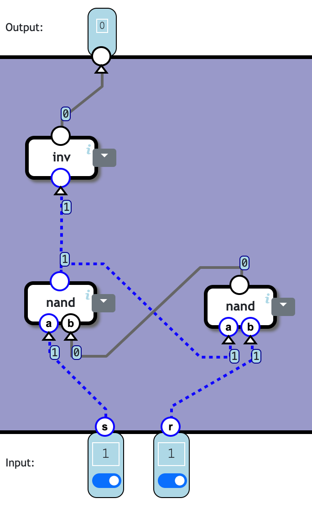

但这样需要用 3c3n，不够节省。

进一步优化，得到 `output = (s nand p) nand r`：

| s   | p   | s nand p | r   | (s nand p) nand r | output |
| --- | --- | -------- | --- | ----------------- | ------ |
| 1   | 0   | 1        | 0   | 1                 | 1      |
| 1   | 1   | 0        | 0   | 1                 | 1      |
| 0   | 0   | 1        | 1   | 0                 | 0      |
| 0   | 1   | 1        | 1   | 0                 | 0      |
| 1   | 0   | 1        | 1   | 0                 | 0      |
| 1   | 1   | 0        | 1   | 1                 | 1      |

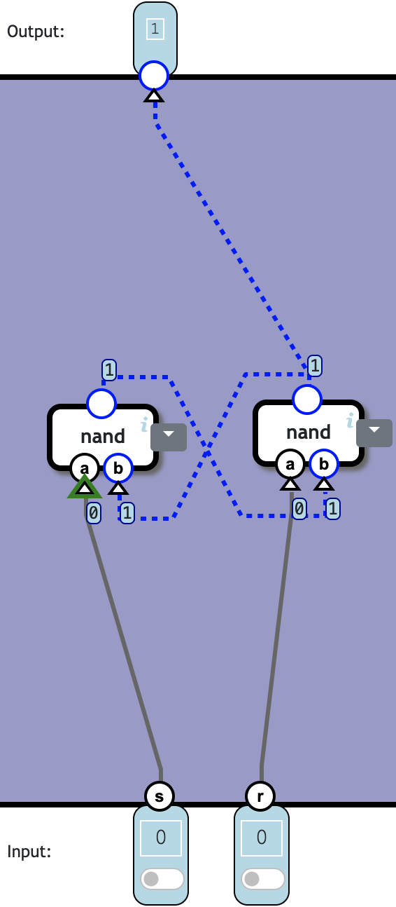

👍 Totally 2c2n.

### D Latch

> [!tip]
> The SR latch is somewhat impractical as a building block for memory because of the separate pins for storing 1 or 0 and because of the "forbidden" (0, 0) input state. The **Data Latch** extends it with a more practical input: one input for data and an input to indicate if the data should be stored.

A **D Latch** (data latch) component holds a single bit.

When **st** (store) is 1, the **d** bit is stored and emitted.

When **st** is 0, the last stored bit is emitted, and the current value of **d** is ignored.

| st  | d   | output           |
| --- | --- | ---------------- |
| 1   | 0   | 0                |
| 1   | 1   | 1                |
| 0   | 1   | Same as previous |
| 0   | 0   | Same as previous |

跟 **select** 的行为类似。用 p 表示 previous output。则：

`output = select(s=st, d1=d, d0=p)`

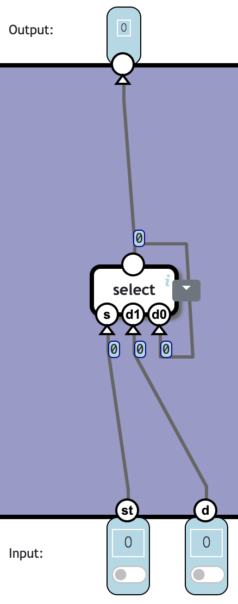

👍 Totally 1c4n:

| Component | Cnt | Nand | Subtotal |
| --------- | --- | ---- | -------- |
| select    | 1   | 4    | 4        |
| Total     | 1   |      | 4        |
<!-- TBLFM: @I$>..@>$>=($2*$3) -->
<!-- TBLFM: @>$2=sum(@I..@-1) -->
<!-- TBLFM: @>$>=sum(@I..@-1) -->

> 很奇怪，如果把 **select** 直接 "Replace with parts"，就不行了，从 `st = 1, d = 1` 变成 `st = 0, d = 1` 时，电路无法产生稳定的状态。

也可以借助 **sr latch**。令 `r = st nand d`，`s = st nand r` 即可：

| st  | d   | r = st nand d | s = st nand r | input of sr-latch | output of sr-latch |
| --- | --- | ------------- | ------------- | ----------------- | ------------------ |
| 1   | 0   | 1             | 0             | (0, 0)            | 0                  |
| 1   | 1   | 0             | 1             | (1, 0)            | 1                  |
| 0   | 1   | 1             | 1             | (1, 1)            | Same as previous   |
| 0   | 0   | 1             | 1             | (1, 1)            | Same as previous   |

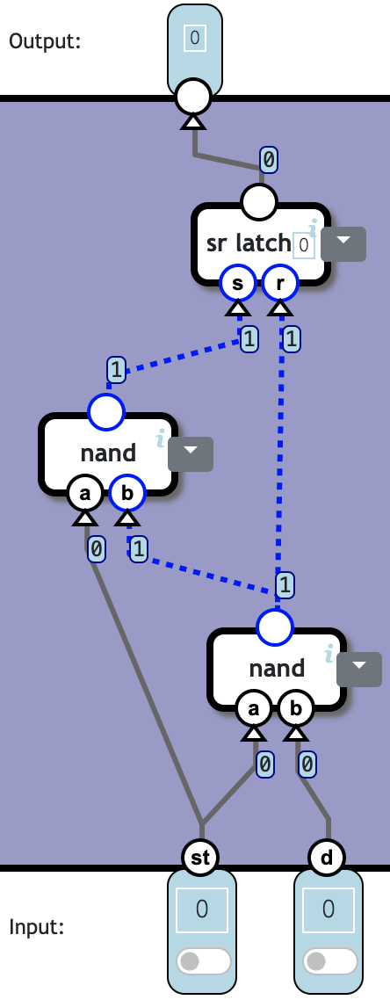

👍 Totally 3c4n，这个如果把 **sr latch** 展开是没有问题的。

| Component | Cnt | Nand | Subtotal |
| --------- | --- | ---- | -------- |
| nand      | 2   | 1    | 2        |
| sr latch  | 1   | 2    | 2        |
| Total     | 3   |      | 4        |
<!-- TBLFM: @I$>..@>$>=($2*$3) -->
<!-- TBLFM: @>$2=sum(@I..@-1) -->
<!-- TBLFM: @>$>=sum(@I..@-1) -->

### Data Flip-Flop

> [!tip]
> A problem appears when using latches: Since state changes are not synchronized across the circuit, changes ripple through the circuit in an unpredictable order, leading to race conditions and generally unpredictable results.
>
> The solution is a **clock signal**, a one-bit signal which periodically changes and which is connected to all stateful components.
>
> If components only change output when the clock signal changes, then changes will happen across the circuit at the same time, and we avoid synchronization issues.
>
> The clock signal is like a metronome, causing all components to change in unison.
>
> A **clock cycle** is the span of the clock signal changing from 0 to 1 and then from 1 back to 0.
>
> The **clock rate** is how fast the clock changes. The higher the clock rate, the faster the computer operates.

The DFF (data flip-flop) component stores a bit when the clock signal **cl** is 1 but only starts emitting the stored bit when the clock signal **cl** changes to 0.

- **cl**=0: The input flags **st** and **d** can change in this stage.
- **cl** changes to 1: If **st**=1 when **cl** changes to 1, the current value of **d** is stored. The stored value is not yet output.
- **cl** changes to 0: When **cl** changes to 0 again, the previously stored value is output.

Effect of inputs when cl=1:

| st  | d   | effect    |
| --- | --- | --------- |
| 1   | 0   | next = 0  |
| 1   | 1   | next = 1  |
| 0   | 0   | unchanged |
| 0   | 1   | unchanged |

首先需要用一个 **d-latch** 在 **cl** = 1 时记录需要设置的值，也就是当 **st** 和 **cl** 都为 1 时，写入 **d** 的值，即 `o1 = d-latch(st=(st and cl), d=d)`。这样只要 **st** 或 **cl** 有一个为 0，此 **d-latch** 的输出都会保持不变（不再随 **d** 改变）。

需要用另一个 **d-latch** 在 **cl** = 0 时，把前一个 **d-latch** 的输出写进来，并提供给最终的输出。即 `output = d-latch(st=inv(cl), d=o1)`。这样当 **cl** 变为 1 之后，output 可以维持住。



``` mermaid
flowchart BT
st((st)) & cl((cl)) --> and -->|st| latch1[d latch] -->|d| latch2[d latch] --> o(((o)))
cl --> inv -->|st| latch2
d((d)) -->|d| latch1
```



👍 Totally 4c11n:

| Component | Cnt | Nand | Subtotal |
| --------- | --- | ---- | -------- |
| and       | 1   | 2    | 2        |
| d latch   | 2   | 4    | 8        |
| inv       | 1   | 1    | 1        |
| Total     | 4   |      | 11       |
<!-- TBLFM: @I$>..@>$>=($2*$3) -->
<!-- TBLFM: @>$2=sum(@I..@-1) -->
<!-- TBLFM: @>$>=sum(@I..@-1) -->

### Register

A **2-bit DFF** component works like a data flip-flop, except two bits (**d1** and **d0**) are stored and emitted instead of one.

Simply use two **dff** components.



``` mermaid
flowchart BT
st((st)) -->|st| dff1[dff] & dff0[dff]
d1((d1)) -->|d| dff1
d0((d0)) -->|d| dff0
cl((cl)) -->|cl| dff1 & dff0
dff1 --> o1(((o1)))
dff0 --> o0(((o0)))

subgraph input [" "]
    d1
    d0
end
subgraph output [" "]
    o1
    o0
end
```



👍 Totally 2c22n:

| Component | Cnt | Nand | Subtotal |
| --------- | --- | ---- | -------- |
| dff       | 2   | 11   | 22       |
| Total     | 2   |      | 22       |
<!-- TBLFM: @I$>..@>$>=($2*$3) -->
<!-- TBLFM: @>$2=sum(@I..@-1) -->
<!-- TBLFM: @>$>=sum(@I..@-1) -->

The design for a two-bit storage can be trivially repeated. We repeat it to get a 16-bit storage unit. We call this component a **register**.

### Counter

A **counter** component increments a 16-bit number for each clock cycle.

Counters are a core component in a processor because they drive the execution of instructions.

If **st** (store) is 1, then the input value **X** is used as the new counter value.

If **st** is 0, then the previous counter value is incremented by 1.

The counter output changes when **cl** (clock signal) changes to 0.

| st  | cl  | effect                         |
| --- | --- | ------------------------------ |
| 0   | 0   | set **next** to **output** + 1 |
| 1   | 0   | set **next** to **X**          |

**output** is the current output of the component. **next** becomes the current output when **cl** changes to 0.

**st** 控制一个 **select** component，其 D1 直接接 X，用于当 **st** = 1 时重置 counter 为 X。

该 **select** 的输出则通过一个 **register** 保存，其 st 和 cl 分别取 `inv(cl)` 和 cl 即可。**register** 的输出再连一个 **inc** 后，接到 **select** 的 D0 上，用于当 **st** = 0 时，对 output 自增。



``` mermaid
flowchart BT
st((st)) -->|s| select[select 16]
inv -->|st| register ==> J@{ shape: f-circ } ==> O(((O)))
X((X)) ==>|D1| select ==>|X| register
cl((cl)) --> inv
cl -->|cl| register
J ==> inc[inc 16] ==>|D0| select
```



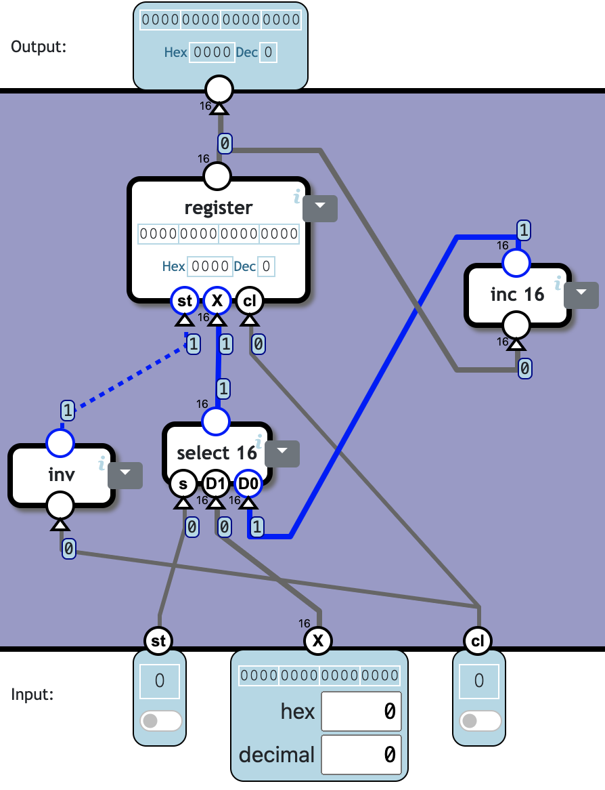

👍 Totally 4c386n:

| Component | Cnt | Nand | Subtotal |
| --------- | --- | ---- | -------- |
| inv       | 1   | 1    | 1        |
| select 16 | 1   | 64   | 64       |
| inc 16    | 1   | 145  | 145      |
| register  | 1   | 176  | 176      |
| Total     | 4   |      | 386      |
<!-- TBLFM: @I$>..@>$>=($2*$3) -->
<!-- TBLFM: @>$2=sum(@I..@-1) -->
<!-- TBLFM: @>$>=sum(@I..@-1) -->

### RAM

> [!tip]
> We can get more memory just by stacking registers (the 16-bit storage unit).
>
> But since a processor operates on a word at a time, we need a way to select and change individual words in a larger bank of memory.
>
> We use memory addresses for this.
>
> We number the data words in memory counting from 0. The number of a memory word is called its **address**. When reading or writing a memory cell, we use its address to access it.
>
> This kind of memory is called RAM (Random Access Memory) because we can access any cell and update its value as long as we know its address.
>
> Memory capacity (RAM and other storage) is measured in **bytes**, where a byte is 8 bits. Because we have a 16-bit architecture we store and retrieve 16-bit words at a time, each word is 2 bytes. We can have 65,536 memory cells (since 65,535 is the highest number that can be expressed in 16 bits), so measured in bytes we have twice the number, 131,072 bytes. This is usually written as 128KB (KB = kilobytes).

Build a memory unit with two 16-bit registers which is addressable and writable using a one-bit address.

Input:

**ad** (address) indicates which storage unit we are accessing.

**st** (store) indicates if we want to write to the unit:

- If 1, the value on **X** is stored in the unit.
- If 0, then **X** is ignored.

**X** (data) is a 16-bit value.

**cl** (clock signal) synchronizes state changes. **X** is stored when **cl** changes from 0 to 1, but emitted only when **cl** changes from 1 to 0.

Output:

**output** is the value currently stored in the unit addressed by **ad**.

用两个 **register** components 分别存储两个位置的数据，它们的输出通过 **select** 进行选择。

两个 **register** 的 X 和 cl 都分别直接连到 **X** 和 **cl** 上。但 st 则通过 **switch** 进行分发。

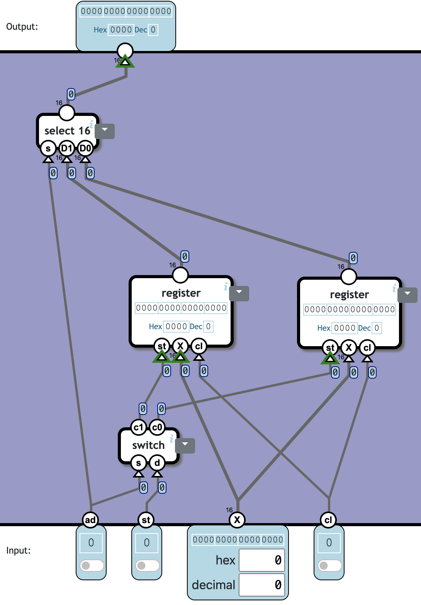

👍 Totally 4c420n:

| Component | Cnt | Nand | Subtotal |
| --------- | --- | ---- | -------- |
| switch    | 1   | 4    | 4        |
| select 16 | 1   | 64   | 64       |
| register  | 2   | 176  | 352      |
| Total     | 4   |      | 420      |
<!-- TBLFM: @I$>..@>$>=($2*$3) -->
<!-- TBLFM: @>$2=sum(@I..@-1) -->
<!-- TBLFM: @>$>=sum(@I..@-1) -->

Note: 420n for this 2x16-bit (i.e. 4 B) register, so `420 / 4 * 1024 = 107520 nand/KB`.

## Hardware Level: Processor

### Combined Memory

> [!tip]
> A processor uses both kinds of memory, registers, and RAM.
>
> Registers are directly accessible by the processor and used for intermediate values and calculations. RAM can store a large amount of data, but we can read or write from only a single address at a time.
>
> RAM has by far the largest capacity, but since we need addresses to read from ram, and because we need to store intermediate values, we have two registers for these purposes: A (for address) and D (for data).
>
> A _flag_ is a term for an input-bit that selects a single option. If there are multiple flags they can be turned on or off independently. For example, in this component the flags **a**, **d**, and ***a** can be set in any combination, including all three or none.

Combine two registers called **A** and **D** and one RAM bank.

The **a**, **d**, **\*a** flags and the **X** input is used to update one or more of the registers.

| Flag | Effect                                                |
| ---- | ----------------------------------------------------- |
| a    | Write X to the A register                             |
| d    | Write X to the D register                             |
| \*a  | Write X to RAM at the address given by the A register |

| Output | Value                                                           |
| ------ | --------------------------------------------------------------- |
| A      | The current value of the A register                             |
| D      | The current value of the D register                             |
| *A     | The current value in RAM at the address given by A the register |

直接把两个 register 的输出分别接到 RAM 的 Ad 和 X 输入端即可。

👍 Totally 3c352n + 107520 n/KB:

| Component | Cnt | Nand | Subtotal |
| --------- | --- | ---- | -------- |
| register  | 2   | 176  | 352      |
| ram       | 1   |      | 0        |
| Total     | 3   |      | 352      |
<!-- TBLFM: @I$>..@>$>=($2*$3) -->
<!-- TBLFM: @>$2=sum(@I..@-1) -->
<!-- TBLFM: @>$>=sum(@I..@-1) -->

### ALU Instruction

**I** is an instruction to the ALU and condition components. The bits direct the operation as specified:

| In: Bit | Out: Group  | Out: flag |
| ------- | ----------- | --------- |
| 10      | ALU         | u         |
| 9       | ALU         | op1       |
| 8       | ALU         | op0       |
| 7       | ALU         | zx        |
| 6       | ALU         | sw        |
| 5       | destination | a         |
| 4       | destination | d         |
| 3       | destination | \*a       |
| 2       | condition   | lt        |
| 1       | condition   | eq        |
| 0       | condition   | gt        |

The X input to the ALU should be D, the Y input should be either A or \*A depending on bit 12 in the instruction. If bit 12 is 0, it is A, if 1, \*A.

The **R** output is the result of the ALU operation.

The **j** flag indicate if the ALU output conforms to the conditions specified in bit 0-2.

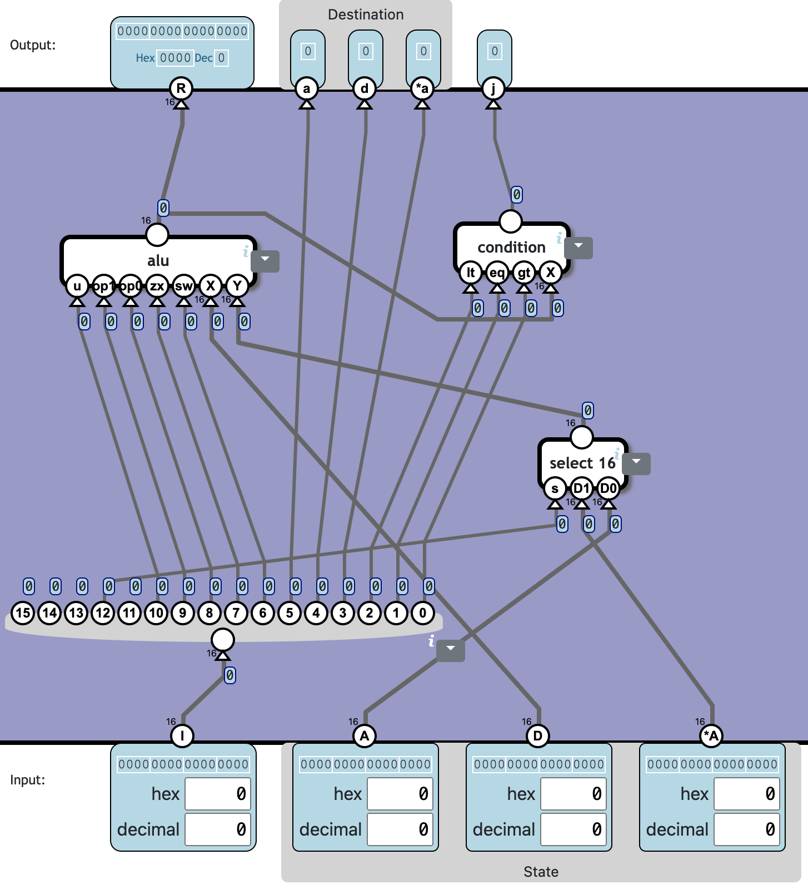

❓ Totally 3c1161n:

| Component | Cnt | Nand | Subtotal |
| --------- | --- | ---- | -------- |
| select 16 | 1   | 64   | 64       |
| alu       | 1   | 1041 | 1041     |
| condition | 1   | 56   | 56       |
| Total     | 3   |      | 1161     |
<!-- TBLFM: @I$>..@>$>=($2*$3) -->
<!-- TBLFM: @>$2=sum(@I..@-1) -->
<!-- TBLFM: @>$>=sum(@I..@-1) -->

### Control Selector

The **s** flag selects one of the two sets of inputs for output.

| s   | R   | a   | d   | \*a  | j   |
| --- | --- | --- | --- | ---- | --- |
| 0   | R₀  | a₀  | d₀  | \*a₀ | j₀  |
| 1   | R₁  | a₁  | d₁  | \*a₁ | j₁  |

This is a simple component, but necessary for supporting different kinds of instructions in the CPU.

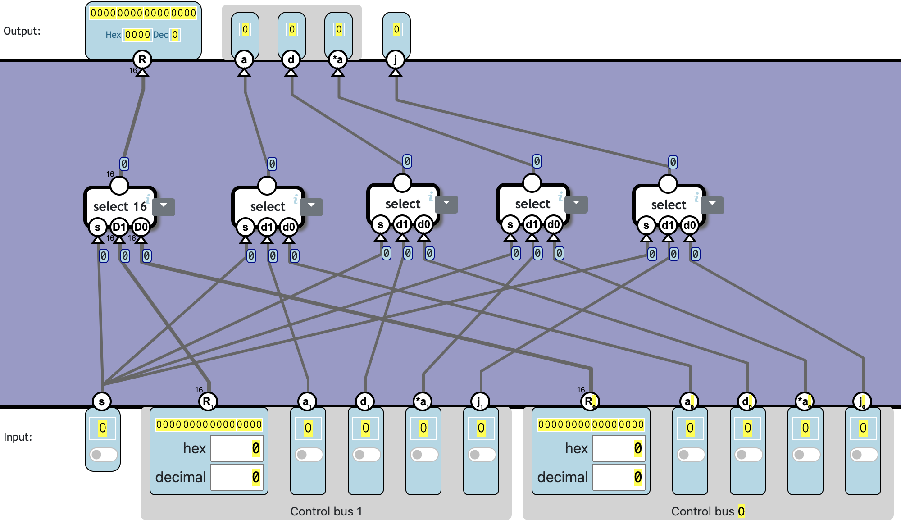

❓ Totally 5c80n:

| Component | Cnt | Nand | Subtotal |
| --------- | --- | ---- | -------- |
| select 16 | 1   | 64   | 64       |
| select    | 4   | 4    | 16       |
| Total     | 5   |      | 80       |
<!-- TBLFM: @I$>..@>$>=($2*$3) -->
<!-- TBLFM: @>$2=sum(@I..@-1) -->
<!-- TBLFM: @>$>=sum(@I..@-1) -->

### Control Unit

> [!tip]
> A program is a sequence of instructions, where each instruction is a set of bit flags which determine:
>
> - An ALU operation to perform
> - What registers to use as input.
> - What register(s) to store the result in.

In addition to the ALU instructions, the computer should also support **data instructions**. In a data instruction, the instruction value is directly written to the A register.

Create a control unit which execute either a data- or ALU instruction, depending on the high-bit of the instruction **I**:

| Bit 15     | Effect           |
| ---------- | ---------------- |
| 0          | Data instruction |
| 1 (0x8000) | ALU instruction  |

For ALU instructions, the output should be as specified in the previous level. R is the result of the ALU operation.

For a data instruction, the output **R** should be the **I** input, and destination should be the A register. I.e. **a** should be 1 and **d**, **a\***, and **j** flags should be 0.

另外其中的四个 **select**，有三个的输入 d0 恒为 0，可以简化为 **and**（因为本关未提供 **and**，可以用 **nand** + **inv** 替代）；另一个的 d0 = inv s，也可以退化。总共可以节省 9 个 **nand**，即：

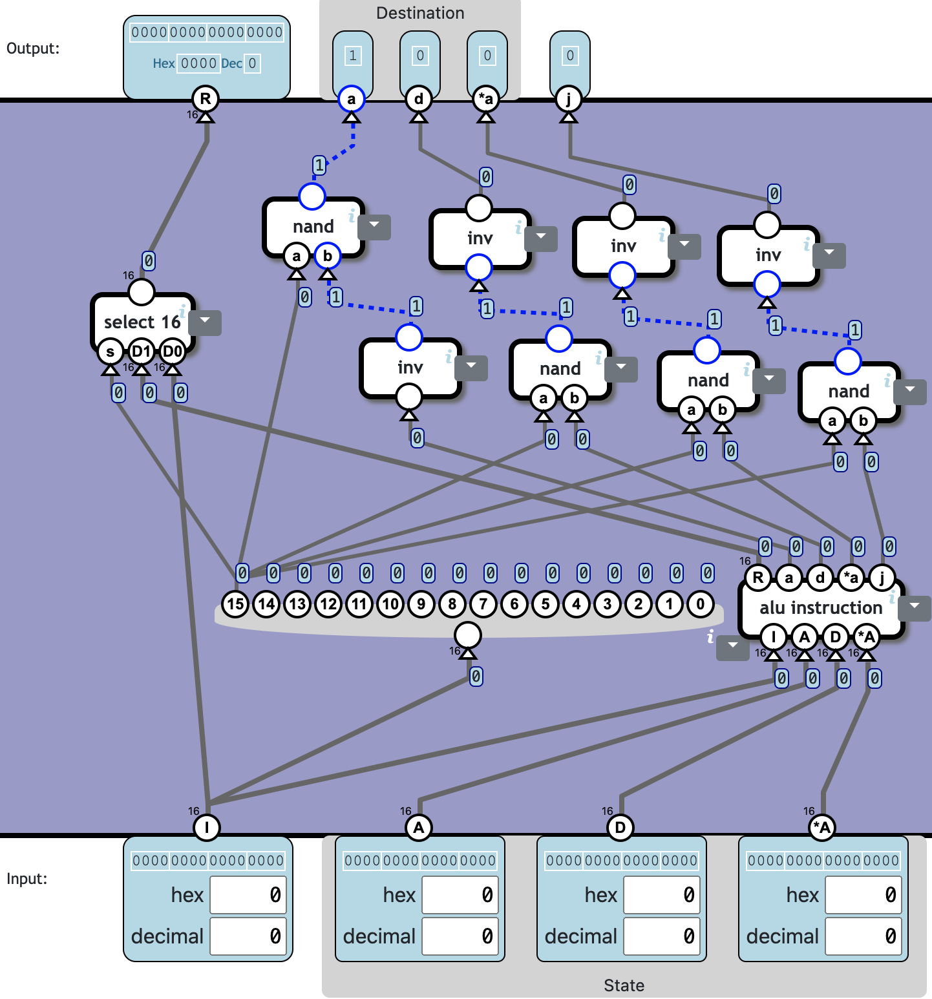

❓ Totally 10c1233n:

| Component       | Cnt | Nand | Subtotal |
| --------------- | --- | ---- | -------- |
| alu instruction | 1   | 1161 | 1161     |
| select 16       | 1   | 64   | 64       |
| inv             | 4   | 1    | 4        |
| nand            | 4   | 1    | 4        |
| Total           | 10  |      | 1233     |
<!-- TBLFM: @I$>..@>$>=($2*$3) -->
<!-- TBLFM: @>$2=sum(@I..@-1) -->
<!-- TBLFM: @>$>=sum(@I..@-1) -->

### Computer

Build a computer by combining:

- A control unit
- Storage memory (RAM and registers)
- A program memory unit (ROM).
- A counter which keeps track of the current instruction address (called the "program counter" or **PC**).
- A clock unit

The word at the PC address in the program memory is the **I** input to the control unit.

Each clock cycle changes the program counter depending on **j**:

If **j**=0, the program counter should advance with 1.

If **j**=1, the PC should be set to the value on **A**.

除了明确指定的，其他端口按名称对应连线即可。

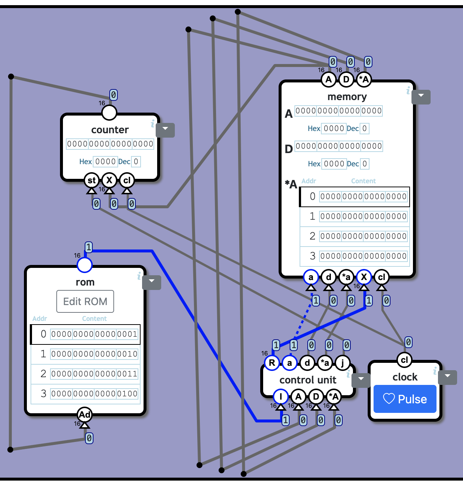

👍 Totally 4c1971n + 107520 n/KB (clock, rom not counting)

| Component    | Cnt | Nand | Subtotal |
| ------------ | --- | ---- | -------- |
| rom          | 1   |      | 0        |
| counter      | 1   | 386  | 386      |
| control unit | 1   | 1233 | 1233     |
| memory       | 1   | 352  | 352      |
| Total        | 4   |      | 1971     |
<!-- TBLFM: @I$>..@>$>=($2*$3) -->
<!-- TBLFM: @>$2=sum(@I..@-1) -->
<!-- TBLFM: @>$>=sum(@I..@-1) -->

### Input and Output

> [!tip]
> **Memory-mapped** input/output means that connections to external devices are plugged into the memory address space alongside the regular RAM units.
>
> This means the processor can write to output devices and read from input devices exactly the same way it reads and writes to memory.

Connect a lamp and a button, so they can be accessed like a memory address.

Output to device:

The lamp is controlled by bit 0 and 1 of **X**:

- When bit 1 is 1, the lamp should get a signal on **on**. When bit 0 is 1, the lamp should get a signal on **off**.
- Signals should be sent to the hardware when **st** (store) is 1 and **cl** (clock signal) is 1.

Input from device:

The button state is shown in bit 15 of the component output.

When the button is pressed, bit 15 should be 1. When it is not pressed, it should be 0.

Input signals should be readable immediately.

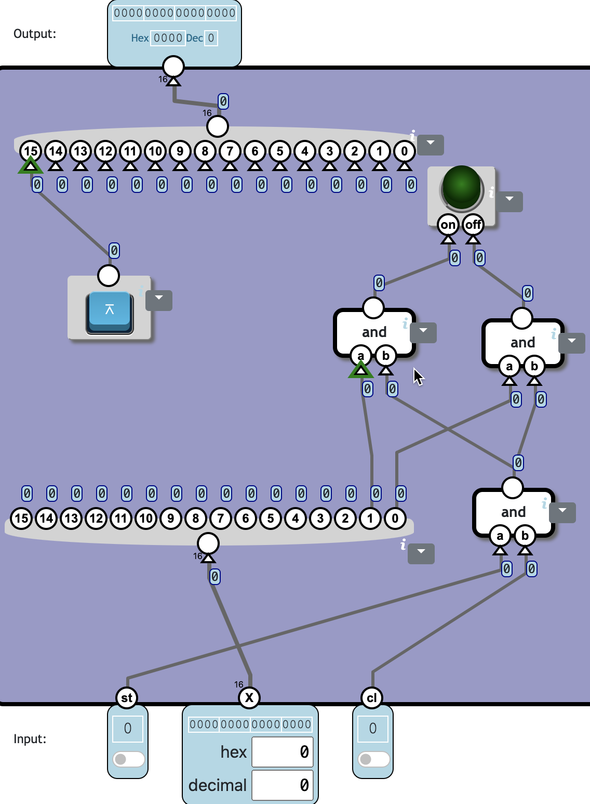

❓ Totally 3c6n:

| Component | Cnt | Nand | Subtotal |
| --------- | --- | ---- | -------- |
| and       | 3   | 2    | 6        |
| Total     | 3   |      | 6        |
<!-- TBLFM: @I$>..@>$>=($2*$3) -->
<!-- TBLFM: @>$2=sum(@I..@-1) -->
<!-- TBLFM: @>$>=sum(@I..@-1) -->
