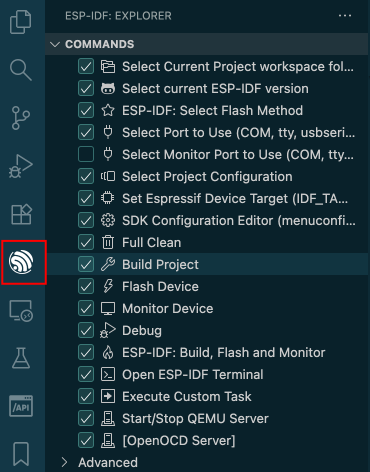
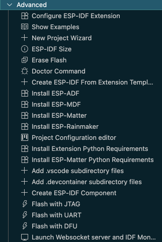
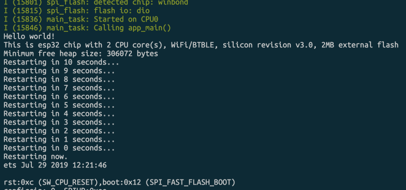
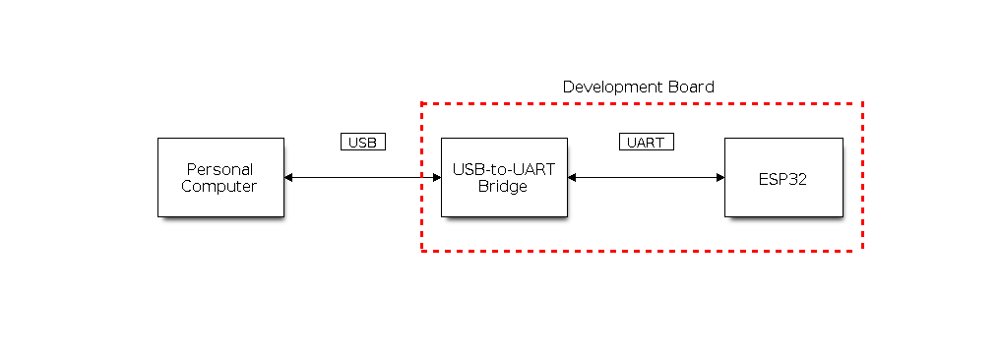
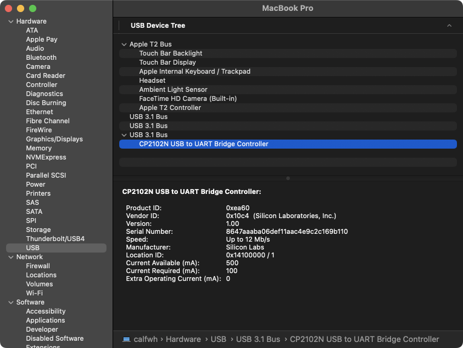

## ESP-IDF

[espressif/esp-idf: Espressif IoT Development Framework. Official development framework for Espressif SoCs.](https://github.com/espressif/esp-idf)



## ESP-IDF VS Code Extension

[espressif/vscode-esp-idf-extension: Visual Studio Code extension for ESP-IDF projects](https://github.com/espressif/vscode-esp-idf-extension)



{.invert-when-light}

{.invert-when-light}

[Standard Toolchain Setup for Linux and macOS - ESP32 - — ESP-IDF Programming Guide latest documentation](https://docs.espressif.com/projects/esp-idf/en/latest/esp32/get-started/linux-macos-setup.html)

```bash
brew install cmake ninja dfu-util
```

Install Python 3.14 using pyenv (see [python-version-management-virtual-environments](../python-version-management-virtual-environments/index.md)), then:

```bash
pyenv virtualenv 3.14.0 esp
```

Setup the extension (Express mode):

{.invert-when-light}

👆 Changed the python path to `~/.espressif/python_env/idf5.5_py3.14_env/bin/python3`

👇 应该不用自己的 venv 了，直接用 `~/.espressif/python_env/` 里面的更好。

Note that there are several Python requirements files in `~/esp/v5.5.1/esp-idf/tools/requirements`:

```text
~/esp/v5.5.1/esp-idf/tools/requirements
├── requirements.ci.txt
├── requirements.core.txt
├── requirements.docs.txt
├── requirements.gdbgui.txt
├── requirements.ide.txt
├── requirements.pytest.txt
└── requirements.test-specific.txt
```

```bash
# cd ~/esp/v5.5.1/esp-idf/tools/requirements
# pyenv shell esp
# for req in requirements.*.txt; do pip install -r $req; done
```

Command: Open ESP-IDF Terminal:

```shell-session
$ echo $IDF_PATH
/Users/zhouji/esp/v5.5.1/esp-idf

$ pyenv version
esp (set by PYENV_VERSION environment variable)
```

👆 如果提示：

```text
WARNING: Python interpreter "/Users/zhouji/.pyenv/versions/esp/bin/python" used to start idf.py is not from installed venv "/Users/zhouji/.espressif/python_env/idf5.5_py3.14_env
```

运行：

```shell-session
$ . $IDF_PATH/export.sh
Checking "python3" ...
Python 3.14.0
"python3" has been detected
Activating ESP-IDF 5.5
Setting IDF_PATH to '/Users/zhouji/esp/v5.5.1/esp-idf'.
* Checking python version ... 3.14.0
* Checking python dependencies ... OK
* Deactivating the current ESP-IDF environment (if any) ... OK
* Establishing a new ESP-IDF environment ... OK
* Identifying shell ... zsh
* Detecting outdated tools in system ... OK - no outdated tools found
* Shell completion ... Autocompletion code generated

Done! You can now compile ESP-IDF projects.
Go to the project directory and run:

  idf.py build

$ which python
/Users/zhouji/.espressif/python_env/idf5.5_py3.14_env/bin/python

$ which idf.py
/Users/zhouji/esp/v5.5.1/esp-idf/tools/idf.py
```

## Play with Hello World Examples

Examples: [esp-idf/examples at master · espressif/esp-idf](https://github.com/espressif/esp-idf/tree/master/examples)

> Can load example directly using the extension!

[esp-idf/examples/get-started/hello\_world at master · espressif/esp-idf](https://github.com/espressif/esp-idf/tree/master/examples/get-started/hello_world)

```text
├── CMakeLists.txt
├── pytest_hello_world.py      Python script used for automated testing
├── main
│   ├── CMakeLists.txt
│   └── hello_world_main.c
└── README.md                  This is the file you are currently reading
```

### Command: SDK Configuration Editor (menuconfig)

如果报错：

```log
asyncio.exceptions.LimitOverrunError: Separator is found, but chunk is longer than limit
```

可以直接打开 ESP-IDF terminal，运行：

```bash
idf.py menuconfig
```

### Command: Build Project

### Command: Start/Stop QEMU Server » QEMU Monitor / QEMU Debug

```bash
python ~/esp/v5.5.1/esp-idf/tools/idf.py -B /PATH-TO-PROJECT/hello_world/build qemu monitor
```

If failed:

```bash
brew install libslirp
python $IDF_PATH/tools/idf_tools.py install qemu-xtensa
```

If succeed:

{.invert-when-light}

Use Command: Start/Stop QEMU Server » Stop QEMU to stop it.

### Test

```shell-session
$ pytest pytest_hello_world.py
pytest_hello_world.py EEEEEEEEEEEEEFFFF
```

👆 TODO

### Connect, Flash, Monitor Device

[Establish Serial Connection with ESP32 - ESP32 - — ESP-IDF Programming Guide latest documentation](https://docs.espressif.com/projects/esp-idf/en/latest/esp32/get-started/establish-serial-connection.html)

{.invert-when-dark}

Need install the USB driver:

- CP210x: [CP210x USB to UART Bridge VCP Drivers](https://www.silabs.com/developers/usb-to-uart-bridge-vcp-drivers) (Refer to [ESP32-PICO-DevKitM-2 开发板](../esp32-pico-devkitm-2/index.md))

> [!caution]
> 要小心使用的 USB 线，有些线可能只能用来充电，或者有什么毛病，也会导致接到电脑上看不到设备！

{.invert-when-light}

```shell-session
$ ll /dev/tty.*; ll /dev/cu.*
...
crw-rw-rw- 1 root wheel 9, 6 Nov  2 00:50 /dev/tty.SLAB_USBtoUART 👈
crw-rw-rw- 1 root wheel 9, 4 Nov  2 00:50 /dev/tty.usbserial-1410
...
crw-rw-rw- 1 root wheel 9, 7 Nov  2 00:50 /dev/cu.SLAB_USBtoUART 👈
crw-rw-rw- 1 root wheel 9, 5 Nov  2 00:50 /dev/cu.usbserial-1410
```

Command: ESP-IDF: Select Flash Method » UART.

Command: Select Port to Use » `/dev/tty.SLAB_USBtoUART`.

Command: Select Monitor Port to Use » `/dev/tty.SLAB_USBtoUART`.

Command: Monitor Device:

全新的板子（芯片），会看到 0xFFFFFFFF 什么的，是因为芯片里还没有任何程序。

Command: Flash Device.

> [!Note]
>
> If the device does not support the auto download mode, you need to get into the download mode manually. To do so, press and hold the `BOOT` button and then press the `RESET` button once. After that release the `BOOT` button.

```text
 *  Executing task: /Users/zhouji/.espressif/python_env/idf5.5_py3.14_env/bin/python /Users/zhouji/esp/v5.5.1/esp-idf/components/esptool_py/esptool/esptool.py -p /dev/tty.SLAB_USBtoUART -b 460800 --before default_reset --after hard_reset --chip esp32 write_flash --flash_mode dio --flash_freq 40m --flash_size 2MB 0x1000 bootloader/bootloader.bin 0x10000 hello_world.bin 0x8000 partition_table/partition-table.bin

pyenv shell esp
esptool.py v4.10.0
Serial port /dev/tty.SLAB_USBtoUART
Connecting....
Chip is ESP32-PICO-V3-02 (revision v3.1)
Features: WiFi, BT, Dual Core, 240MHz, Embedded Flash, Embedded PSRAM, VRef calibration in efuse, Coding Scheme None
Crystal is 40MHz
MAC: 00:4b:12:a3:9f:54
Uploading stub...
Running stub...
Stub running...
Changing baud rate to 460800
Changed.
Configuring flash size...
Flash will be erased from 0x00001000 to 0x00007fff...
Flash will be erased from 0x00010000 to 0x00036fff...
Flash will be erased from 0x00008000 to 0x00008fff...
SHA digest in image updated
Compressed 26240 bytes to 16495...
Wrote 26240 bytes (16495 compressed) at 0x00001000 in 0.9 seconds (effective 242.8 kbit/s)...
Hash of data verified.
Compressed 156096 bytes to 85490...
Wrote 156096 bytes (85490 compressed) at 0x00010000 in 2.3 seconds (effective 538.9 kbit/s)...
Hash of data verified.
Compressed 3072 bytes to 103...
Wrote 3072 bytes (103 compressed) at 0x00008000 in 0.1 seconds (effective 264.4 kbit/s)...
Hash of data verified.

Leaving...
Hard resetting via RTS pin...
```

Command: Monitor Device: 👍

```text
export IDF_PATH='/Users/zhouji/esp/v5.5.1/esp-idf'
'/Users/zhouji/.espressif/python_env/idf5.5_py3.14_env/bin/python' '/Users/zhouji/esp/v5.5.1/esp-idf/tools/idf_monitor.py' -p /dev/tty.SLAB_USBtoUART -b 115200 --toolchain-prefix xtensa-esp32-elf- --make ''/Users/zhouji/.espressif/python_env/idf5.5_py3.14_env/bin/python' '/Users/zhouji/esp/v5.5.1/esp-idf/tools/idf.py'' --target esp32 '/Users/zhouji/lab/try-esp32/hello_world/hello_world/build/hello_world.elf'
pyenv shell esp

[11:42:07] zhouji@calfwh in ~/lab/try-esp32/hello_world/hello_world () go1.20.2 n20.14.0 L:3
$ export IDF_PATH='/Users/zhouji/esp/v5.5.1/esp-idf'

[11:42:07] zhouji@calfwh in ~/lab/try-esp32/hello_world/hello_world () go1.20.2 n20.14.0 L:3
$ '/Users/zhouji/.espressif/python_env/idf5.5_py3.14_env/bin/python' '/Users/zhouji/esp/v5.5.1/esp-idf/tools/idf_monitor.py' -p /dev/tty.SLAB_USBtoUART -b 115200 --toolchain-prefix xtensa-esp32-elf-
--make ''/Users/zhouji/.espressif/python_env/idf5.5_py3.14_env/bin/python' '/Users/zhouji/esp/v5.5.1/esp-idf/tools/idf.py'' --target esp32 '/Users/zhouji/lab/try-esp32/hello_world/hello_world/build/h
ello_world.elf'
--- Warning: Serial ports accessed as /dev/tty.* will hang gdb if launched.
--- Using /dev/cu.SLAB_USBtoUART instead...
--- esp-idf-monitor 1.8.0 on /dev/cu.SLAB_USBtoUART 115200
--- Quit: Ctrl+] | Menu: Ctrl+T | Help: Ctrl+T followed by Ctrl+H
ets Jul 29 2019 12:21:46

rst:0x1 (POWERON_RESET),boot:0x13 (SPI_FAST_FLASH_BOOT)
configsip: 271414342, SPIWP:0xee
clk_drv:0x00,q_drv:0x00,d_drv:0x00,cs0_drv:0x00,hd_drv:0x00,wp_drv:0x00
mode:DIO, clock div:2
load:0x3fff0030,len:6380
ho 0 tail 12 room 4
load:0x40078000,len:15916
load:0x40080400,len:3860
--- 0x40080400: _invalid_pc_placeholder at /Users/zhouji/esp/v5.5.1/esp-idf/components/xtensa/xtensa_vectors.S:2235
entry 0x40080638
I (30) boot: ESP-IDF v5.5.1-dirty 2nd stage bootloader
I (30) boot: compile time Nov  2 2025 01:08:28
I (30) boot: Multicore bootloader
I (32) boot: chip revision: v3.1
I (35) boot.esp32: SPI Speed      : 40MHz
I (38) boot.esp32: SPI Mode       : DIO
I (42) boot.esp32: SPI Flash Size : 2MB
I (45) boot: Enabling RNG early entropy source...
I (50) boot: Partition Table:
I (53) boot: ## Label            Usage          Type ST Offset   Length
I (59) boot:  0 nvs              WiFi data        01 02 00009000 00006000
I (65) boot:  1 phy_init         RF data          01 01 0000f000 00001000
I (72) boot:  2 factory          factory app      00 00 00010000 00100000
I (78) boot: End of partition table
I (82) esp_image: segment 0: paddr=00010020 vaddr=3f400020 size=076b0h ( 30384) map
I (100) esp_image: segment 1: paddr=000176d8 vaddr=3ffb0000 size=021e8h (  8680) load
I (103) esp_image: segment 2: paddr=000198c8 vaddr=40080000 size=06750h ( 26448) load
I (114) esp_image: segment 3: paddr=00020020 vaddr=400d0020 size=0fd58h ( 64856) map
I (137) esp_image: segment 4: paddr=0002fd80 vaddr=40086750 size=063ech ( 25580) load
I (147) esp_image: segment 5: paddr=00036174 vaddr=50000000 size=00020h (    32) load
I (154) boot: Loaded app from partition at offset 0x10000
I (154) boot: Disabling RNG early entropy source...
I (165) cpu_start: Multicore app
I (174) cpu_start: Pro cpu start user code
I (174) cpu_start: cpu freq: 160000000 Hz
I (174) app_init: Application information:
I (174) app_init: Project name:     hello_world
I (178) app_init: App version:      1
I (181) app_init: Compile time:     Nov  2 2025 01:08:19
I (186) app_init: ELF file SHA256:  1357622a1...
I (191) app_init: ESP-IDF:          v5.5.1-dirty
I (195) efuse_init: Min chip rev:     v0.0
I (199) efuse_init: Max chip rev:     v3.99
I (203) efuse_init: Chip rev:         v3.1
I (207) heap_init: Initializing. RAM available for dynamic allocation:
I (213) heap_init: At 3FFAE6E0 len 00001920 (6 KiB): DRAM
I (218) heap_init: At 3FFB2A50 len 0002D5B0 (181 KiB): DRAM
I (223) heap_init: At 3FFE0440 len 00003AE0 (14 KiB): D/IRAM
I (229) heap_init: At 3FFE4350 len 0001BCB0 (111 KiB): D/IRAM
I (234) heap_init: At 4008CB3C len 000134C4 (77 KiB): IRAM
I (240) spi_flash: detected chip: generic
I (243) spi_flash: flash io: dio
W (246) spi_flash: Detected size(8192k) larger than the size in the binary image header(2048k). Using the size in the binary image header.
I (259) main_task: Started on CPU0
I (269) main_task: Calling app_main()
```

```log
Hello world!
This is esp32 chip with 2 CPU core(s), WiFi/BTBLE, silicon revision v3.1, 2MB embedded flash
Minimum free heap size: 306072 bytes
Restarting in 10 seconds...
Restarting in 9 seconds...
Restarting in 8 seconds...
Restarting in 7 seconds...
Restarting in 6 seconds...
Restarting in 5 seconds...
Restarting in 4 seconds...
Restarting in 3 seconds...
Restarting in 2 seconds...
Restarting in 1 seconds...
Restarting in 0 seconds...
Restarting now.
```

### Using the idf.py

In ESP-IDF Terminal:

```bash
# 设置目标芯片
idf.py set-target esp32 # esp32s3, esp32c3

# 清理旧配置
idf.py fullclean

# 进入配置菜单
idf.py menuconfig

# 编译和烧录
idf.py build
idf.py flash monitor
# Press `Ctrl + ]` to exit monitor
```

## ESP-IDF Programming

[ESP-IDF Programming Guide - ESP32 - — ESP-IDF Programming Guide latest documentation](https://docs.espressif.com/projects/esp-idf/en/latest/esp32/index.html)

[ESP-IDF Programming Guide - ESP32-S3 - — ESP-IDF Programming Guide latest documentation](https://docs.espressif.com/projects/esp-idf/en/latest/esp32s3/index.html)

[ESP-IoT-Solution Programming Guide - - — ESP-IoT-Solution latest documentation](https://docs.espressif.com/projects/esp-iot-solution/en/latest/index.html)
