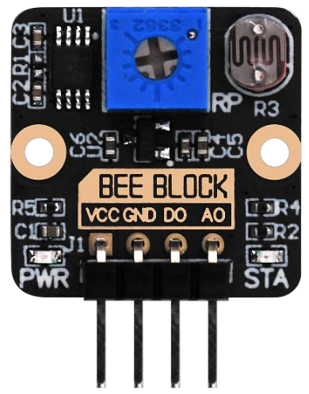

## 资料

[正点原子资料下载中心 — 正点原子资料下载中心 1.0.0 文档](http://www.openedv.com/docs/index.html)

## BEE BLOCK 模块

[【正点原子产品资料】BEE BLOCK模块资料下载和技术讨论链接-OpenEdv-开源电子网](http://openedv.com/thread-351031-1-1.html)

1）正点原子BEE BLOCK模块资料

[http://www.openedv.com/docs/boards/stm32/beeblock.html](http://www.openedv.com/docs/boards/stm32/beeblock.html)

2）正点原子BEE BLOCK模块介绍和购买链接：

[https://detail.tmall.com/item.htm?id=863358007079](https://detail.tmall.com/item.htm?id=863358007079)

3）正点原子BEE BLOCK模块配套视频：

[https://www.bilibili.com/video/BV1dzCJYFEsD](https://www.bilibili.com/video/BV1dzCJYFEsD)

4）正点原子所有产品资料下载总链接：

[http://www.openedv.com/thread-13912-1-1.html](http://www.openedv.com/thread-13912-1-1.html)

5）原子哥在线教学平台视频免费学习:

[https://www.yuanzige.com](https://www.yuanzige.com/)

### 光敏传感器模块（ATK-MB001）

链接： [https://pan.baidu.com/s/19s12rYZjJoB7SwEDYAcvtw](https://pan.baidu.com/s/19s12rYZjJoB7SwEDYAcvtw) 提取码：5kdk

模块内置可调电位器，用于设定光照强度阈值。

- 🔄 逆时针转：阈值降低
- 🔃 顺时针转：阈值提高

当环境光强度高于阈值时，数字输出（DO）为低电平，此时 STA 指示灯被点亮；当低于阈值时，DO 输出高电平，此时 STA 指示灯被熄灭。

AO 端输出与光照强度相关的模拟信号，可用单片机的 ADC 外设采集该电压，从而可以大概计算出光照强度百分比占比。AO 端的电压和环境光强度有关，环境光照强度越强，AO 端电压越低。

## ESP32 AI CHAT ROBOT

正点原子基于/支持小智 AI 的板子：[【正点原子产品资料】ESP32 AI CHAT ROBOT资料下载和技术讨论链接-OpenEdv-开源电子网](http://openedv.com/thread-352045-1-1.html)

[ESP32 AI CHAT ROBOT — 正点原子资料下载中心 1.0.0 文档](http://www.openedv.com/docs/boards/esp32/ATK-CHAT_ROBOT.html)

在 [小智 AI 聊天机器人](../xiaozhi-ai-chatbot/index.md) 代码库中对应的 board 是 `atk-dnesp32s3m-wifi`。
